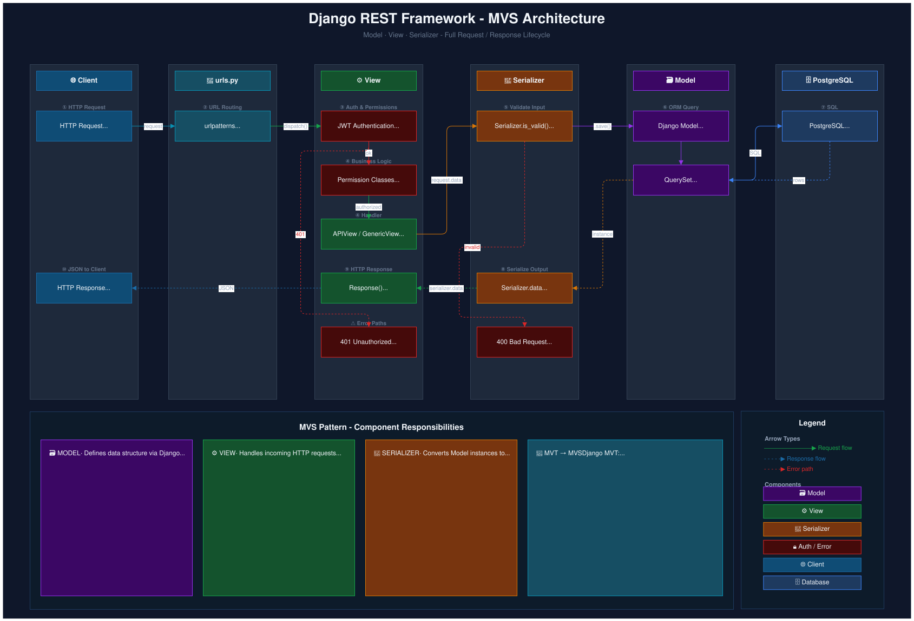
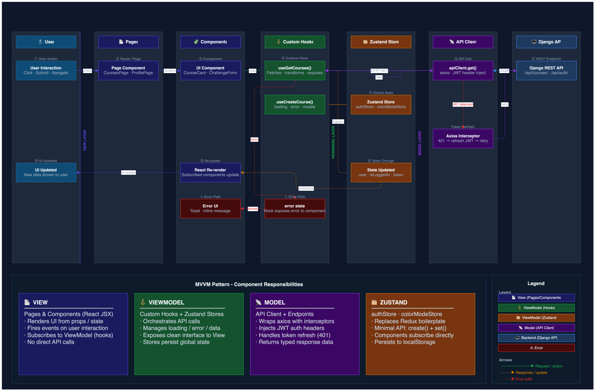
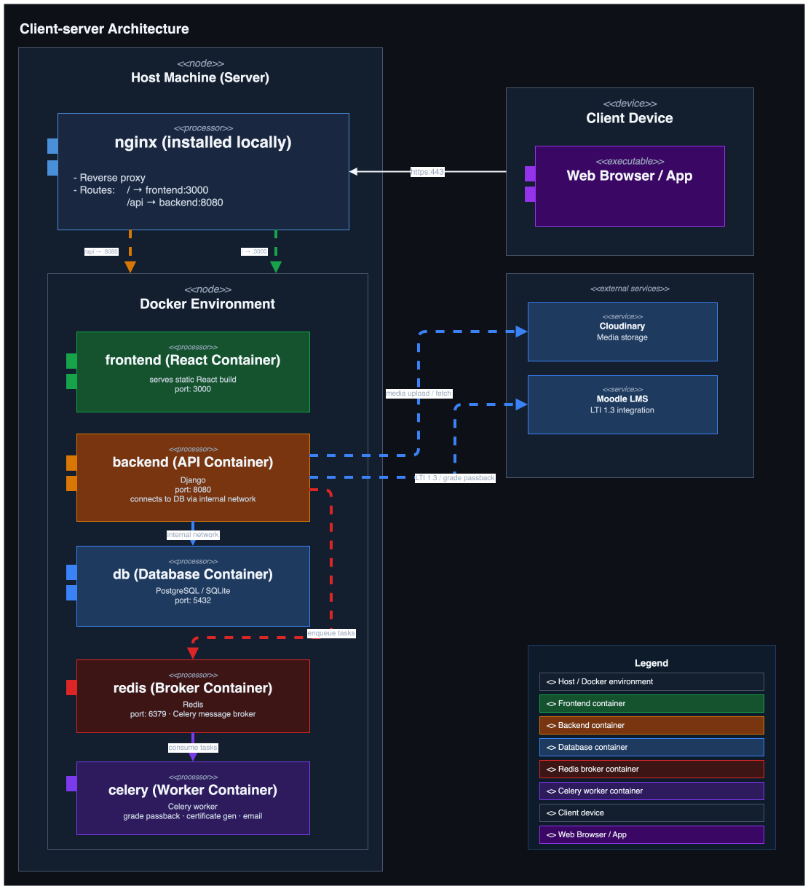
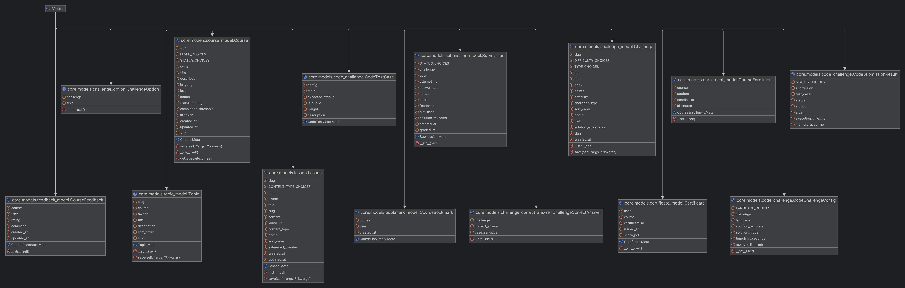
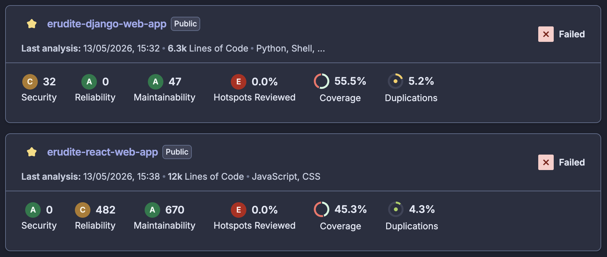

# ERUDITE - Software Architecture Document

# Table of Contents

- [Introduction](#1-introduction)
  - [Purpose](#11-purpose)
  - [Scope](#12-scope)
  - [Definitions, Acronyms and Abbreviations](#13-definitions-acronyms-and-abbreviations)
  - [References](#14-references)
  - [Overview](#15-overview)
- [Architectural Representation](#2-architectural-representation)
  - [Backend Architecture (MVS)](#21-backend-architecture-django-rest-framework--mvs)
  - [Frontend Architecture (MVVM)](#22-frontend-architecture-react--zustand--mvvm)
- [Architectural Goals and Constraints](#3-architectural-goals-and-constraints)
- [Use-Case View](#4-use-case-view)
  - [Use-Case Realizations](#41-use-case-realizations)
- [Logical View](#5-logical-view)
  - [Overview](#51-overview)
  - [Architecturally Significant Design Packages](#52-architecturally-significant-design-packages)
- [Process View](#6-process-view)
- [Deployment View](#7-deployment-view)
- [Implementation View](#8-implementation-view)
  - [Overview](#81-overview)
  - [Layers](#82-layers)
- [Data View](#9-data-view)
  - [Entity Relationship Diagram](#91-entity-relationship-diagram)
  - [DB Model Overview](#92-db-model-overview)
  - [DB Model Overview Classic ERD](#93-db-model-overview-classic-erd)
  - [Generated DB Diagram (PyCharm)](#94-generated-db-diagram-pycharm)
- [Size and Performance](#10-size-and-performance)
  - [Size](#101-size)
  - [Performance](#102-performance)
- [Quality](#11-quality)
  - [SonarCloud Results](#111-sonarcloud-results)
  - [Metrics Summary](#112-metrics-summary)
  - [Planned Improvements](#113-planned-improvements)

## 1. Introduction

### 1.1 Purpose

This document provides a detailed overview of the software architecture of **ERUDITE**, an interactive web-based learning platform designed
to facilitate user engagement through challenges, and community interactions.
It defines the architectural design, framework choices, logical structure, deployment view, and data model.
The document serves as a technical reference for developers, and maintainers, ensuring alignment with the [Software Requirements Specification](Documents/SoftwareRequirementsSpecification.md) (SRS).

### 1.2 Scope

This document describes the architecture of the ERUDITE project,
including the backend API, frontend user interface, database schema,
and deployment strategy.
It focuses on core components and excludes detailed implementation of third-party services (e.g., Cloudinary integration specifics),
or external integrations beyond the REST API. Non-functional aspects like performance and quality are addressed at a high level.

### 1.3 Definitions, Acronyms and Abbreviations

| Abbreviation | Description                                    |
| ------------ | ---------------------------------------------- |
| API          | Application Programming Interface              |
| MVC          | Model View Controller                          |
| REST         | Representational State Transfer                |
| JWT          | JSON Web Token                                 |
| DRF          | Django REST Framework                          |
| SPA          | Single Page Application                        |
| ORM          | Object Relational Mapper                       |
| CI/CD        | Continuous Integration / Continuous Deployment |
| DBMS         | Database Management System                     |
| VCS          | Version Control System                         |
| SRS          | Software Requirements Specification            |
| MVS          | Model-View-Serializer (REST variant of MVT)    |
| MVVM         | Model-View-ViewModel                           |
| MUI          | Material UI                                    |

### 1.4 References

| Title                                                                          |    Date    | Publishing organization |
| ------------------------------------------------------------------------------ | :--------: | ----------------------- |
| [ERUDITE SRS](Documents/SoftwareRequirementsSpecification.md)                  | 2026-05-14 | ERUDITE Team            |
| [ERUDITE Django Web App](https://github.com/coffee3333/erudite-django-web-app) | 2026-05-14 | ERUDITE Team            |
| [ERUDITE React Web App](https://github.com/coffee3333/erudite-react-web-app)   | 2026-05-14 | ERUDITE Team            |
| [ERUDITE Blog](https://eruditedev.wordpress.com/)                              | 2026-05-14 | ERUDITE Team            |
| [Django REST Framework Documentation](https://www.django-rest-framework.org/)  |  Ongoing   | Django REST Community   |
| [React Vite Documentation](https://vite.dev/guide/)                            |  Ongoing   | VoidZero Inc.           |

### 1.5 Overview

This document explains **ERUDITE’s** layered architecture, emphasizing its separation of concerns between backend (Django REST),
frontend (React SPA), and database (PostgreSQL). It provides a visual and conceptual breakdown of the Model–View–Serializer
(MVS) pattern for the backend, MVVM for the frontend, UML diagrams, and the deployment setup.
Sections cover logical, process, deployment, implementation, and data views, with emphasis on scalability and maintainability.

## 2. Architectural Representation

ERUDITE is built using the **MVS** pattern (a REST-oriented variant of MVC/MVT) for the backend and the **MVVM** pattern for the frontend to enable reactive state management.

The system separates concerns across two independently deployable layers:

- **Backend** - a stateless REST API built with Django REST Framework, following the MVS (Model–View–Serializer) pattern.
- **Frontend** - a React single-page application following MVVM, with Zustand as the ViewModel layer.

Both layers communicate exclusively over a JSON REST API, authenticated via JWT tokens.

---

### 2.1 Backend Architecture (Django REST Framework - MVS)

Django REST Framework (DRF) evolves the traditional Django MVT (Model–View–Template) pattern into **MVS** (Model–View–Serializer) for API-focused development. Serializers replace templates as the presentation layer, converting between Django model instances and JSON.

- **Model** - Django ORM models defining data structure and database schema.
- **View** - APIViews / ViewSets handling request routing, permission checks, and business logic.
- **Serializer** - converts model instances to/from JSON; handles validation.

#### Short Overview

The following diagram shows the high-level MVS request/response flow:

#### Detailed Architecture

The full diagram shows all Django apps, their models, views, serializers, and how they interact with PostgreSQL and Cloudinary:

---

### 2.2 Frontend Architecture (React + Zustand - MVVM)

The frontend is a component-based SPA using React and Vite. ERUDITE adopts a functional approach, avoiding complex class hierarchies. State is managed via **Zustand**, which acts as the ViewModel layer - holding application state, exposing actions, and keeping UI components in sync without prop drilling.

- **Model** - API response data and domain types consumed from the backend.
- **ViewModel** - Zustand stores (`authStore`, etc.) managing state, derived values, and API call orchestration.
- **View** - React components rendering UI from store state, using Material UI (MUI) for styling.

#### Short Overview

The following diagram shows the high-level MVVM data flow between components, stores, and the API:

#### Detailed Architecture

The full diagram shows the complete layer breakdown - pages, components, stores, services, and API client:

## 3. Architectural Goals and Constraints

### Goals

- Achieve clear separation of concerns between data (models), logic (views), and presentation (serializers/components).
- Ensure maintainability, modularity, and extensibility for future features like gamification.
- Provide secure, RESTful communication with JWT authentication.
- Support responsive UI for diverse devices using MUI.

### Constraints

- Use open-source tools (e.g., Django, React) to minimize costs.
- Target web browsers (Chrome, Firefox, Safari) with no native mobile support initially.
- Limit team size to small-scale development, favoring lightweight frameworks.

## 4. Use-Case View

This view illustrates the actors and use cases of the ERUDITE platform, showing which roles interact with which features.

> **Note:** The scope of this view covers the entire ERUDITE platform - all implemented use cases are included below. No use cases have been intentionally excluded from the scope.

### 4.1 Use-Case Realizations

| Domain             | Use Cases                                                                                                                                                                                                                                                                                                    |
| ------------------ | ------------------------------------------------------------------------------------------------------------------------------------------------------------------------------------------------------------------------------------------------------------------------------------------------------------ |
| **Authentication** | [Register](../UCs/Authentication/Register.md) · [Login](../UCs/Authentication/Login.md) · [Logout](../UCs/Authentication/Logout.md) · [Google OAuth](../UCs/Authentication/GoogleOAuth.md) · [Verify Email](../UCs/Authentication/VerifyEmail.md) · [Reset Password](../UCs/Authentication/ResetPassword.md) |
| **Courses**        | [Create Course](../UCs/Courses/CreateCourse.md) · [Edit Course](../UCs/Courses/EditCourse.md) · [Delete Course](../UCs/Courses/DeleteCourse.md) · [View Courses](../UCs/Courses/ViewCourses.md) · [Manage Enrollments](../UCs/Courses/ManageEnrollments.md)                                                  |
| **Topics**         | [Create Topic](../UCs/Topics/CreateTopic.md) · [Edit Topic](../UCs/Topics/EditTopic.md) · [Delete Topic](../UCs/Topics/DeleteTopic.md) · [View Topic](../UCs/Topics/ViewTopic.md)                                                                                                                            |
| **Lessons**        | [Create Lesson](../UCs/Lessons/CreateLesson.md) · [Edit Lesson](../UCs/Lessons/EditLesson.md) · [Delete Lesson](../UCs/Lessons/DeleteLesson.md) · [View Lesson](../UCs/Lessons/ViewLesson.md)                                                                                                                |
| **Challenges**     | [Create Challenge](../UCs/Challenges/CreateChallenge.md) · [Edit Challenge](../UCs/Challenges/EditChallenge.md) · [Delete Challenge](../UCs/Challenges/DeleteChallenge.md) · [View Challenges](../UCs/Challenges/ViewChallenges.md) · [Submit Challenge](../UCs/Challenges/SubmitChallenge.md)               |
| **Profile**        | [View Profile](../UCs/Profile/ViewProfile.md) · [Edit Profile](../UCs/Profile/EditProfile.md) · [Change Password](../UCs/Profile/ChangePassword.md)                                                                                                                                                          |
| **Other**          | [Dashboard](../UCs/Dashboard/Dashboard.md) · [Bookmark Course](../UCs/Bookmarks/BookmarkCourse.md) · [Course Feedback](../UCs/Feedback/CourseFeedback.md) · [Course Certificate](../UCs/Certificates/CourseCertificate.md) · [LTI Moodle Integration](../UCs/LTI/LTI-MoodleIntegration.md)                   |

## 5. Logical View

### 5.1 Overview

ERUDITE follows a **modular Django architecture**, where each app corresponds to a functional domain. See [Section 2.1](#21-backend-architecture-django-rest-framework---mvs).

### 5.2 Architecturally Significant Design Packages

The backend is split into three Django apps, each owning a distinct functional domain. The diagram below shows the full breakdown - models, views, serializers, design patterns, and infrastructure - across all apps.

---

#### `config` - Project Root

Holds global Django settings, the root URL router, WSGI/ASGI entry points, and Celery configuration. It registers all apps but contains no domain logic of its own.

---

#### `authentication` - Identity & Access

| Layer           | Contents                                                                                                                                                                        |
| --------------- | ------------------------------------------------------------------------------------------------------------------------------------------------------------------------------- |
| **Models**      | `User` (custom `AbstractBaseUser`, roles: student/teacher), `PasswordResetOTP`, `EmailVerificationCode`                                                                         |
| **Serializers** | `RegisterSerializer`, `LoginSerializer`, `UserProfileSerializer`, `PasswordResetSerializer`                                                                                     |
| **Views**       | `RegisterView`, `LoginView`, `LogoutView`, `ProfileView`, `GoogleOAuthView`, `VerifyEmailView`, `ResetPasswordView`, `DashboardView`, `TeacherDashboardView`, `LeaderboardView` |
| **Helpers**     | `permissions.py`, `filters.py`, `pagination.py`, `utils.py`                                                                                                                     |

---

#### `core` - Learning Domain

The largest app. Owns all course, content, and submission logic.

| Layer               | Contents                                                                                                                                                                                         |
| ------------------- | ------------------------------------------------------------------------------------------------------------------------------------------------------------------------------------------------ |
| **Models**          | `Course`, `Topic`, `Lesson`, `Challenge`, `ChallengeOption`, `Submission`, `CourseEnrollment`, `CourseFeedback`, `CourseBookmark`, `Certificate`                                                 |
| **Serializers**     | `CourseSerializer`, `TopicSerializer`, `LessonSerializer`, `ChallengeSerializer`, `EnrollmentSerializer`, `FeedbackSerializer`                                                                   |
| **Views**           | `CourseViewSet`, `TopicViewSet`, `LessonViewSet`, `ChallengeViewSet`, `SubmissionView`, `ChallengeCheckView`, `EnrollmentView`, `FeedbackView`, `BookmarkView`, `CertificateView`, `RunCodeView` |
| **Design Patterns** | See below                                                                                                                                                                                        |
| **Utils**           | `access.py`, `completion.py`, `certificate_pdf.py`, `execution/executor.py`                                                                                                                      |

**Design Patterns used in `core/patterns/`:**

| Pattern      | Class(es)                                                                                        | Purpose                                                                                                                              |
| ------------ | ------------------------------------------------------------------------------------------------ | ------------------------------------------------------------------------------------------------------------------------------------ |
| **Factory**  | `GraderFactory`                                                                                  | Resolves the correct grader key (`quiz_mcq`, `quiz_text`, `text`, `code`) from a challenge type, keeping dispatch logic in one place |
| **Strategy** | `ScoringStrategy`, `ExactMatchScoringStrategy`, `PartialCreditScoringStrategy`, `ScoringContext` | Interchangeable scoring algorithms - exact match for quiz/text, weighted partial credit for code challenges                          |
| **Observer** | `EnrollmentEventBus` (singleton), `EnrollmentObserver`, `EnrollmentAuditLogObserver`             | Decouples enrollment side-effects (audit logging, future notifications) from the enrollment view                                     |
| **Builder**  | `CertificateBuilder`                                                                             | Step-by-step construction of certificate PDF parameters before calling the generator                                                 |

---

#### `lti` - Moodle Integration

| Layer      | Contents                                                        |
| ---------- | --------------------------------------------------------------- |
| **Models** | `LTIRegistration`, `LTIResourceMapping`, `LTISession`           |
| **Views**  | LTI 1.3 launch handler, JWKS endpoint, AGS grade passback       |
| **Utils**  | JWT verification, JWKS key resolution, grade submission helpers |
| **Tasks**  | Celery async grade passback to Moodle                           |

---

#### Infrastructure (cross-cutting)

| Component       | Role                                                                                                                                                                                                       |
| --------------- | ---------------------------------------------------------------------------------------------------------------------------------------------------------------------------------------------------------- |
| PostgreSQL      | Primary database (all models)                                                                                                                                                                              |
| Cloudinary      | Media storage (`featured_image`, `photo` fields)                                                                                                                                                           |
| JWT (simplejwt) | Stateless authentication tokens                                                                                                                                                                            |
| Celery + Redis  | Async task queue (grade passback, email)                                                                                                                                                                   |
| Docker + Nginx  | Containerised deployment, reverse proxy                                                                                                                                                                    |
| GitHub Actions  | CI - runs pytest, Behave (BDD), SonarCloud on every PR. [Behave](https://behave.readthedocs.io/) is a Python BDD framework that executes feature files written in Gherkin to verify user-facing scenarios. |

## 6. Process View

This section describes the runtime behavior of ERUDITE through activity diagrams, grouped by functional area. Each group file contains all diagrams for that domain.

| Group                                                                   | Diagrams                                                                                                                                  |
| ----------------------------------------------------------------------- | ----------------------------------------------------------------------------------------------------------------------------------------- |
| [Authentication](../Diagrams/ActivityDiagrams/Authentication/README.md) | Register, Login, Logout, Google OAuth, Verify Email, Reset Password                                                                       |
| [Courses](../Diagrams/ActivityDiagrams/Courses/README.md)               | Create, Edit, Delete, View Course, Manage Enrollments                                                                                     |
| [Topics](../Diagrams/ActivityDiagrams/Topics/README.md)                 | Create, Edit, Delete, View Topic                                                                                                          |
| [Lessons](../Diagrams/ActivityDiagrams/Lessons/README.md)               | Create, Edit, Delete Lesson                                                                                                               |
| [Challenges](../Diagrams/ActivityDiagrams/Challenges/README.md)         | Create, Edit, Submit Challenge                                                                                                            |
| [Profile](../Diagrams/ActivityDiagrams/Profile/README.md)               | Edit Profile, Change Password                                                                                                             |
| [Dashboard](../Diagrams/ActivityDiagrams/Dashboard/README.md)           | Dashboard                                                                                                                                 |
| [Bookmarks](../Diagrams/ActivityDiagrams/Bookmarks/README.md)           | Bookmark Course                                                                                                                           |
| [Certificates](../Diagrams/ActivityDiagrams/Certificates/README.md)     | Course Certificate                                                                                                                        |
| [Feedback](../Diagrams/ActivityDiagrams/Feedback/README.md)             | Course Feedback                                                                                                                           |
| [LTI / Moodle Integration](../Diagrams/ActivityDiagrams/LTI/README.md)  | LTI Moodle Integration - for the full LTI 1.3 protocol flow see the [IMS LTI 1.3 specification](https://www.imsglobal.org/spec/lti/v1p3/) |

## 7. Deployment View

ERUDITE employs a containerized client-server architecture using Docker for component isolation and Nginx as a reverse proxy for routing. This setup supports both development and production environments, with scalability in mind.

#### Client-server Architecture 

- Host Machine (Server): Runs Nginx (installed locally) as a reverse proxy. It routes root paths (/) to the frontend on port 3000 and API paths (/api) to the backend on port 8080. HTTPS is enforced on port 443 for client connections.
- Docker Environment: Contains isolated containers for the application components:
  - Frontend (React Container): Serves the static React build on port 3000.
  - Backend (API Container): Runs the Django application on port 8080, connecting to the database via an internal Docker network.
  - Database (DB Container): Uses PostgreSQL (or SQLite for lightweight testing) on port 5432.
  - Redis (Broker Container): Message broker on port 6379, used by Celery for task queuing.
  - Celery (Worker Container): Processes async tasks - grade passback to Moodle, certificate generation, and email delivery.

- Client Device: Users access the web app via a browser, connecting over HTTPS on port 443.
- External Services: Media files are handled by Cloudinary (not shown in the diagram), integrated via API calls from the backend.
- Environments: Development uses local Docker Compose for orchestration; staging and production leverage cloud hosting (e.g., AWS EC2 or Heroku) with auto-scaling and load balancing.
- CI/CD: Automated via GitHub Actions, building and deploying containers.
- Networking and Security: Internal network for container communication; HTTPS termination at Nginx; rate limiting and firewalls for protection.

## 8. Implementation View

### 8.1 Overview

The implementation is split across two repositories managed via Git, with CI/CD automated through GitHub Actions. Both follow a consistent layered structure within their respective frameworks.

| Repository               | Stack                          | Structure                                                                |
| ------------------------ | ------------------------------ | ------------------------------------------------------------------------ |
| `erudite-django-web-app` | Python · Django REST Framework | Django app-per-domain: `config/`, `authentication/`, `core/`, `lti/`     |
| `erudite-react-web-app`  | JavaScript · React · Vite      | Feature-based: `pages/`, `components/`, `stores/`, `hooks/`, `services/` |

The full package breakdown - models, views, serializers, design patterns, and utilities - is documented in [Section 5.2](#52-architecturally-significant-design-packages).

#### Class Diagram (Manual)

#### Class Diagram (Generated by PyCharm)

> **Note:** PyCharm's diagram generator does not distinguish between project-defined classes and third-party imported classes, resulting in a dense graph. This is a known limitation of Python tooling - unlike Java, Python's dynamic imports make static analysis-based class diagrams inherently noisy. The manually drawn diagram above should be used as the primary reference.

### 8.2 Layers

| Layer              | Backend                                                        | Frontend                                                         |
| ------------------ | -------------------------------------------------------------- | ---------------------------------------------------------------- |
| **Presentation**   | DRF Serializers - convert model instances to/from JSON         | React components (MUI) - render UI from store state              |
| **Business Logic** | Views / ViewSets - handle requests, permissions, orchestration | Custom hooks - orchestrate API calls, manage loading/error state |
| **Data Access**    | Django ORM models and QuerySets                                | Axios API client with JWT interceptor                            |
| **Infrastructure** | PostgreSQL · Cloudinary · JWT · Celery · Docker                | Zustand stores · localStorage · Vite build                       |

## 9. Data View

The backend uses Django ORM as its data access layer. All persistent state lives in PostgreSQL (production) or SQLite (local dev). Each Django app owns its models; foreign-key relationships cross app boundaries only where explicitly required.

### 9.1 Entity Relationship Diagram

The ERD covers all 20 tables across the `authentication`, `core`, and `lti` apps. Solid arrows are same-app foreign keys; dashed arrows are cross-app references.

### 9.2 DB Model Overview

### 9.3 DB Model Overview Classic ERD

### 9.4 Generated DB Diagram (PyCharm)

## 10. Size and Performance

### 10.1 Size

Size metrics are collected automatically via SonarCloud on every CI run.

| Metric            | erudite-django-web-app                | erudite-react-web-app |
| ----------------- | ------------------------------------- | --------------------- |
| **Lines of Code** | 6.3k                                  | 12k                   |
| **Language**      | Python, Shell                         | JavaScript, CSS       |
| **DB Tables**     | 20                                    | -                     |
| **Django Apps**   | 4 (config, authentication, core, lti) | -                     |
| **Duplications**  | 5.2%                                  | 4.3%                  |

### 10.2 Performance

No formal load testing has been conducted at this stage. The following targets and strategies are in place:

- **API response time** - target < 500 ms for standard CRUD endpoints under normal load.
- **Async tasks** - computationally heavy operations (code challenge grading, certificate generation) are offloaded to **Celery + Redis** workers to keep API response times low.
- **Static files** - served directly by **nginx**, bypassing the Django application server entirely.
- **Database** - key fields (`slug`, `status`, `created_at`) are indexed at the model level to speed up common queries.
- **Media** - images and uploads are handled by **Cloudinary**, removing file I/O load from the application server.

## 11. Quality/Metrics

ERUDITE uses **SonarCloud** for static analysis on both repositories, integrated into the GitHub Actions CI/CD pipeline.

### 11.1 SonarCloud Results

### 11.2 Metrics Summary

| Metric              | erudite-django-web-app | erudite-react-web-app |
| ------------------- | ---------------------- | --------------------- |
| **Lines of Code**   | 6.3k                   | 12k                   |
| **Security**        | C - 32 issues          | A - 0 issues          |
| **Reliability**     | A - 0 issues           | C - 482 issues        |
| **Maintainability** | A - 47 issues          | A - 670 issues        |
| **Coverage**        | 55.5%                  | 45.3%                 |
| **Duplications**    | 5.2%                   | 4.3%                  |

- **Security** - Backend has 32 issues (grade C); frontend is clean (A). Security hotspots in auth and token handling have not yet been formally reviewed.
- **Reliability** - Backend is clean (A). Frontend has 482 issues (C) mostly from null checks and unhandled promises typical in JavaScript.
- **Maintainability** - Both score A. Issues are non-blocking code smells addressed incrementally.
- **Coverage** - Both above the 30% minimum target. Backend at 55.5%, frontend at 45.3%. Core logic is covered; UI components and edge-case API paths remain the main gaps for future improvement.
- **Duplications** - 5.2% and 4.3% - well within acceptable limits.

### 11.3 Planned Improvements

| Priority | Area                   | Action                                                       |
| -------- | ---------------------- | ------------------------------------------------------------ |
| High     | Security (backend)     | Resolve 32 security issues and complete hotspot review       |
| Medium   | Coverage               | Increase coverage beyond current 55.5% / 45.3% — focus on topic, lesson, and challenge endpoints |
| Medium   | Reliability (frontend) | Fix null checks and unhandled promise rejections             |
| Low      | Maintainability        | Address code smells incrementally during feature development |
