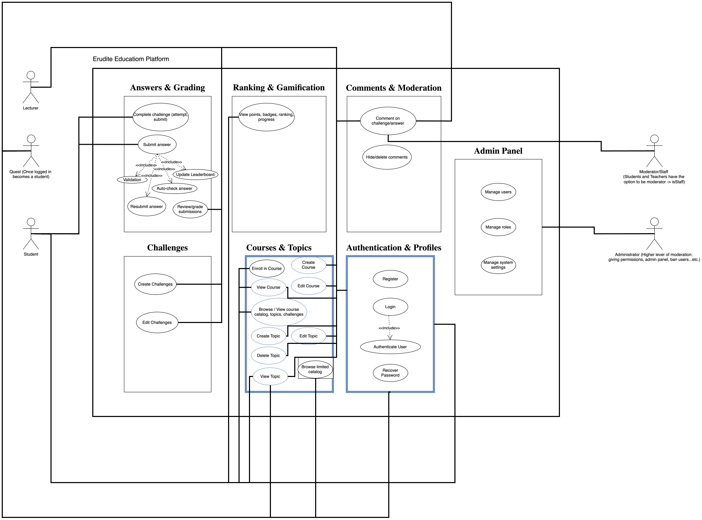
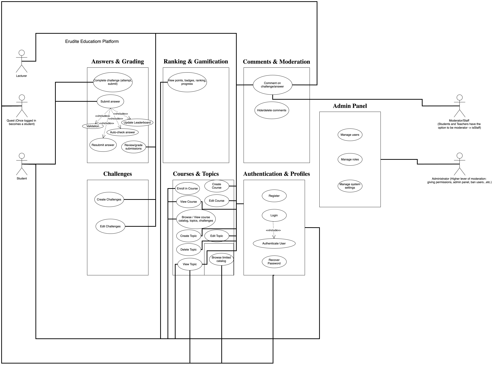
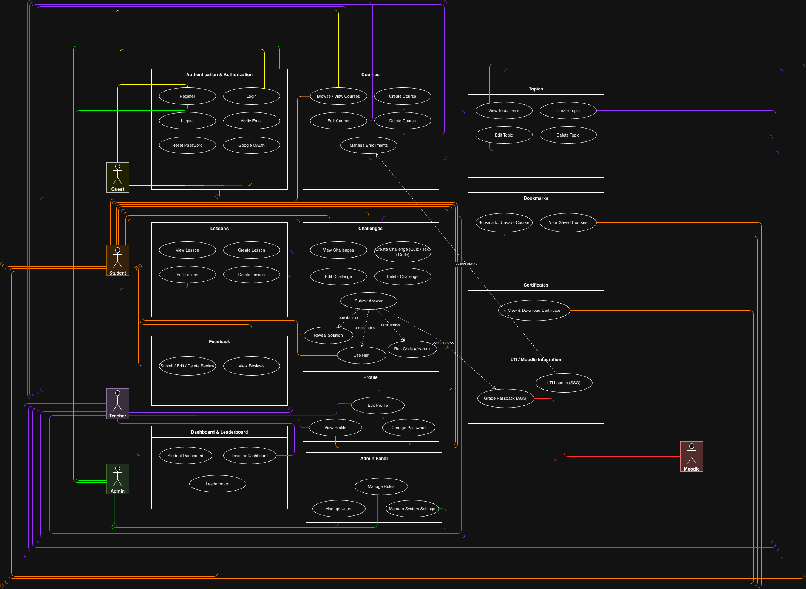

# ERUDITE - Software Requirements Specification

## Table of contents

- [Table of contents](#table-of-contents)
- [Introduction](#1-introduction)
  - [Purpose](#11-purpose)
  - [Scope](#12-scope)
  - [Definitions, Acronyms and Abbreviations](#13-definitions-acronyms-and-abbreviations)
  - [References](#14-references)
  - [Overview](#15-overview)
- [Overall Description](#2-overall-description)
  - [Vision](#21-vision)
  - [Use Case Diagram](#22-use-case-diagram)
    - [Use Case Realizations](#221-use-case-realizations)
  - [Technology Stack](#23-technology-stack)
- [Specific Requirements](#3-specific-requirements)
  - [Functionality](#31-functionality)
  - [Usability](#32-usability)
  - [Reliability](#33-reliability)
  - [Performance](#34-performance)
  - [Supportability](#35-supportability)
  - [Design Constraints](#36-design-constraints)
  - [Online User Documentation and Help System Requirements](#37-on-line-user-documentation-and-help-system-requirements)
  - [Purchased Components](#38-purchased-components)
  - [Interfaces](#39-interfaces)
  - [Licensing Requirements](#310-licensing-requirements)
  - [Legal, Copyright and Other Notices](#311-legal-copyright-and-other-notices)
  - [Applicable Standards](#312-applicable-standards)
- [Supporting Information](#4-supporting-information)

---

## 1. Introduction

### 1.1 Purpose

This Software Requirements Specification (SRS) describes all specifications for the application **ERUDITE**, a web-based platform for interactive learning with courses and challenges. It includes an overview of the system's purpose, vision, features, and constraints.

### 1.2 Scope

The project is implemented as a **web platform** with courses, topics, lessons, and challenges. The scope was defined in semester 1 and significantly extended in semester 2 following feedback from our customer **Liberating Education**.

---

#### Semester 1 Scope

Initial delivery focused on the core learning loop.

**Actors:**

| Actor                 | Role                                                       |
| --------------------- | ---------------------------------------------------------- |
| **Guest**             | Browse limited catalog, register                           |
| **Student**           | Enroll in courses, complete challenges, view rankings      |
| **Author/Instructor** | Create courses/topics/challenges, review/grade submissions |
| **Moderator**         | Global moderation of content and reports                   |
| **Administrator**     | Manage users, roles, system settings                       |

**Planned subsystems:**

| Subsystem                 | Description                                                             |
| ------------------------- | ----------------------------------------------------------------------- |
| Authentication & Profiles | Registration/login (email, OAuth), profile with stats, privacy settings |
| Courses & Topics          | Catalog with filters, structured into topics and challenges             |
| Challenges                | Multiple types (text, quiz) - code execution added in semester 2        |
| Answers & Grading         | Auto-check grading with rubric                                          |
| Ranking & Gamification    | Points, badges, course-based leaderboards                               |
| Comments & Moderation     | Discussion threads, reports, moderation tools                           |
| Admin Panel               | Manage users, courses, system settings                                  |

---

#### Semester 2 Scope

Following feedback from **Liberating Education**, the scope was extended. The Moderator role was deprioritised and removed; the Teacher role replaced Author/Instructor; Moodle LMS was added as an external actor.

**Actor changes:**

| Actor             | Change                                                         |
| ----------------- | -------------------------------------------------------------- |
| **Guest**         | Unchanged                                                      |
| **Student**       | Extended - bookmarks, certificates, dashboard added            |
| **Teacher**       | Renamed from _Author/Instructor_; teacher dashboard added      |
| **Administrator** | Unchanged                                                      |
| ~~Moderator~~     | **Removed** - moderation deprioritised, not implemented        |
| **Moodle LMS**    | **Added** - external system for LTI 1.3 SSO and grade passback |

**New subsystems added:**

| Subsystem                | Description                                           |
| ------------------------ | ----------------------------------------------------- |
| Lessons                  | Structured lesson content within topics               |
| Bookmarks                | Students can save/unsave courses                      |
| Course Feedback          | Students submit reviews for completed courses         |
| Certificates             | Auto-generated PDF certificates on course completion  |
| Dashboard                | Separate student and teacher dashboards               |
| LTI / Moodle Integration | LTI 1.3 launch, SSO, and AGS grade passback to Moodle |

---

### 1.3 Definitions, Acronyms and Abbreviations

| Abbreviation | Description                          |
| ------------ | ------------------------------------ |
| SRS          | Software Requirements Specification  |
| UC           | Use Case                             |
| JWT          | JSON Web Token                       |
| SPA          | Single Page Application              |
| OAuth        | Open Authorization                   |
| TTFB         | Time To First Byte                   |
| E2E          | End-to-End (testing)                 |
| WCAG         | Web Content Accessibility Guidelines |
| GDPR         | General Data Protection Regulation   |
| LTI          | Learning Tools Interoperability      |
| BDD          | Behaviour-Driven Development         |

### 1.4 References

| Title                                                           |    Date    | Publishing organization    |
| --------------------------------------------------------------- | :--------: | -------------------------- |
| ERUDITE Project Docs (internal)                                 | 2026-05-14 | ERUDITE Team               |
| [Django REST Framework](https://www.django-rest-framework.org/) | 2026-05-14 | Django Software Foundation |
| [React](https://react.dev)                                      | 2026-05-14 | Meta Open Source           |

### 1.5 Overview

This document outlines the system's vision and high-level architecture, followed by detailed functional and non-functional requirements. It includes use cases, technology stack, interfaces, and supporting information to guide implementation and verification.

---

## 2. Overall Description

### 2.1 Vision

#### Semester 1

ERUDITE is a collaborative learning platform. Students join courses, complete challenges of various types, receive grades and points, and appear in rankings. Teachers create structured learning experiences.

#### Semester 2

The vision was extended: ERUDITE also integrates with institutional LMS platforms (Moodle) via LTI 1.3, enabling universities to embed ERUDITE challenges directly into their existing course flows. Grade results are passed back automatically to Moodle.

### 2.2 Use Case Diagram

#### Semester 1 Scope

The initial scope covered the core learning loop: authentication, basic course and topic management, and challenge CRUD. This was the agreed deliverable for semester 1.

The Overall Use Case Diagram for 1st Semester

#### Semester 2 Scope

Following feedback from our customer **Liberating Education**, the scope was extended to include Moodle LTI 1.3 integration, certificates, bookmarks, course feedback, and a full student/teacher dashboard. The diagram below reflects the current full scope.

### 2.2.1 Use Case Realizations

| Domain                  | Use Cases                                                                                                                                                                                                                                                                                                    |
| ----------------------- | ------------------------------------------------------------------------------------------------------------------------------------------------------------------------------------------------------------------------------------------------------------------------------------------------------------ |
| **Authentication**      | [Register](../UCs/Authentication/Register.md) · [Login](../UCs/Authentication/Login.md) · [Logout](../UCs/Authentication/Logout.md) · [Google OAuth](../UCs/Authentication/GoogleOAuth.md) · [Verify Email](../UCs/Authentication/VerifyEmail.md) · [Reset Password](../UCs/Authentication/ResetPassword.md) |
| **Courses**             | [Create Course](../UCs/Courses/CreateCourse.md) · [Edit Course](../UCs/Courses/EditCourse.md) · [Delete Course](../UCs/Courses/DeleteCourse.md) · [View Courses](../UCs/Courses/ViewCourses.md) · [Manage Enrollments](../UCs/Courses/ManageEnrollments.md)                                                  |
| **Topics**              | [Create Topic](../UCs/Topics/CreateTopic.md) · [Edit Topic](../UCs/Topics/EditTopic.md) · [Delete Topic](../UCs/Topics/DeleteTopic.md) · [View Topic](../UCs/Topics/ViewTopic.md)                                                                                                                            |
| **Lessons** _(S2)_      | [Create Lesson](../UCs/Lessons/CreateLesson.md) · [Edit Lesson](../UCs/Lessons/EditLesson.md) · [Delete Lesson](../UCs/Lessons/DeleteLesson.md) · [View Lesson](../UCs/Lessons/ViewLesson.md)                                                                                                                |
| **Challenges**          | [Create Challenge](../UCs/Challenges/CreateChallenge.md) · [Edit Challenge](../UCs/Challenges/EditChallenge.md) · [Delete Challenge](../UCs/Challenges/DeleteChallenge.md) · [View Challenges](../UCs/Challenges/ViewChallenges.md) · [Submit Challenge](../UCs/Challenges/SubmitChallenge.md)               |
| **Profile**             | [View Profile](../UCs/Profile/ViewProfile.md) · [Edit Profile](../UCs/Profile/EditProfile.md) · [Change Password](../UCs/Profile/ChangePassword.md)                                                                                                                                                          |
| **Dashboard** _(S2)_    | [Dashboard](../UCs/Dashboard/Dashboard.md)                                                                                                                                                                                                                                                                   |
| **Bookmarks** _(S2)_    | [Bookmark Course](../UCs/Bookmarks/BookmarkCourse.md)                                                                                                                                                                                                                                                        |
| **Feedback** _(S2)_     | [Course Feedback](../UCs/Feedback/CourseFeedback.md)                                                                                                                                                                                                                                                         |
| **Certificates** _(S2)_ | [Course Certificate](../UCs/Certificates/CourseCertificate.md)                                                                                                                                                                                                                                               |
| **LTI** _(S2)_          | [LTI Moodle Integration](../UCs/LTI/LTI-MoodleIntegration.md)                                                                                                                                                                                                                                                |

### 2.3 Technology Stack

#### Semester 1

| Layer        | Technology                                                        |
| ------------ | ----------------------------------------------------------------- |
| **Client**   | React (Vite), JavaScript, MUI, Zustand                            |
| **Server**   | Django REST Framework, JWT authentication, role-based permissions |
| **Database** | PostgreSQL                                                        |
| **Storage**  | Cloudinary                                                        |
| **CI/CD**    | GitHub Actions, Docker                                            |
| **Testing**  | Behave (Python BDD, Gherkin feature files), Linters               |

#### Semester 2 - additions

| Layer           | Added                                                                           |
| --------------- | ------------------------------------------------------------------------------- |
| **Server**      | Celery + Redis (async task queue for grade passback and certificate generation) |
| **Integration** | LTI 1.3 / Moodle (PyLTI1p3 library)                                             |
| **Testing**     | Unit tests (pytest), integration and E2E tests                                  |
| **Monitoring**  | Grafana (planned)                                                               |
| **CI**          | SonarCloud static analysis                                                      |

---

## 3. Specific Requirements

### 3.1 Functionality

#### Semester 1 - Original Requirements

| Feature                                                                      |   Status    | Notes                                                                                  |
| ---------------------------------------------------------------------------- | :---------: | -------------------------------------------------------------------------------------- |
| **Registration & Authentication** (email+password, OAuth, password recovery) | Implemented | Email+password, Google OAuth, email verification, and password reset OTP all delivered |
| **Profile Management** (nickname, photo, stats, badges)                      |   Partial   | Delivered in semester 2; badges deferred to backlog                                    |
| **Courses & Topics** (catalog, enrollment, prerequisites)                    |   Partial   | Fully delivered in semester 2; prerequisites descoped                                  |
| **Challenges** (text, photo input, multiple choice)                          | Implemented | Text, MCQ, and code execution types delivered; photo-input deferred                    |
| **Answers & Submissions** (resubmission, validation, history)                | Implemented | Submission history, resubmission, and auto-validation via `ChallengeCheckView`         |
| **Grading & Points** (formula-based)                                         | Implemented | Exact-match and partial-credit scoring strategies                                      |
| **Ranking** (leaderboards, progress tracking)                                | Implemented | `LeaderboardView` and student progress tracking                                        |
| **Comments** (threaded, moderated)                                           |   Planned   | No Comment model implemented; remains in backlog                                       |
| **Admin Panel** (users, courses, moderation)                                 |   Partial   | Django admin for content management; custom moderation UI not built                    |

#### Semester 2 - Added Requirements

| Feature                                       |   Status    | Notes                                                                                                                  |
| --------------------------------------------- | :---------: | ---------------------------------------------------------------------------------------------------------------------- |
| **Profile Management** _(from S1)_            | Implemented | Profile, photo, and stats fully delivered                                                                              |
| **Courses & Topics** _(from S1)_              | Implemented | Course, Topic, and enrollment fully delivered                                                                          |
| **Challenges** _(from S1)_                    | Implemented | Extended with code execution type (`RunCodeView`)                                                                      |
| **Grading & Points** _(from S1)_              | Implemented | Extended with partial-credit scoring strategy                                                                          |
| **Comments** _(from S1)_                      |   Planned   | Still in backlog - not implemented                                                                                     |
| **Admin Panel** _(from S1)_                   |   Partial   | Django admin only; custom moderation UI not built                                                                      |
| **Lessons**                                   | Implemented | Lesson model and `LessonViewSet` in `core` app                                                                         |
| **Bookmarks**                                 | Implemented | `CourseBookmark` model with `BookmarkView`                                                                             |
| **Certificates**                              | Implemented | `Certificate` model, PDF generation via `CertificateBuilder` pattern                                                   |
| **Course Feedback**                           | Implemented | `CourseFeedback` model with `FeedbackView`                                                                             |
| **Dashboard**                                 | Implemented | `DashboardView` (student) and `TeacherDashboardView`                                                                   |
| **Profile UCs** (View, Edit, Change Password) | Implemented | Dedicated profile use cases: `ViewProfile`, `EditProfile`, `ChangePassword`                                            |
| **Manage Enrollments**                        | Implemented | `EnrollmentView` - teacher-side enrollment management                                                                  |
| **Run Code**                                  | Implemented | `RunCodeView` - live code execution for code-type challenges                                                           |
| **LTI / Moodle Integration**                  | Implemented | LTI 1.3 launch, JWKS endpoint, async grade passback via Celery - added at request of customer **Liberating Education** |

### 3.2 Usability

| Semester 1                               | Semester 2  |
| ---------------------------------------- | ----------- |
| Mobile-first responsive UI.              | No changes. |
| Familiar layouts (cards, progress bars). |             |
| Dark/light theme.                        |             |
| Accessibility (WCAG 2.1 AA).             |             |

### 3.3 Reliability

| Semester 1                               | Semester 2                                                                                 |
| ---------------------------------------- | ------------------------------------------------------------------------------------------ |
| Target ≥ 99.5% uptime for the API.       | Grade passback to Moodle must be retried on failure (handled by Celery task retry policy). |
| Data consistency and no submission loss. |                                                                                            |

### 3.4 Performance

| Semester 1                          | Semester 2                                                                                                                                    |
| ----------------------------------- | --------------------------------------------------------------------------------------------------------------------------------------------- |
| TTFB < 500ms for ≥ 95% of requests. | Heavy operations (code grading, certificate generation, grade passback) are offloaded to Celery workers - API response time target unchanged. |

### 3.5 Supportability

| Semester 1                                                       | Semester 2                                                 |
| ---------------------------------------------------------------- | ---------------------------------------------------------- |
| Clean code standards, linting, typing (JavaScript for frontend). | Unit, integration, and E2E tests added to the test suite.  |
| Behave (BDD) feature files for user-facing scenarios.            | SonarCloud static analysis integrated into CI on every PR. |

### 3.6 Design Constraints

| Semester 1                 | Semester 2                                                   |
| -------------------------- | ------------------------------------------------------------ |
| REST API in JSON.          | LTI 1.3 standard compliance required for Moodle integration. |
| Role-based access control. | Async task processing must use Celery + Redis.               |

### 3.7 On-line User Documentation and Help System Requirements

| Semester 1                                  | Semester 2  |
| ------------------------------------------- | ----------- |
| FAQ section.                                | No changes. |
| "Help" button inside app with contact form. |             |

---

### 3.8 Purchased Components

| Semester 1                             | Semester 2                                                             |
| -------------------------------------- | ---------------------------------------------------------------------- |
| Cloudinary subscription (file hosting) | Moodle LMS (open-source, self-hosted by customer Liberating Education) |

### 3.9 Interfaces

#### 3.9.1 User Interfaces

| Semester 1                                                 | Semester 2                                                   |
| ---------------------------------------------------------- | ------------------------------------------------------------ |
| **Landing page** - overview, registration/login            | **Teacher Dashboard** - course management, submission review |
| **Dashboard** - list of courses, filters                   | **Bookmarks page** - saved courses list                      |
| **Course Page** - topics, challenges, ranking              | **Feedback page** - course reviews                           |
| **Challenge Page** - statement, answer form, attempts      | **Certificate page** - view and download certificate         |
| **Profile** - personal data, stats                         |                                                              |
| **Admin Panel** - Django admin for content/user management |                                                              |

#### 3.9.2 Hardware Interfaces

N/A

#### 3.9.3 Software Interfaces

| Semester 1     | Semester 2                                 |
| -------------- | ------------------------------------------ |
| REST API       | LTI 1.3 (Moodle launch and grade passback) |
| OAuth (Google) | Celery + Redis (internal async interface)  |

#### 3.9.4 Communication Interfaces

- HTTPS (TLS 1.3)

### 3.10 Licensing Requirements

MIT License (open-source components).

### 3.11 Legal, Copyright and Other Notices

- User-generated content remains property of authors.

### 3.12 Applicable Standards

- WCAG 2.1 AA (accessibility).
- GDPR (privacy).
- PEP8 (Python), ESLint/Prettier (JS/TS).
- IMS LTI 1.3 (Moodle integration).

---

## 4. Supporting Information

For further details, please contact the ERUDITE Team.

Team members:

- Atai Mammut
- Niki Huawei
- Brian Maiami
