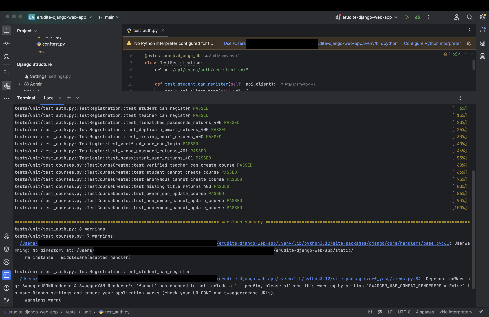
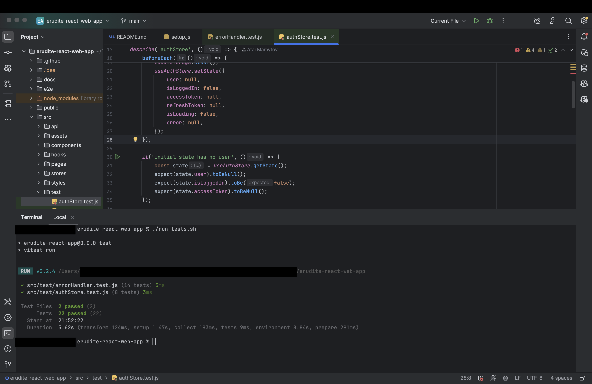

# Test Plan - Erudite Platform

## Table of Contents

- [1. Introduction](#1-introduction)
  - [1.1 Purpose](#11-purpose)
  - [1.2 Scope](#12-scope)
  - [1.3 Intended Audience](#13-intended-audience)
  - [1.4 Document Terminology and Acronyms](#14-document-terminology-and-acronyms)
  - [1.5 References](#15-references)
  - [1.6 Document Structure](#16-document-structure)
- [2. Evaluation Mission and Test Motivation](#2-evaluation-mission-and-test-motivation)
  - [2.1 Background](#21-background)
  - [2.2 Evaluation Mission](#22-evaluation-mission)
  - [2.3 Test Motivators](#23-test-motivators)
- [3. Target Test Items](#3-target-test-items)
- [4. Outline of Planned Tests](#4-outline-of-planned-tests)
  - [4.1 Outline of Test Inclusions](#41-outline-of-test-inclusions)
  - [4.2 Outline of Other Candidates for Potential Inclusion](#42-outline-of-other-candidates-for-potential-inclusion)
  - [4.3 Outline of Test Exclusions](#43-outline-of-test-exclusions)
- [5. Test Approach](#5-test-approach)
  - [5.1 Initial Test-Idea Catalogs and Other Reference Sources](#51-initial-test-idea-catalogs-and-other-reference-sources)
  - [5.2 Testing Techniques and Types](#52-testing-techniques-and-types)
    - [5.2.1 Data and Database Integrity Testing](#521-data-and-database-integrity-testing)
    - [5.2.2 Functional Testing](#522-functional-testing)
    - [5.2.3 Business Cycle Testing](#523-business-cycle-testing)
    - [5.2.4 User Interface Testing](#524-user-interface-testing)
    - [5.2.5 Security and Access Control Testing](#525-security-and-access-control-testing)
- [6. Entry and Exit Criteria](#6-entry-and-exit-criteria)
  - [6.1 Test Plan Entry/Exit Criteria](#61-test-plan-entryexit-criteria)
  - [6.2 Test Cycle Entry/Exit Criteria](#62-test-cycle-entryexit-criteria)
- [7. Deliverables](#7-deliverables)
- [8. Testing Workflow](#8-testing-workflow)
- [9. Environmental Needs](#9-environmental-needs)
  - [9.1 Base System Hardware](#91-base-system-hardware)
  - [9.2 Base Software Elements in the Test Environment](#92-base-software-elements-in-the-test-environment)
  - [9.3 Productivity and Support Tools](#93-productivity-and-support-tools)
- [10. Responsibilities, Staffing, and Training Needs](#10-responsibilities-staffing-and-training-needs)
- [11. Iteration Milestones](#11-iteration-milestones)
- [12. Risks, Dependencies, Assumptions, and Constraints](#12-risks-dependencies-assumptions-and-constraints)
- [13. Test Execution Screenshots](#13-test-execution-screenshots)

---

## 1. Introduction

### 1.1 Purpose

This Test Plan defines the testing strategy, scope, and approach for the **Erudite Platform** - covering both the Django REST API backend and the React frontend. The purpose of this document is to plan and control the test effort, identify what will be tested, and define success criteria for the full-stack application.

### 1.2 Scope

This plan covers:
- **Unit and integration testing** of the authentication and course management API endpoints (backend)
- **BDD acceptance testing** of key user-facing workflows using Gherkin feature files (backend)
- **Unit testing** of core frontend utilities (`errorHandler`) and state management (`authStore`)
- **End-to-end testing** of key user flows using Playwright (frontend, manual trigger)
- **Continuous Integration** via GitHub Actions for both repositories

It does not cover third-party service reliability (Cloudinary, email providers, Google OAuth).

### 1.3 Intended Audience

This document is intended for:
- The development team maintaining the backend and frontend
- The course lecturer evaluating the testing deliverable
- Any contributor wishing to understand the testing setup before contributing

### 1.4 Document Terminology and Acronyms

| Term | Definition |
|------|-----------|
| API | Application Programming Interface |
| BDD | Behaviour-Driven Development |
| CI | Continuous Integration |
| DRF | Django REST Framework |
| E2E | End-to-End testing |
| JWT | JSON Web Token - used for authentication |
| RUP | Rational Unified Process |
| SUT | System Under Test |
| MUI | Material UI - the React component library used |
| Zustand | Lightweight state management library used in the frontend |

### 1.5 References

| Document | Location |
|----------|----------|
| Backend repository | https://github.com/coffee3333/erudite-django-web-app |
| Frontend repository | https://github.com/coffee3333/erudite-react-web-app |
| Backend test code (unit) | `tests/unit/` |
| Backend test code (BDD) | `features/` |
| Backend dependency file | `requirements.txt` |
| Frontend test code | `src/test/` |
| Frontend dependency file | `package.json` |
| Backend CI workflows | `.github/workflows/bdd.yml`, `sonarcloud.yml` |
| Frontend CI workflows | `.github/workflows/unit-tests.yml`, `sonarcloud.yml` |
| Backend SonarCloud | https://sonarcloud.io/project/overview?id=erudite_erudite-django-web-app |
| Frontend SonarCloud | https://sonarcloud.io/project/overview?id=erudite_erudite-react-web-app |

### 1.6 Document Structure

- Sections 1-2: purpose, background, and motivation
- Section 3: what is being tested
- Sections 4-5: what tests are planned and how they are executed
- Sections 6-7: criteria for starting/stopping testing and deliverables
- Sections 8-12: environment, responsibilities, milestones, and risks
- Section 13: test execution screenshots

---

## 2. Evaluation Mission and Test Motivation

### 2.1 Background

Erudite is a full-stack e-learning platform. The backend is a Django + DRF REST API handling authentication, course management, topic and lesson management, challenge submission, and enrollment. The frontend is a React 19 single-page application using Material UI 7 and Zustand for state management. Correctness of access control, authentication state, and error handling logic is critical across both layers.

### 2.2 Evaluation Mission

The mission of the test effort is to verify that:
- All API endpoints return correct HTTP status codes and response bodies
- Authentication and authorization rules are enforced on the backend
- Frontend error handling correctly maps API errors to user-facing messages
- Frontend auth store correctly manages tokens and login state across all operations

### 2.3 Test Motivators

- **Correctness** - ensure endpoints and frontend logic behave as specified
- **Access control** - verify role-based permissions (student / teacher / anonymous) are enforced
- **Regression prevention** - catch breaking changes via CI on every pull request
- **Confidence for deployment** - tests must pass before any merge to `main`

---

## 3. Target Test Items

**Backend:**
- Authentication endpoints - registration, login, logout (`/api/users/auth/`)
- Course management endpoints - create, update (`/api/platform/courses/`)
- Permission logic - IsTeacher, IsOwner, IsAuthenticated

**Frontend:**
- `src/utils/errorHandler.jsx` - maps API errors to toast notifications per endpoint
- `src/stores/authStore.jsx` - Zustand store managing JWT tokens, user object, and login state
- E2E flows (Playwright, manual): sign up, sign in, course browsing, feedback, profile editing

---

## 4. Outline of Planned Tests

### 4.1 Outline of Test Inclusions

| Test Type | Framework | Repository | Count |
|-----------|-----------|------------|-------|
| Unit / Integration | pytest + pytest-django | backend `tests/unit/` | 15 tests |
| BDD Acceptance | behave + behave-django | backend `features/` | 7 scenarios |
| Unit (error handler) | Vitest + jsdom | frontend `src/test/` | 14 tests |
| Unit (auth store) | Vitest + jsdom | frontend `src/test/` | 8 tests |
| E2E | Playwright + Chromium | frontend `e2e/` | 4 spec files (manual) |

### 4.2 Outline of Other Candidates for Potential Inclusion

- Topic, lesson, and challenge CRUD endpoints (backend)
- Password reset and email verification flows (backend)
- React component rendering tests - CourseCard, ChallengeCard, etc. (frontend)
- Hook unit tests - `useSignIn`, `useGetCourses`, etc. (frontend)
- API client token refresh logic (frontend)

### 4.3 Outline of Test Exclusions

- Third-party service reliability (Cloudinary, email, Google OAuth)
- Performance, load, and stress testing
- Multi-browser compatibility testing (only Chromium for E2E)
- Database failover and recovery

---

## 5. Test Approach

### 5.1 Initial Test-Idea Catalogs and Other Reference Sources

- pytest-django docs: https://pytest-django.readthedocs.io/
- behave-django docs: https://behave-django.readthedocs.io/
- Vitest docs: https://vitest.dev/
- React Testing Library docs: https://testing-library.com/docs/react-testing-library/intro/
- Playwright docs: https://playwright.dev/

### 5.2 Testing Techniques and Types

#### 5.2.1 Data and Database Integrity Testing

| | |
|---|---|
| **Technique Objective** | Verify that the database correctly stores and retrieves data and enforces constraints (unique email, required fields) |
| **Technique** | Submit requests with valid and invalid data via the API; assert HTTP status codes and database state |
| **Oracles** | HTTP 201 for successful creation; HTTP 400 with field-level errors for constraint violations |
| **Required Tools** | pytest-django (`@pytest.mark.django_db`), SQLite in-memory database |
| **Success Criteria** | All constraint violations return 400; valid data is persisted and retrievable |
| **Special Considerations** | Each test runs in an isolated transaction rolled back after the test |

#### 5.2.2 Functional Testing

| | |
|---|---|
| **Technique Objective** | Verify that each API endpoint and frontend function performs its intended logic for all key scenarios |
| **Technique** | Backend: exercise each endpoint with the DRF `APIClient`, assert status codes and response fields. Frontend: call functions directly with controlled inputs, mock external dependencies, assert return values and side effects |
| **Oracles** | Expected HTTP status codes; presence of specific JSON fields; return values (`true`/`false`); toast mock call arguments; store state; localStorage values |
| **Required Tools** | pytest, pytest-django, DRF APIClient; Vitest, jsdom, `vi.mock` |
| **Success Criteria** | All 15 backend unit tests pass; all 22 frontend unit tests pass |
| **Special Considerations** | Backend fixtures defined in `tests/conftest.py`; `react-hot-toast` mocked in frontend tests |

**Backend - `tests/unit/test_auth.py` (8 tests):**

| # | Test | Expected |
|---|------|----------|
| 1 | Student can register | 201 |
| 2 | Teacher can register | 201 |
| 3 | Mismatched passwords | 400 |
| 4 | Duplicate email | 400 |
| 5 | Missing email | 400 |
| 6 | Verified user can login | 200 + `access` token |
| 7 | Wrong password | 401 |
| 8 | Unknown user login | 401 |

**Backend - `tests/unit/test_courses.py` (7 tests):**

| # | Test | Expected |
|---|------|----------|
| 1 | Teacher creates course | 201 |
| 2 | Student cannot create | 403 |
| 3 | Anonymous cannot create | 401 |
| 4 | Missing title | 400 |
| 5 | Owner can update | 200 |
| 6 | Non-owner cannot update | 403 |
| 7 | Anonymous cannot update | 401 |

**Frontend - `src/test/errorHandler.test.js` (14 tests):**

| # | Route | Test | Expected |
|---|-------|------|----------|
| 1 | `/users/auth/registration/` | 400 + `email` field | `toast.error("Email: …")`, `true` |
| 2 | `/users/auth/registration/` | 400 + `username` field | `toast.error("Username: …")`, `true` |
| 3 | `/users/auth/registration/` | 400 + `password` field | `toast.error("Password: …")`, `true` |
| 4 | `/users/auth/registration/` | 400, no known fields | Generic toast, `true` |
| 5 | `/users/auth/registration/` | 500 | No toast, `false` |
| 6 | `/users/auth/registration/` | 400 + `non_field_errors` | Shows error message, `true` |
| 7 | `/users/auth/login/` | 400 | "Invalid email or password.", `true` |
| 8 | `/users/auth/login/` | 401 | No toast, `false` |
| 9 | `/users/users/me/update/` | 400 + `username` | Shows username error, `true` |
| 10 | `/users/users/me/update/` | 500 | No toast, `false` |
| 11 | `/users/auth/password/reset/request/` | 404 | `true` |
| 12 | `/users/auth/password/reset/request/` | 500 | `false` |
| 13 | `/users/auth/password/reset/confirm/` | 400 | `true` |
| 14 | `/users/auth/password/reset/confirm/` | 500 | `false` |

**Frontend - `src/test/authStore.test.js` (8 tests):**

| # | Test | Expected |
|---|------|----------|
| 1 | Initial state | `user=null`, `isLoggedIn=false`, `accessToken=null` |
| 2 | `setAccessToken('abc123')` | token set, `isLoggedIn=true`, localStorage written |
| 3 | `setAccessToken(null)` | token cleared, `isLoggedIn=false`, localStorage cleared |
| 4 | `setRefreshToken` | token in store + localStorage |
| 5 | `setUser` | user in store + localStorage as JSON |
| 6 | `logout()` | all state null, all localStorage keys removed |
| 7 | `setIsLoading` | `isLoading` toggles correctly |
| 8 | `setError` | `error` set to string |

#### 5.2.3 Business Cycle Testing

| | |
|---|---|
| **Technique Objective** | Verify complete end-to-end user workflows as described in the acceptance criteria |
| **Technique** | Execute Gherkin feature file scenarios using behave-django; each scenario covers a full user journey |
| **Oracles** | HTTP status codes and response body content asserted in step definitions |
| **Required Tools** | behave, behave-django, Gherkin feature files in `features/` |
| **Success Criteria** | All 7 BDD scenarios pass |
| **Special Considerations** | Background steps create prerequisite data before each scenario |

**BDD scenarios (`features/`):**

| Feature | Scenario | Expected |
|---|---|---|
| `authentication.feature` | Successful login | 200 + access + refresh tokens |
| `authentication.feature` | Failed login (wrong password) | 401 |
| `authentication.feature` | Successful logout | 205 + "Successfully logged out" |
| `create_course.feature` | Successfully create a course | 201 + "Course created successfully." |
| `create_course.feature` | Fail - missing title/description | 400 + "title" in response |
| `update_course.feature` | Successfully update a course | 200 + updated title |
| `update_course.feature` | Fail - empty fields | "No changes detected" |

#### 5.2.4 User Interface Testing

Playwright E2E tests interact with the rendered React application in a real Chromium browser. They are triggered manually via `workflow_dispatch` only.

| File | Scenarios Covered |
|------|-------------------|
| `e2e/auth.spec.js` | Sign up, sign in, sign out |
| `e2e/courses.spec.js` | Browse, create, update, delete courses |
| `e2e/feedback.spec.js` | Submit and view course ratings/feedback |
| `e2e/profile.spec.js` | View and edit user profile |

#### 5.2.5 Security and Access Control Testing

| | |
|---|---|
| **Technique Objective** | Verify role-based permissions on the backend and correct token lifecycle management on the frontend |
| **Technique** | Backend: submit requests as unauthenticated, student, and non-owner teacher; assert 401/403. Frontend: unit test `logout()` and `setAccessToken(null)` clear all tokens |
| **Oracles** | 401 for unauthenticated; 403 for unauthorized; `isLoggedIn=false` + empty localStorage after logout |
| **Required Tools** | pytest-django, DRF APIClient; Vitest, localStorage mock |
| **Success Criteria** | All permission tests pass in `test_courses.py`; auth store logout tests pass |

---

## 6. Entry and Exit Criteria

### 6.1 Test Plan Entry/Exit Criteria

**Entry criteria:**
- Backend: Python 3.12 installed, `.venv` created, `pip install -r requirements.txt` completed, migrations applied
- Frontend: Node.js 20 installed, `npm install` completed

**Exit criteria:**
- All 15 backend unit tests pass, all 7 BDD scenarios pass
- All 22 frontend unit tests pass
- CI pipelines green on `main`

**Suspension criteria:**
- Migration failures or dependency install failures suspend the run until resolved

### 6.2 Test Cycle Entry/Exit Criteria

**Entry:** A pull request is opened targeting `main`; GitHub Actions triggers automatically.

**Exit:** All CI workflows complete with status `success`; PR is eligible for merge.

**Abnormal termination:** CI timeout or environment build failure blocks the PR.

---

## 7. Deliverables

| Deliverable | Location |
|---|---|
| Backend unit tests | `tests/unit/` in `erudite-django-web-app` |
| Backend BDD feature files | `features/` in `erudite-django-web-app` |
| Frontend unit tests | `src/test/` in `erudite-react-web-app` |
| Backend CI workflows | `.github/workflows/` in `erudite-django-web-app` |
| Frontend CI workflows | `.github/workflows/` in `erudite-react-web-app` |
| Backend SonarCloud report | https://sonarcloud.io/project/overview?id=erudite_erudite-django-web-app |
| Frontend SonarCloud report | https://sonarcloud.io/project/overview?id=erudite_erudite-react-web-app |
| This test plan | `Documents/TEST_PLAN.md` in `erudite-documentation` |

---

## 8. Testing Workflow

**Backend:**
1. Run `./run_tests.sh` locally (loads `.env`, runs pytest)
2. Open PR → GitHub Actions runs `bdd.yml` + `sonarcloud.yml`
3. All checks must pass before merge

**Frontend:**
1. Run `./run_tests.sh` locally (runs `npm test`)
2. Open PR → GitHub Actions runs `unit-tests.yml` + `sonarcloud.yml`
3. All checks must pass before merge

---

## 9. Environmental Needs

### 9.1 Base System Hardware

Any machine capable of running Python 3.12 and Node.js 20. No external database required - SQLite in-memory for backend tests.

### 9.2 Base Software Elements in the Test Environment

**Backend:**

| Software | Version |
|---|---|
| Python | 3.12 |
| pytest | 8.3.5 |
| pytest-django | 4.9.0 |
| pytest-bdd | 7.3.0 |
| pytest-cov | 6.0.0 |
| behave-django | 1.4.0 |

Full list: [`requirements.txt`](https://github.com/coffee3333/erudite-django-web-app/blob/main/requirements.txt)

**Frontend:**

| Software | Version |
|---|---|
| Node.js | 20 |
| Vitest | ^3.1.1 |
| jsdom | ^26.1.0 |
| @testing-library/react | ^16.3.0 |
| @vitest/coverage-v8 | ^3.1.1 |

Full list: [`package.json`](https://github.com/coffee3333/erudite-react-web-app/blob/main/package.json)

### 9.3 Productivity and Support Tools

| Tool | Purpose |
|---|---|
| GitHub Actions | CI/CD - runs tests on every PR |
| SonarCloud | Static analysis, coverage, security scan |

---

## 10. Responsibilities, Staffing, and Training Needs

| Role | Responsibility |
|---|---|
| Developer | Write and maintain unit, integration, and BDD tests |
| Developer | Ensure CI pipeline passes before requesting PR review |
| Developer | Monitor SonarCloud and address flagged issues |

---

## 11. Iteration Milestones

| Milestone | Status |
|---|---|
| Backend unit tests passing (15/15) | ✅ Achieved |
| Backend BDD scenarios passing (7/7) | ✅ Achieved |
| Frontend unit tests passing (22/22) | ✅ Achieved |
| Backend CI pipeline green | ✅ Achieved |
| Frontend CI pipeline green | ✅ Achieved |
| SonarCloud - backend coverage | 49.8% (goal: ≥ 60%) |
| SonarCloud - frontend security rating | A, 0 security issues ✅ |

---

## 12. Risks, Dependencies, Assumptions, and Constraints

| Risk | Probability | Impact | Mitigation |
|---|---|---|---|
| Missing env vars break CI | Medium | High | All vars set as GitHub Actions env vars with placeholder values |
| Migration conflicts block test DB | Low | High | Migrations regenerated from scratch; `migrate` runs before every CI job |
| BDD steps drift from endpoint changes | Medium | Medium | Step definitions reviewed on every endpoint change |
| Coverage stays below target | Medium | Medium | Expand tests to topic/lesson/challenge endpoints next iteration |
| E2E tests flaky without live backend | High | Low | E2E is manual-trigger only - not blocking PRs |

---

## 13. Test Execution Screenshots

### 13.1 Backend Tests (pytest + behave)

### 13.2 Frontend Tests (Vitest)

