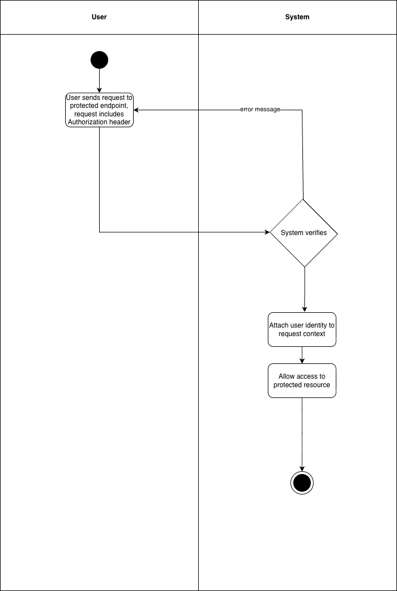

# 1 Use-Case Name
Authenticate User — Authorization Check

## 1.1 Brief Description

This use case describes how the system verifies a user’s identity using an access token (JWT) when the user attempts to access a protected resource.  
The system checks whether the token is valid, unexpired, and belongs to an existing active user.  
If authentication is successful, the request proceeds; otherwise, the system returns an error.

---

# 2 Flow of Events

## 2.1 Basic Flow
1. User sends a request to a protected API endpoint.
2. User includes an **Authorization header** containing a JWT access token:
   - `Authorization: Bearer <access_token>`
3. System extracts the token.
4. System verifies:
   - The token is syntactically valid.
   - The token signature is correct.
   - The token has not expired.
   - The token has not been revoked or blacklisted.
5. System identifies the associated user.
6. System checks if the user account is active.
7. If authentication succeeds, the system grants access to the requested resource.

### 2.1.1 Activity Diagram


### 2.1.2 Mock-up


### 2.1.2 Narrative
Every protected request must be authenticated.  
The system uses JWT to verify identity and ensure the requester is an active, legitimate user.  
If authentication fails, the system blocks access, ensuring secure operations across the platform.

---

```gherkin
Feature: Authenticate user for protected endpoints

  As a System
  I want to validate the user's identity
  So that only authorized users can access protected resources.

  Scenario: Successful authentication
    Given the user has a valid access token
    When the user sends a request to "/api/platform/courses/"
    Then the system grants access
    And the response status code should be 200

  Scenario: Missing token
    When the user sends a request without an Authorization header
    Then the status code should be 401
    And the response should contain "Authentication credentials were not provided."

  Scenario: Invalid token
    When the user sends a request with a malformed token
    Then the status code should be 401
    And the response should contain "Invalid token"

  Scenario: Expired token
    When the user sends a request with an expired access token
    Then the status code should be 401
    And the response should contain "Token has expired"
```

## 2.2 Alternative Flows

- **Missing token**  

- **Invalid token**  


- **Expired token**  


- **Inactive User**  


---

# 3 Special Requirements

- Token verification must follow **JWT security standards**.  
- Expired tokens must **not** be accepted.  
- Authentication middleware must be applied to **all protected endpoints**.  
- System clock must be synchronized for accurate token expiry checks.

---

# 4 Preconditions

- User has previously logged in and obtained a **valid access token**.  
- The request is sent to a **protected endpoint**.  

---

# 5 Postconditions

### If authentication succeeds:
- The request is processed.  
- User identity is known and attached to the request context.  

### If authentication fails:
- The request is denied.  
- No sensitive data is disclosed.  

---

# 6 Extension Points

- **Refresh Token:** User may refresh an expired access token.  
- **Role-Based Authorization:** After authentication, permissions may be checked.  
- **Logout:** Token cannot be reused.  
