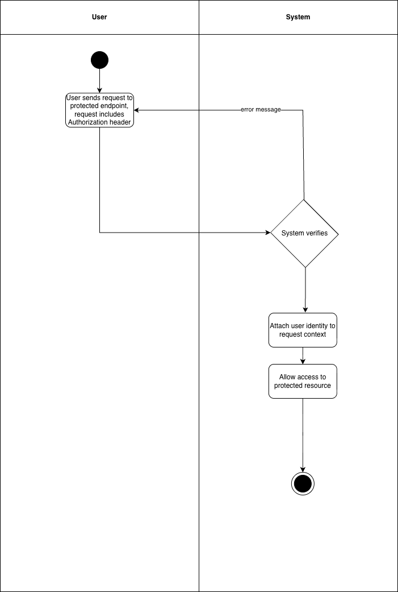

# 1 Use-Case Name: Authenticate User

Use-case: Authenticate User

## 1.1 Brief Description

This use case describes how the system verifies a user’s identity using an access token (JWT) when the user attempts to access a protected resource.  
The system checks whether the token is valid, unexpired, and belongs to an existing active user.  
If authentication is successful, the request proceeds; otherwise, the system returns an error.

---

# 2 Flow of Events

## 2.1 Basic Flow
1. User sends a request to a protected API endpoint.
2. User includes an **Authorization header** containing a JWT access token:
   - `Authorization: Bearer <access_token>`
3. System extracts the token.
4. System verifies:
   - The token is syntactically valid.
   - The token signature is correct.
   - The token has not expired.
   - The token has not been revoked or blacklisted.
5. System identifies the associated user.
6. System checks if the user account is active.
7. If authentication succeeds, the system grants access to the requested resource.

### 2.1.1 Activity Diagram


### 2.1.2 Mock-up


### 2.1.2 Narrative
Every protected request must be authenticated.  
The system uses JWT to verify identity and ensure the requester is an active, legitimate user.  
If authentication fails, the system blocks access, ensuring secure operations across the platform.

---

```gherkin
Feature: User Authentication
  As a registered user
  I want to log in and log out
  So that I can access protected resources securely

  Background:
    Given a registered user exists with email "test@example.com" and password "secret123@A"

  Scenario: Successful login
    When I send a POST request to "/api/users/auth/login/" with email "test@example.com" and password "secret123@A"
    Then the response status code should be 200
    And the response should contain "access" and "refresh" tokens

  Scenario: Failed login with invalid credentials
    When I send a POST request to "/api/users/auth/login/" with email "test@example.com" and password "wrongpass"
    Then the response status code should be 401

  Scenario: Successful logout
    Given a registered user exists with email "test@example.com" and password "secret123@A"
    Given I am logged in with email "test@example.com" and password "secret123@A"
    When I send a POST request to "/api/users/auth/logout/" with a valid refresh token
    Then the response status code should be 205
    And the response should contain "Successfully logged out"
```
[Link to feature file](https://github.com/coffee3333/erudite-django-web-app/blob/main/features/authentication.feature)

## 2.2 Alternative Flows


### Missing Token  
- The user sends a request without an Authorization header.  
- The system rejects the request.  
- The system returns HTTP 401 Unauthorized.  

### Invalid Token
- The user sends a request with a invalid token.
- The system fails validation.
- The system returns HTTP 401 Unauthorized.

### Expired Token
- The user sends a request with an expired token.
- The system detects expiration.
- The system denies access.
- The system returns HTTP 401 Unauthorized.

### Inactive User
- The token is valid but belongs to an inactive user account.
- The system denies access.
- The system returns HTTP 403 Forbidden or 401 Unauthorized.

---

# 3 Special Requirements

- Token verification must follow **JWT security standards**.  
- Expired tokens must **not** be accepted.  
- Authentication middleware must be applied to **all protected endpoints**.  
- System clock must be synchronized for accurate token expiry checks.

---

# 4 Preconditions

- User has previously logged in and obtained a **valid access token**.  
- The request is sent to a **protected endpoint**.  

---

# 5 Postconditions

### If authentication succeeds:
- The request is processed.  
- User identity is known and attached to the request context.  

### If authentication fails:
- The request is denied.  
- No sensitive data is disclosed.  

---

# 6 Extension Points

- **Refresh Token:** User may refresh an expired access token.  
- **Role-Based Authorization:** After authentication, permissions may be checked.  
- **Logout:** Token cannot be reused.  
