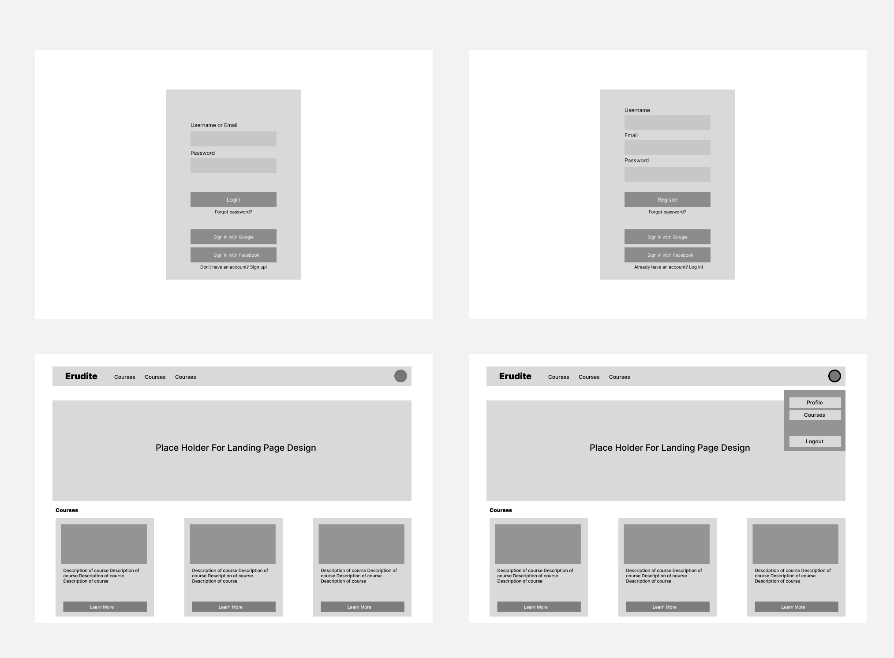

# 1 Use-Case Name: Login

Use case: User Login - Authentication

## 1.1 Brief Description

This use case describes how a User logs into the platform using their email and password.
Upon successful login, the system issues authentication tokens (JWT) that allow the user to access protected resources.

---

# 2 Flow of Events

## 2.1 Basic Flow
1. User navigates to the platform’s login page.
2. User enters:
   - Email  
   - Password  
3. User clicks **“Log In.”**
4. System validates the credentials.
5. System generates and returns:
   - Access token (JWT)
   - Refresh token
6. System logs the user in and redirects them to their dashboard.
7. System displays confirmation: **“Login successful.”**

### 2.1.1 Activity Diagram


### 2.1.2 Mock-up


### 2.1.3 Narrative
The user enters their credentials and submits the login form.  
The system verifies the email and password, and if valid, issues authentication tokens.  
The login flow grants access to personalized features such as course enrollment, challenge submissions, and topic management (for teachers).

---

```gherkin
Feature: User Authentication
  As a registered user
  I want to log in and log out
  So that I can access protected resources securely

  Background:
    Given a registered user exists with email "test@example.com" and password "secret123@A"

  Scenario: Successful login
    When I send a POST request to "/api/users/auth/login/" with email "test@example.com" and password "secret123@A"
    Then the response status code should be 200
    And the response should contain "access" and "refresh" tokens

  Scenario: Failed login with invalid credentials
    When I send a POST request to "/api/users/auth/login/" with email "test@example.com" and password "wrongpass"
    Then the response status code should be 401

  Scenario: Successful logout
    Given a registered user exists with email "test@example.com" and password "secret123@A"
    Given I am logged in with email "test@example.com" and password "secret123@A"
    When I send a POST request to "/api/users/auth/logout/" with a valid refresh token
    Then the response status code should be 205
    And the response should contain "Successfully logged out"
```
[Link to feature file](https://github.com/coffee3333/erudite-django-web-app/blob/main/features/authentication.feature)

## 2.2 Alternative Flows

- **Invalid credentials**

- **Account not verified**

- **User not found**

- **Missing fields**

---

# 3 Special Requirements

- Login must include security controls.
- Tokens must be generated securely.

---

# 4 Preconditions

- User has a registered and active account.
- User’s email is verified.
- User provides email and password.

---

# 5 Postconditions

- User is authenticated and receives valid JWT tokens.
- User is redirected to their dashboard.
---

# 6 Extension Points

- **Password Reset:** User can request a password reset if login fails.
- **OAuth Login**
