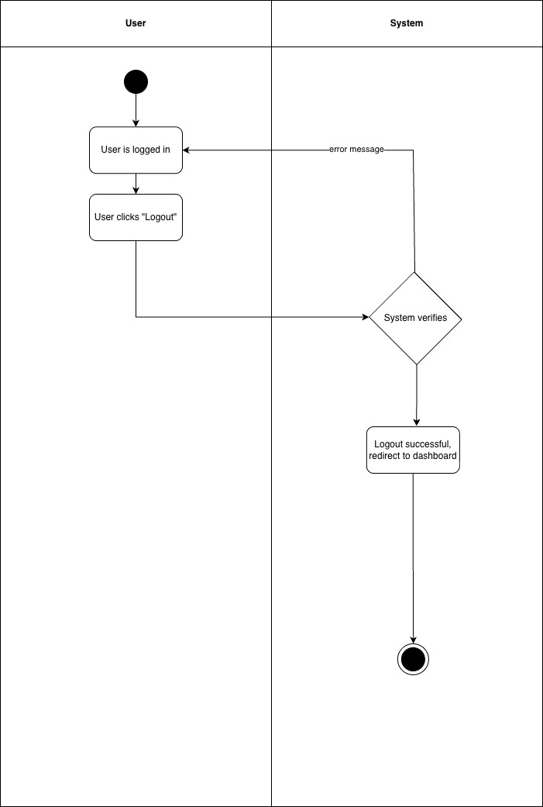
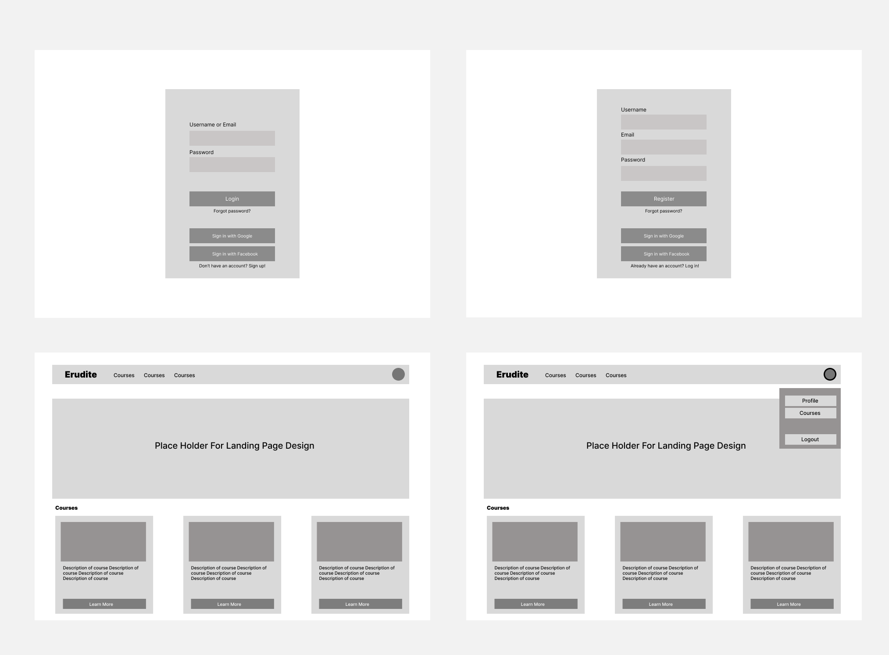

# 1 Use-Case Name
User Logout — Authentication

## 1.1 Brief Description

This use case describes how an authenticated User logs out of the platform.


---

# 2 Flow of Events

## 2.1 Basic Flow
1. User is logged into the platform.
2. User clicks **“Log Out.”**
3. System receives the logout request.
4. System invalidates:
   - Access token  
   - Refresh token  
6. System redirects the user to the homepage or login page.
7. System displays confirmation.

### 2.1.1 Activity Diagram


### 2.1.2 Mock-up


### 2.1.3 Narrative
The user initiates the logout action from any part of the platform.  
Once complete, the user is redirected and no longer has access to protected resources.

---

```gherkin
Feature: User Logout

  As an authenticated User
  I want to log out of the platform
  So that I can end my active session securely.

  Background:
    Given I am logged in with a valid access token

  Scenario: Successful logout
    When I send a POST request to "/api/auth/logout/"
    Then the response status code should be 200
    And the response should contain "Logged out successfully"

  Scenario: Logout with invalid or expired token
    When I send a POST request to "/api/auth/logout/" with an expired token
    Then the response status code should be 401
    And the response should contain "Invalid or expired token"

  Scenario: Logout without authentication
    When I send a POST request to "/api/auth/logout/" without a token
    Then the response status code should be 401
    And the response should contain "Authentication credentials were not provided"
```

## 2.2 Alternative Flows

- **Invalid or expired token**

- **User already logged out**

---

# 3 Special Requirements

- Logout must invalidate both **access** and **refresh** tokens.  
- Session cookies must be cleared for web-based authentication.  


---

# 4 Preconditions

- User is logged in with a valid token.  

---

# 5 Postconditions

- User’s tokens are invalidated and cannot be reused.  
- User is redirected to the login page or homepage.  
- User is no longer authenticated.  

---

# 6 Extension Points

- **Refresh Token:** User may request a new token before logging out (optional).  
- **Login:** User can log back in after logout.  

