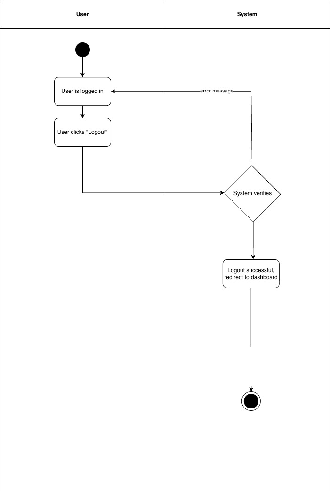

# 1 Use-Case Name: Logout
Use-case: User Logout - Authentication

## 1.1 Brief Description

This use case describes how an authenticated User logs out of the platform.


---

# 2 Flow of Events

## 2.1 Basic Flow
1. User is logged into the platform.
2. User clicks **“Log Out.”**
3. System receives the logout request.
4. System invalidates:
   - Access token  
   - Refresh token  
6. System redirects the user to the homepage or login page.
7. System displays confirmation.

### 2.1.1 Activity Diagram


### 2.1.2 Mock-up


### 2.1.3 Narrative
The user initiates the logout action from any part of the platform.  
Once complete, the user is redirected and no longer has access to protected resources.

---

```gherkin
Feature: User Authentication
  As a registered user
  I want to log in and log out
  So that I can access protected resources securely

  Background:
    Given a registered user exists with email "test@example.com" and password "secret123@A"

  Scenario: Successful login
    When I send a POST request to "/api/users/auth/login/" with email "test@example.com" and password "secret123@A"
    Then the response status code should be 200
    And the response should contain "access" and "refresh" tokens

  Scenario: Failed login with invalid credentials
    When I send a POST request to "/api/users/auth/login/" with email "test@example.com" and password "wrongpass"
    Then the response status code should be 401

  Scenario: Successful logout
    Given a registered user exists with email "test@example.com" and password "secret123@A"
    Given I am logged in with email "test@example.com" and password "secret123@A"
    When I send a POST request to "/api/users/auth/logout/" with a valid refresh token
    Then the response status code should be 205
    And the response should contain "Successfully logged out"
```
[Link to feature file](https://github.com/coffee3333/erudite-django-web-app/blob/main/features/authentication.feature)

## 2.2 Alternative Flows

- **Invalid or expired token**

- **User already logged out**

---

# 3 Special Requirements

- Logout must invalidate both **access** and **refresh** tokens.  
- Session cookies must be cleared for web-based authentication.  


---

# 4 Preconditions

- User is logged in with a valid token.  

---

# 5 Postconditions

- User’s tokens are invalidated and cannot be reused.  
- User is redirected to the login page or homepage.  
- User is no longer authenticated.  

---

# 6 Extension Points

- **Refresh Token:** User may request a new token before logging out (optional).  
- **Login:** User can log back in after logout.  

