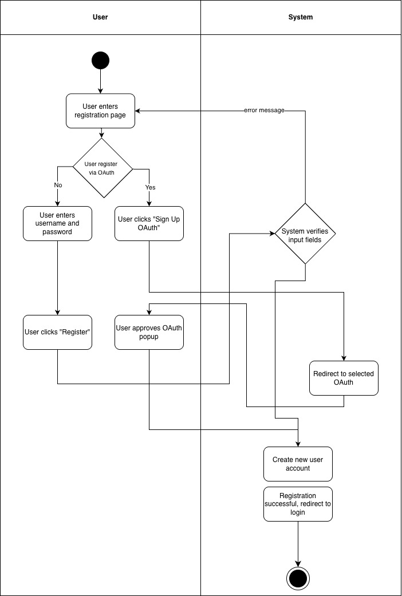

# 1 Use-Case Name
User Registration — Authentication (Create Account)

## 1.1 Brief Description

This use case describes how a new User creates an account on the platform.

---

# 2 Flow of Events

## 2.1 Basic Flow
1. User navigates to the **Registration** page.
2. User enters the required fields:
   - Email  
   - Password  
3. User clicks **“Register”**.
4. System validates the input fields.
5. System checks whether the email is already in use.
6. System creates a new user account in the database with:
   - status = *unverified*
8. System displays confirmation

### 2.1.1 Activity Diagram


### 2.1.2 Mock-up


### 2.1.3 Narrative
The User fills out the registration form with an email and password.  
The system ensures the data is valid and that the email is not already used.  
A new unverified account is created.

---

```gherkin
Feature: User Registration

  As a new User
  I want to create an account
  So that I can log in and access learning features.

  Scenario: Successful registration
    When I send a POST request to "/api/auth/register/" with:
        | email    | newuser@example.com |
        | password | strongPassword123   |
    Then the response status code should be 201
    And the response should contain "Verification email sent"

  Scenario: Registration fails with existing email
    When I send a POST request to "/api/auth/register/" with:
        | email    | existing@example.com |
        | password | strongPassword123    |
    Then the response status code should be 400
    And the response should contain "Email already in use"

  Scenario: Registration fails with invalid fields
    When I send a POST request to "/api/auth/register/" with:
        | email    | not-an-email |
        | password | short        |
    Then the response status code should be 400
    And the response should contain "Invalid email" or "Password too short"
```

## 2.2 Alternative Flows

- **Email already in use** 

- **Invalid email format**

- **Weak password**

- **Email sending failure**

---

# 3 Special Requirements

- Registration form must follow security rules.

---

# 4 Preconditions

- User is **not logged in**.
- User provides a **valid email and password**.

---

# 5 Postconditions

- A new user account is created with **unverified** status.

---

# 6 Extension Points

- **Login:** User logs in after successful verification.
