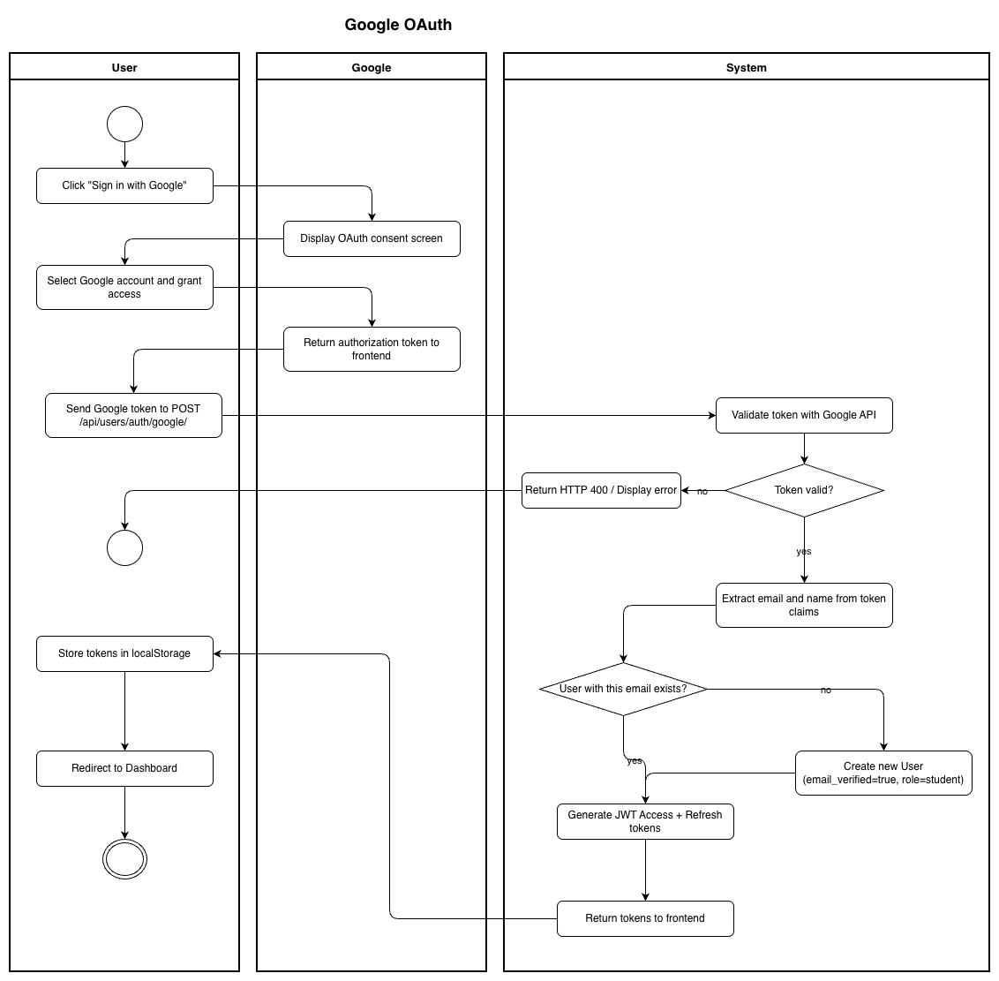
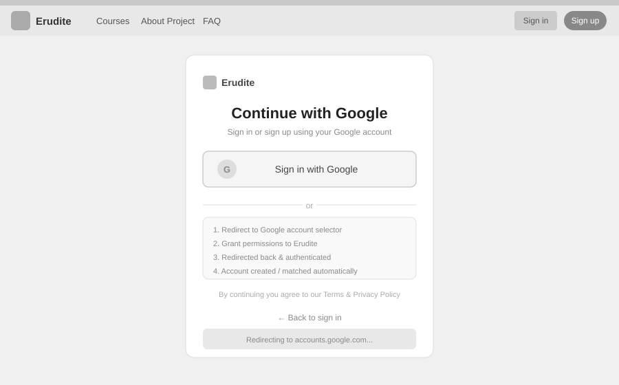

# Use-Case Name: Google OAuth Sign-In

Use-case: Sign In with Google - Authentication

## 1. Brief Description

A user can sign in to Erudite using their Google account instead of registering with email and password. The frontend exchanges a Google OAuth token with the backend, which either creates a new account or logs in an existing one.

---

## 2. Basic Flow

1. User clicks **"Sign in with Google"** on the login or registration page.
2. Google's OAuth consent screen opens.
3. User selects their Google account and grants access.
4. Google returns an authorization token to the frontend.
5. Frontend sends `POST /api/users/auth/google/` with the Google token.
6. Backend validates the token with Google and extracts user info (email, name).
7. If no account with that email exists → a new account is created with `email_verified = true`.
8. If an account already exists → the user is logged in.
9. Backend returns JWT access and refresh tokens.
10. User is redirected to the dashboard.

### 2.1 Activity Diagram



### 2.2 Mock-up



### 2.3 Alternate Flows

- **Google token invalid:** System returns HTTP 400; user is shown an error message.
- **Email already registered with password:** System may link the accounts or prompt the user to log in normally.

### 2.2 Narrative

```gherkin
Feature: Google OAuth Sign-In
  As a user
  I want to sign in using my Google account
  So that I don't need to manage a separate password

  Scenario: New user signs in with Google
    Given I am on the login page
    When I click "Sign in with Google" and complete Google's consent
    And the frontend sends my Google token to "/api/users/auth/google/"
    Then a new account is created with my Google email
    And I receive JWT tokens
    And I am redirected to the dashboard

  Scenario: Existing user signs in with Google
    Given I already have an account with the same email as my Google account
    When I complete the Google OAuth flow
    Then I am logged in to my existing account
    And I receive JWT tokens
```

---

## 3. Preconditions

- User has a valid Google account.
- The Google OAuth application is configured in the backend.

## 4. Postconditions

- User is authenticated with JWT tokens.
- If new: a User record is created with `email_verified = true`, `role = student`.
- If existing: the user's session is started.

## 5. Exceptions

- **Google service unavailable:** User is shown a fallback error and can use email/password login instead.

## 6. Link to SRS

[Software Requirements Specification](../../Documents/SoftwareRequirementsSpecification.md)

## 7. Function Points

Function Points are tracked at **group level** for Erudite because the project contains many small, structurally similar Use Cases. Grouping produces a more reliable FP vs Time correlation (R² = 0.67) and matches the Berkling UCL methodology.

This Use Case belongs to group **`authentication_authorisation`** (AFP = **73 (Week 20 actual)**).

| Attribute | Value |
|---|---|
| **Group** | `authentication_authorisation` |
| **UCs in group** | Register, Login, Logout, AuthenticateUser, ChangePassword, GoogleOAuth, ResetPassword, VerifyEmail |
| **Group AFP** | 73 (Week 20 actual) |
| **Full FP breakdown** | [UCs/FUNCTION_POINTS.md](../FUNCTION_POINTS.md) |
