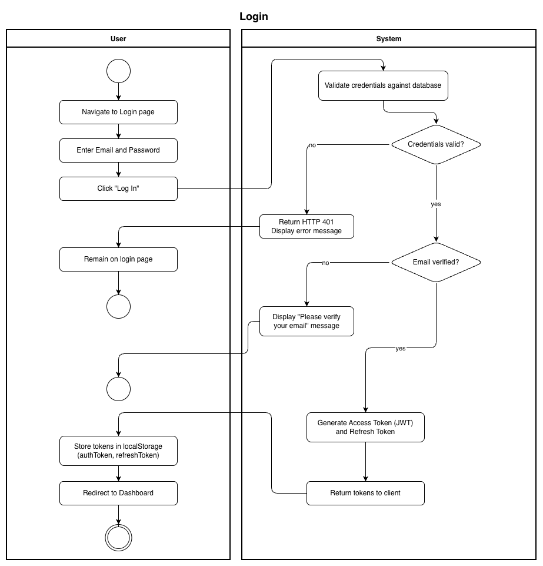
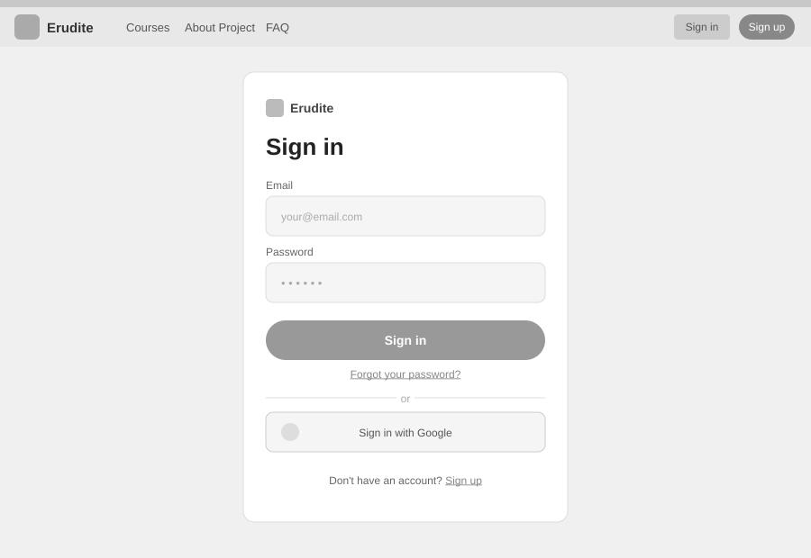

# Use-Case Name: Login

Use-case: User Login — Authentication

## 1. Brief Description

A registered user logs into the Erudite platform using their email and password. On success, the system issues a JWT access token and a refresh token, granting access to protected resources. Google OAuth is supported as an alternative sign-in method.

---

## 2. Basic Flow

1. User navigates to the **Login** page.
2. User enters:
   - Email
   - Password
3. User clicks **"Log In"**.
4. System validates credentials against the database.
5. System confirms the account's email is verified.
6. System generates and returns:
   - Access token (short-lived JWT)
   - Refresh token (long-lived JWT)
7. Tokens are stored in the browser's `localStorage` (`authToken`, `refreshToken`).
8. User is redirected to the dashboard.

### 2.1 Activity Diagram



### 2.2 Mock-up



### 2.3 Alternate Flows

- **Invalid credentials:** System returns HTTP 401 and displays an error message; user remains on the login page.
- **Unverified email:** System prompts the user to verify their email before logging in.
- **Google OAuth:** User clicks "Sign in with Google", exchanges the Google token at `POST /api/users/auth/google/`, and receives JWT tokens.
- **Token expiry during session:** The API client silently refreshes the access token via `POST /api/users/token/refresh/`.

### 2.4 Narrative

```gherkin
Feature: User Login
  As a registered user
  I want to log in to the platform
  So that I can access courses, challenges, and my profile

  Background:
    Given a registered and email-verified user exists with email "student@example.com" and password "Secret!99"

  Scenario: Successful login
    Given I am on the login page
    When I enter "student@example.com" and "Secret!99"
    And I click "Log In"
    Then I receive an access token and a refresh token
    And I am redirected to the dashboard

  Scenario: Login with invalid credentials
    Given I am on the login page
    When I enter "student@example.com" and "WrongPass"
    And I click "Log In"
    Then I see an error message
    And I remain on the login page

  Scenario: Login with unverified email
    Given a registered user exists whose email is not verified
    When I attempt to log in with their credentials
    Then I see a message asking me to verify my email first
```

[Link to feature file](https://github.com/coffee3333/erudite-django-web-app/blob/main/features/authentication.feature)

---

## 3. Preconditions

- User has a registered and active account.
- User's email is verified (`email_verified = true`).
- The login page is accessible.

## 4. Postconditions

- User is authenticated and holds valid JWT tokens.
- User is redirected to their role-specific dashboard.
- The refresh token can be used to obtain new access tokens without re-login.

## 5. Exceptions

- **Account not found:** System returns an appropriate error.
- **System failure:** If the auth service is unavailable, the user is notified to try again.

## 6. Link to SRS

[Software Requirements Specification](../../Documents/SoftwareRequirementsSpecification.md)

## 7. Function Points

Function Points are tracked at **group level** for Erudite because the project contains many small, structurally similar Use Cases. Grouping produces a more reliable FP vs Time correlation (R² = 0.67) and matches the Berkling UCL methodology.

This Use Case belongs to group **`authentication_authorisation`** (AFP = **73 (Week 20 actual)**).

| Attribute | Value |
|---|---|
| **Group** | `authentication_authorisation` |
| **UCs in group** | Register, Login, Logout, AuthenticateUser, ChangePassword, GoogleOAuth, ResetPassword, VerifyEmail |
| **Group AFP** | 73 (Week 20 actual) |
| **Full FP breakdown** | [UCs/FUNCTION_POINTS.md](../FUNCTION_POINTS.md) |
