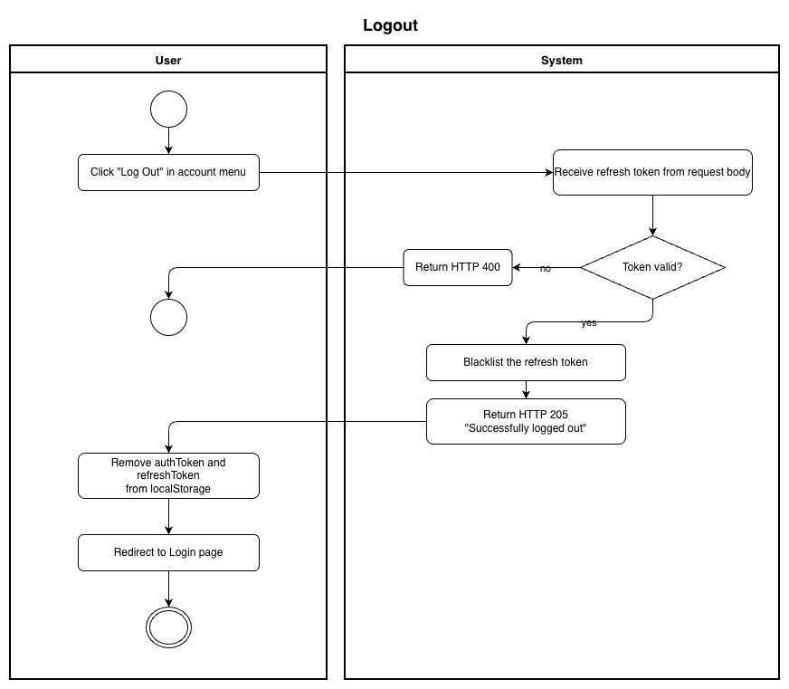
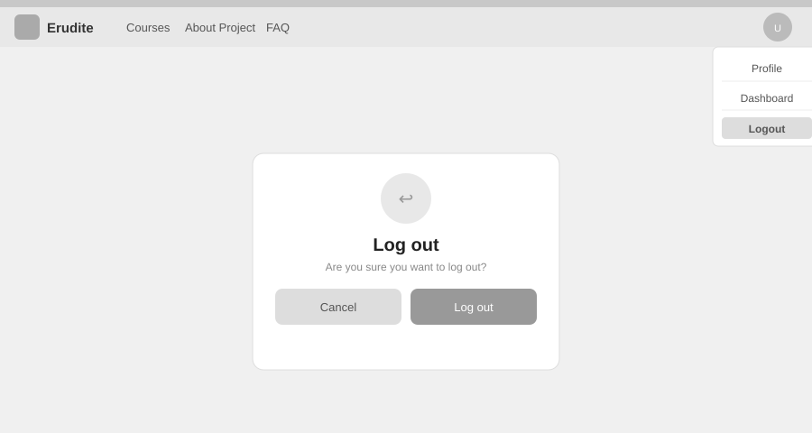

# Use-Case Name: Logout

Use-case: User Logout — Authentication

## 1. Brief Description

An authenticated user ends their session on the Erudite platform. The system invalidates the refresh token server-side, preventing it from being reused to obtain new access tokens.

---

## 2. Basic Flow

1. User is logged in and navigates to the **account menu**.
2. User clicks **"Log Out"**.
3. System sends the current refresh token to `POST /api/users/auth/logout/`.
4. System blacklists the refresh token, rendering it invalid.
5. Frontend removes `authToken` and `refreshToken` from `localStorage`.
6. User is redirected to the login page or homepage.
7. System displays a confirmation: **"Successfully logged out."**

### 2.1 Activity Diagram



### 2.2 Mock-up



### 2.3 Alternate Flows

- **Invalid or expired token:** System returns HTTP 400; frontend clears local storage anyway and redirects to login.
- **User already logged out:** Attempting logout with a blacklisted token returns an error, but the frontend still clears state.

### 2.4 Narrative

```gherkin
Feature: User Logout
  As a logged-in user
  I want to log out
  So that my session is securely ended

  Background:
    Given I am logged in with email "student@example.com" and password "Secret!99"

  Scenario: Successful logout
    When I click the "Log Out" button
    And I send a POST request to "/api/users/auth/logout/" with my refresh token
    Then the response status code is 205
    And the response contains "Successfully logged out"
    And my tokens are removed from localStorage
    And I am redirected to the login page

  Scenario: Logout with already-invalidated token
    Given my refresh token has already been blacklisted
    When I send a POST request to "/api/users/auth/logout/"
    Then the response status code is 400
    And the frontend still clears my local session
```

[Link to feature file](https://github.com/coffee3333/erudite-django-web-app/blob/main/features/authentication.feature)

---

## 3. Preconditions

- User is logged in with a valid access and refresh token.

## 4. Postconditions

- The refresh token is blacklisted and cannot generate new access tokens.
- `authToken` and `refreshToken` are removed from the browser's `localStorage`.
- The user is no longer authenticated.

## 5. Exceptions

- **Network failure:** If the logout request fails, the frontend still clears local tokens to protect the user.

## 6. Link to SRS

[Software Requirements Specification](../../Documents/SoftwareRequirementsSpecification.md)
