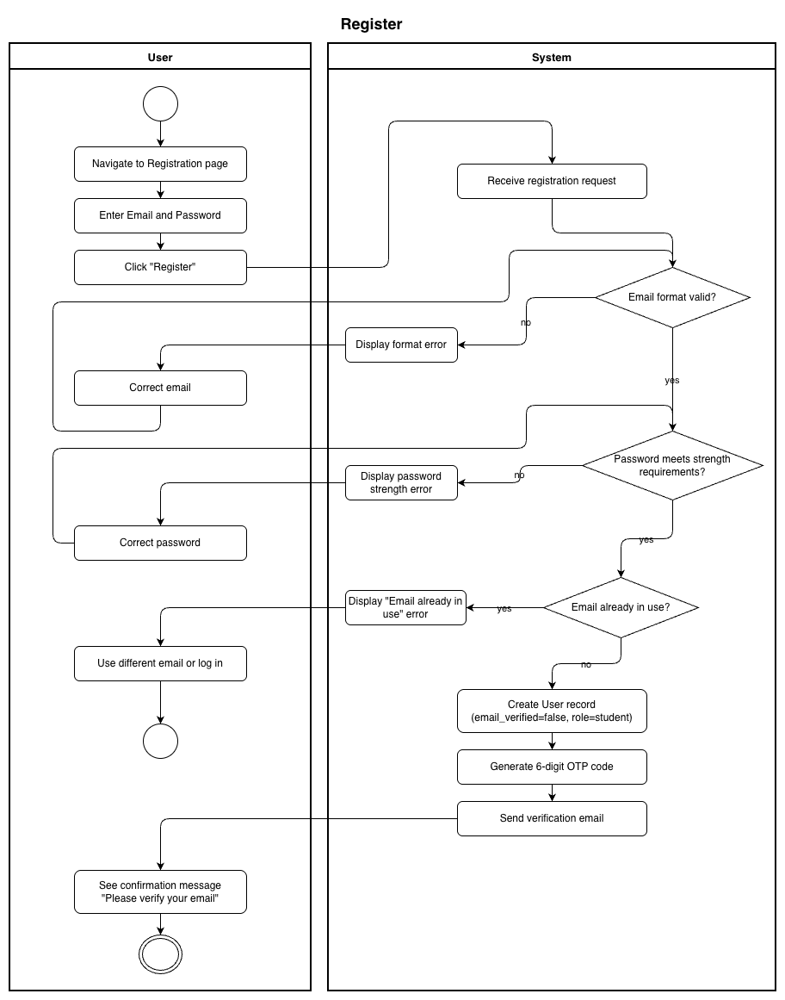
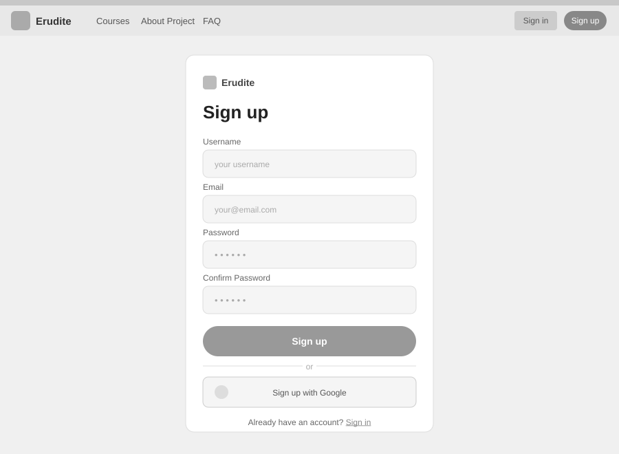

# Use-Case Name: Register

Use-case: User Registration — Authentication | CRUD: Create

## 1. Brief Description

A new user creates an account on the Erudite platform by providing an email and password. The system validates the input, checks for uniqueness, and creates an unverified account. The user must then verify their email before accessing protected features.

---

## 2. Basic Flow

1. User navigates to the **Registration** page.
2. User fills in the following fields:
   - Email
   - Password
3. User clicks **"Register"**.
4. System validates the input:
   - Email format is valid.
   - Password meets strength requirements.
   - Email is not already in use.
5. System creates a new user account with `email_verified = false`.
6. System sends a 6-digit verification code to the provided email.
7. System displays a confirmation message and prompts the user to verify their email.

### 2.1 Activity Diagram



### 2.2 Mock-up



### 2.3 Alternate Flows

- **Email already in use:** System displays an error and asks the user to use a different email or log in.
- **Invalid email format:** System displays a field-level validation error.
- **Weak password:** System displays password strength requirements.
- **Email delivery failure:** System notifies the user and offers to resend the verification code.

### 2.4 Narrative

```gherkin
Feature: User Registration
  As a new visitor
  I want to create an account
  So that I can access courses and challenges on the platform

  Scenario: Successful registration
    Given I am on the registration page and not logged in
    When I enter "newuser@example.com" in the Email field
    And I enter "SecurePass!1" in the Password field
    And I click the "Register" button
    Then a new unverified account is created
    And a verification email is sent to "newuser@example.com"
    And I see a confirmation message

  Scenario: Registration with an already-used email
    Given I am on the registration page
    When I enter "existing@example.com" in the Email field
    And I enter "SecurePass!1" in the Password field
    And I click "Register"
    Then I see an error message indicating the email is already in use
    And no new account is created

  Scenario: Registration with a weak password
    Given I am on the registration page
    When I enter "newuser@example.com" in the Email field
    And I enter "123" in the Password field
    And I click "Register"
    Then I see a password strength error
    And I remain on the registration page
```

[Link to feature file](https://github.com/coffee3333/erudite-django-web-app/blob/main/features/authentication.feature)

---

## 3. Preconditions

- User is not logged in.
- User provides a valid, previously unused email.
- The registration page is accessible and the backend service is running.

## 4. Postconditions

- A new `User` record is created in the database with `email_verified = false` and `role = student`.
- A verification email containing a 6-digit OTP code is sent.
- The account cannot access protected endpoints until email is verified.

## 5. Exceptions

- **System failure:** If account creation fails due to a server error, the user is notified to try again.
- **Email rate-limit:** Repeated registration attempts from the same IP may be throttled.

## 6. Link to SRS

[Software Requirements Specification](../../Documents/SoftwareRequirementsSpecification.md)

## 7. CRUD Classification

- **Create** — creates a new User record.

## 8. Function Points

Function Points are tracked at **group level** for Erudite because the project contains many small, structurally similar Use Cases. Grouping produces a more reliable FP vs Time correlation (R² = 0.67) and matches the Berkling UCL methodology.

This Use Case belongs to group **`authentication_authorisation`** (AFP = **73 (Week 20 actual)**).

| Attribute | Value |
|---|---|
| **Group** | `authentication_authorisation` |
| **UCs in group** | Register, Login, Logout, AuthenticateUser, ChangePassword, GoogleOAuth, ResetPassword, VerifyEmail |
| **Group AFP** | 73 (Week 20 actual) |
| **Full FP breakdown** | [UCs/FUNCTION_POINTS.md](../FUNCTION_POINTS.md) |
