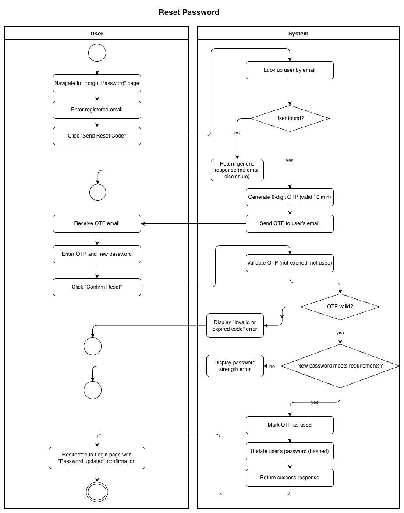
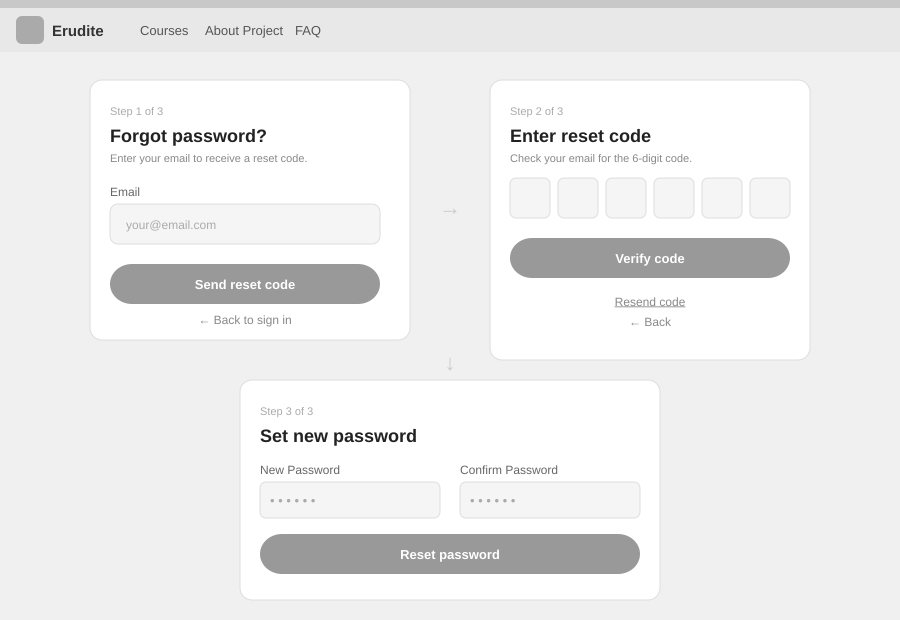

# Use-Case Name: Reset Password

Use-case: Password Reset via OTP — Authentication

## 1. Brief Description

A user who has forgotten their password can request a one-time password (OTP) reset code sent to their registered email. After entering the code, the user sets a new password. The OTP is valid for 10 minutes and can only be used once.

---

## 2. Basic Flow

1. User navigates to the **"Forgot Password"** page.
2. User enters their registered email address.
3. User clicks **"Send Reset Code"**.
4. System sends `POST /api/users/auth/password/reset/request/` with the email.
5. System generates a 6-digit OTP, stores it, and emails it to the user.
6. User enters the OTP code and a new password.
7. User clicks **"Confirm Reset"**.
8. System sends `POST /api/users/auth/password/reset/confirm/` with the OTP and new password.
9. System validates the OTP (not expired, not used).
10. System updates the user's password.
11. System marks the OTP as used.
12. User is redirected to the login page with a success message.

### 2.1 Activity Diagram



### 2.2 Mock-up



### 2.3 Alternate Flows

- **Email not found:** System returns an error without revealing whether the email exists (security measure).
- **Expired OTP:** System returns an error; user must request a new code.
- **OTP already used:** System rejects the request.
- **Weak new password:** System returns a validation error.

### 2.2 Narrative

```gherkin
Feature: Password Reset
  As a user who forgot my password
  I want to reset it using a one-time code
  So that I can regain access to my account

  Scenario: Successful password reset
    Given I am on the "Forgot Password" page
    When I enter "user@example.com" and click "Send Reset Code"
    Then a 6-digit OTP is sent to "user@example.com"
    When I enter the OTP and a new password "NewSecure!1"
    And I click "Confirm Reset"
    Then my password is updated
    And I am redirected to the login page

  Scenario: Reset with expired OTP
    Given I received an OTP more than 10 minutes ago
    When I submit it with a new password
    Then I receive an error "OTP has expired"
    And I can request a new code
```

---

## 3. Preconditions

- User has a registered account with a verified email.
- User is not currently logged in (or the session is expired).

## 4. Postconditions

- The user's password is updated in the database.
- The OTP is marked as `is_used = true` and cannot be reused.
- Any existing active sessions remain valid (tokens are not invalidated on password reset).

## 5. Exceptions

- **Email service unavailable:** User is notified to try again later.

## 6. Link to SRS

[Software Requirements Specification](../../Documents/SoftwareRequirementsSpecification.md)

## 7. Function Points

Function Points are tracked at **group level** for Erudite because the project contains many small, structurally similar Use Cases. Grouping produces a more reliable FP vs Time correlation (R² = 0.67) and matches the Berkling UCL methodology.

This Use Case belongs to group **`authentication_authorisation`** (AFP = **73 (Week 20 actual)**).

| Attribute | Value |
|---|---|
| **Group** | `authentication_authorisation` |
| **UCs in group** | Register, Login, Logout, AuthenticateUser, ChangePassword, GoogleOAuth, ResetPassword, VerifyEmail |
| **Group AFP** | 73 (Week 20 actual) |
| **Full FP breakdown** | [UCs/FUNCTION_POINTS.md](../FUNCTION_POINTS.md) |
