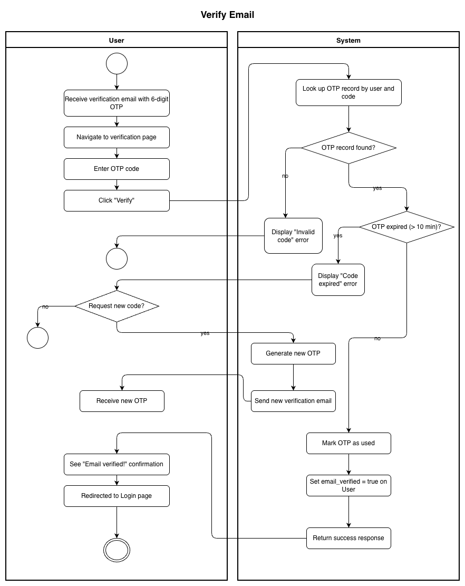
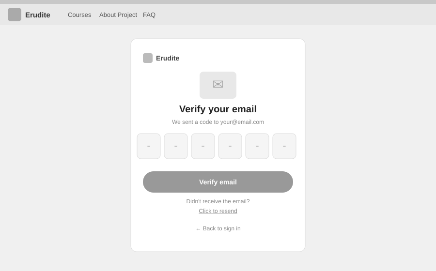

# Use-Case Name: Verify Email

Use-case: Email Verification — Authentication

## 1. Brief Description

After registration, a user must verify their email address using a 6-digit OTP code sent by the system. Until verified, the user cannot log in or access protected resources. The user may request a new code if the original expires.

---

## 2. Basic Flow

1. After registering, the user receives a 6-digit verification code via email.
2. User navigates to the **email verification** prompt.
3. User enters the 6-digit code.
4. User submits by clicking **"Verify"**.
5. System sends `POST /api/users/users/me/email/verify/confirm/` with the code.
6. System checks that the code is valid, unused, and not expired (10-minute window).
7. System sets `email_verified = true` on the user account.
8. User is notified of successful verification and prompted to log in.

### 2.1 Activity Diagram



### 2.2 Mock-up



### 2.3 Alternate Flows

- **Expired code:** System returns an error; user can request a new code via `POST /api/users/users/me/email/verify/request/`.
- **Wrong code:** System returns a validation error; user may retry.
- **Already verified:** System informs the user their email is already verified.

### 2.2 Narrative

```gherkin
Feature: Email Verification
  As a newly registered user
  I want to verify my email address
  So that I can activate my account and log in

  Scenario: Successful email verification
    Given I have registered with email "newuser@example.com"
    And I have received a verification code "123456"
    When I submit the code to "/api/users/users/me/email/verify/confirm/"
    Then my account is marked as verified
    And I can now log in

  Scenario: Verification with expired code
    Given my verification code has expired (older than 10 minutes)
    When I submit the expired code
    Then I receive an error message
    And I can request a new code

  Scenario: Request a new verification code
    Given my email is not yet verified
    When I send a POST request to "/api/users/users/me/email/verify/request/"
    Then a new 6-digit code is sent to my email
```

---

## 3. Preconditions

- User has completed registration.
- User has access to the email inbox used during registration.

## 4. Postconditions

- `email_verified = true` is set on the user record.
- The OTP record is marked as `is_used = true`.
- User can now log in and access protected features.

## 5. Exceptions

- **Email delivery failure:** User can request a resend.
- **Code exhausted:** If too many failed attempts, the code is invalidated.

## 6. Link to SRS

[Software Requirements Specification](../../Documents/SoftwareRequirementsSpecification.md)

## 7. Function Points

Function Points are tracked at **group level** for Erudite because the project contains many small, structurally similar Use Cases. Grouping produces a more reliable FP vs Time correlation (R² = 0.67) and matches the Berkling UCL methodology.

This Use Case belongs to group **`authentication_authorisation`** (AFP = **73 (Week 20 actual)**).

| Attribute | Value |
|---|---|
| **Group** | `authentication_authorisation` |
| **UCs in group** | Register, Login, Logout, AuthenticateUser, ChangePassword, GoogleOAuth, ResetPassword, VerifyEmail |
| **Group AFP** | 73 (Week 20 actual) |
| **Full FP breakdown** | [UCs/FUNCTION_POINTS.md](../FUNCTION_POINTS.md) |
