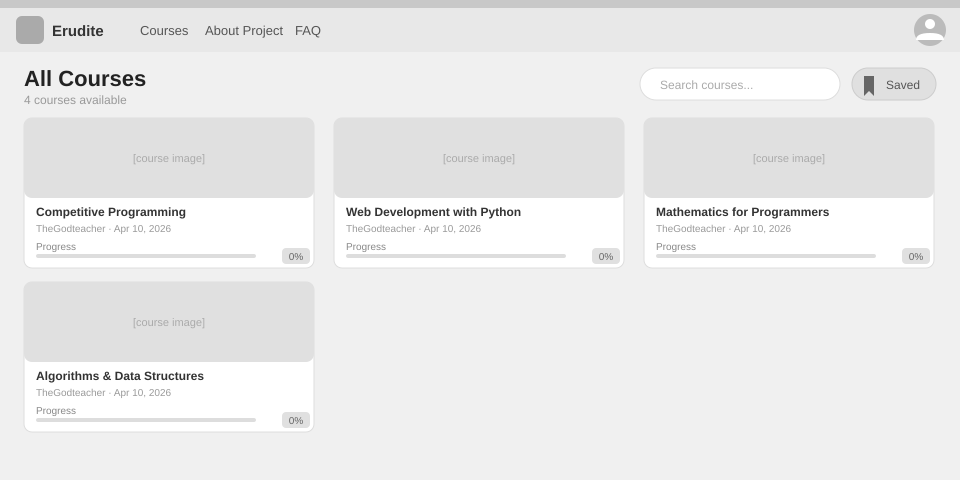
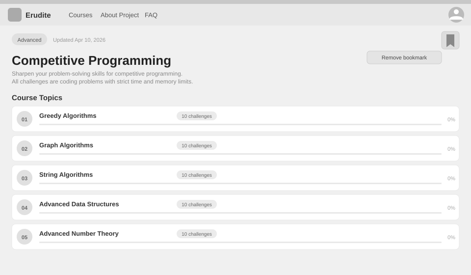

# Use-Case Name: Bookmark Course

Use-case: Bookmark / Save a Course

## 1. Brief Description

A logged-in user bookmarks a course to save it for later. Bookmarking is a toggle — calling the endpoint a second time removes the bookmark. The user can view all their bookmarked courses on their profile and on the Courses page via the "Saved" filter.

---

## 2. Basic Flow

### 2A — Toggle Bookmark

1. User is on a course detail page.
2. User clicks the **bookmark icon** (star/ribbon).
3. System sends `POST /api/platform/courses/<slug>/bookmark/`.
4. If no bookmark exists → system creates a `CourseBookmark` record.
5. If a bookmark already exists → system deletes it.
6. System returns `{ "bookmarked": true }` or `{ "bookmarked": false }`.
7. The bookmark icon updates to reflect the new state.

### 2B — View Bookmarked Courses

1. User navigates to the Courses page and clicks **"Saved"**.
2. System sends `GET /api/platform/courses/bookmarked/`.
3. System returns the list of courses the user has bookmarked.
4. User can also see their bookmarks in the **My Profile** page under the "Saved Courses" section.

### 2.1 Activity Diagram


### 2.2 Mock-up

**All Courses page** (with "Saved" filter button):


**Course detail page** (with bookmark toggle + tooltip):


### 2.3 Alternate Flows

- **Not authenticated:** Bookmark button is hidden; attempting the API call returns HTTP 401.
- **Course not found:** HTTP 404.

### 2.2 Narrative

```gherkin
Feature: Bookmark Course
  As a logged-in user
  I want to bookmark courses
  So that I can find them quickly later

  Background:
    Given I am logged in as a student

  Scenario: Bookmark a course
    Given I am on the detail page for course "intro-to-python"
    When I click the bookmark icon
    Then the response contains "bookmarked: true"
    And the icon changes to a filled state

  Scenario: Remove a bookmark
    Given I have already bookmarked "intro-to-python"
    When I click the bookmark icon again
    Then the response contains "bookmarked: false"
    And the icon changes to an empty state

  Scenario: View saved courses
    Given I have bookmarked 3 courses
    When I send a GET request to "/api/platform/courses/bookmarked/"
    Then I receive a list of 3 courses
```

---

## 3. Preconditions

- User is authenticated (any role).
- The course exists.

## 4. Postconditions

- **Bookmarked:** A `CourseBookmark` record exists for `(user, course)`.
- **Unbookmarked:** The `CourseBookmark` record is deleted.

## 5. Exceptions

- **Course not found:** HTTP 404.

## 6. Link to SRS

[Software Requirements Specification](../../Documents/SoftwareRequirementsSpecification.md)

## 7. Function Points

Function Points are tracked at **group level** for Erudite because the project contains many small, structurally similar Use Cases. Grouping produces a more reliable FP vs Time correlation (R² = 0.67) and matches the Berkling UCL methodology.

This Use Case belongs to group **`bookmarks`** (AFP = **13.26 (UFP × VAF 1.02)**).

| Attribute | Value |
|---|---|
| **Group** | `bookmarks` |
| **UCs in group** | BookmarkCourse |
| **Group AFP** | 13.26 (UFP × VAF 1.02) |
| **Full FP breakdown** | [UCs/FUNCTION_POINTS.md](../FUNCTION_POINTS.md) |
