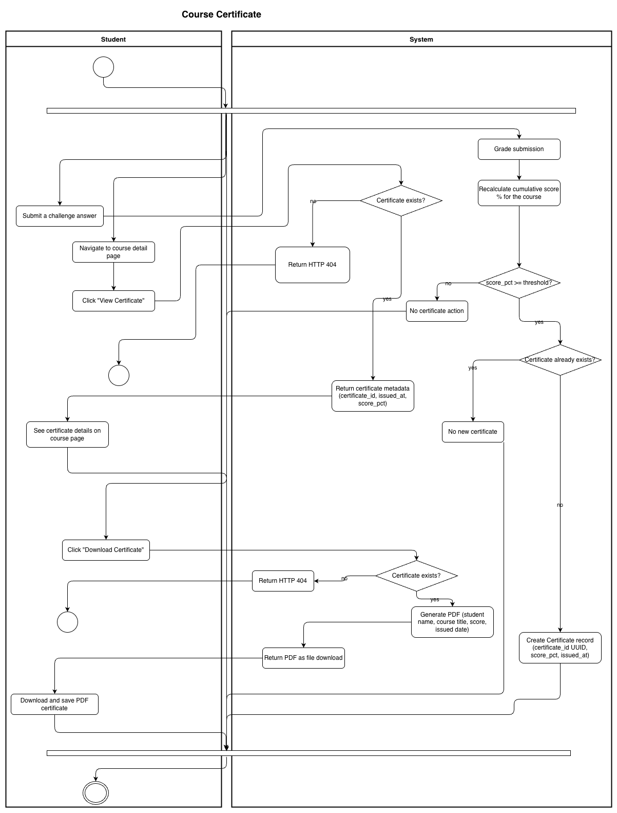
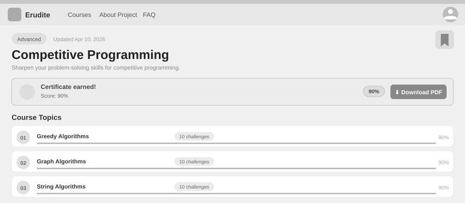
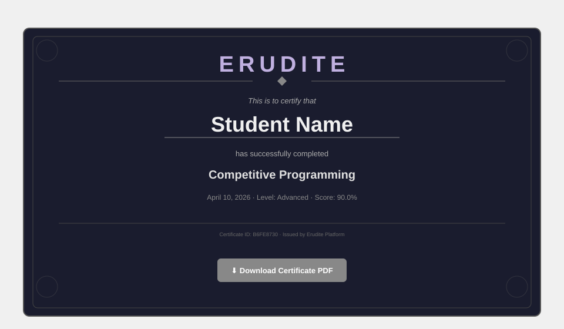

# Use-Case Name: Course Certificate

Use-case: View and Download Course Completion Certificate

## 1. Brief Description

When a student's cumulative score across all challenges in a course reaches the course's `completion_threshold` (default 80%), the system automatically issues a completion certificate. The student can view the certificate details and download it as a PDF.

---

## 2. Basic Flow

### 2A — Auto-Issuance (triggered by Submit Challenge)

1. Student submits a challenge and passes.
2. System recalculates the student's cumulative score percentage for the course.
3. If `score_pct >= completion_threshold`:
   - System creates a `Certificate` record with `certificate_id` (UUID) and `score_pct`.
4. System includes certificate info in the submission response.

### 2B — View Certificate

1. Student navigates to the course detail page.
2. Student clicks **"View Certificate"**.
3. System sends `GET /api/platform/courses/<slug>/certificate/`.
4. System returns certificate metadata: `certificate_id`, `issued_at`, `score_pct`.

### 2C — Download Certificate

1. Student clicks **"Download Certificate"**.
2. System sends `GET /api/platform/courses/<slug>/certificate/download/`.
3. System generates a PDF certificate with the student's name, course title, score, and issuance date.
4. PDF is returned as a file download.

### 2.1 Activity Diagram



### 2.2 Mock-up

**Course detail page — certificate earned banner with download button:**


**Generated PDF certificate layout:**


### 2.3 Alternate Flows

- **Certificate not yet earned:** HTTP 404 — student has not reached the completion threshold.
- **Already has certificate:** Viewing/downloading always returns the existing record.

### 2.2 Narrative

```gherkin
Feature: Course Certificate
  As a student
  I want to receive a certificate when I complete a course
  So that I can prove my achievement

  Scenario: Certificate auto-issued on threshold
    Given I have a cumulative score of 85% in course "intro-to-python"
    And the course completion threshold is 80%
    When I submit the last challenge and pass
    Then a Certificate is created for me
    And I can view it on the course page

  Scenario: Download certificate as PDF
    Given I have earned a certificate for "intro-to-python"
    When I send a GET request to "/api/platform/courses/intro-to-python/certificate/download/"
    Then I receive a PDF file

  Scenario: Certificate not available if threshold not met
    Given my score is only 60% in "intro-to-python"
    When I request the certificate
    Then the response status code is 404
```

---

## 3. Preconditions

- Student is authenticated.
- Student has reached the course's `completion_threshold`.

## 4. Postconditions

- A `Certificate` record exists (unique per student-course pair).
- The PDF is generated on-demand.

## 5. Exceptions

- **Threshold not reached:** HTTP 404.
- **Course not found:** HTTP 404.

## 6. Link to SRS

[Software Requirements Specification](../../Documents/SoftwareRequirementsSpecification.md)
