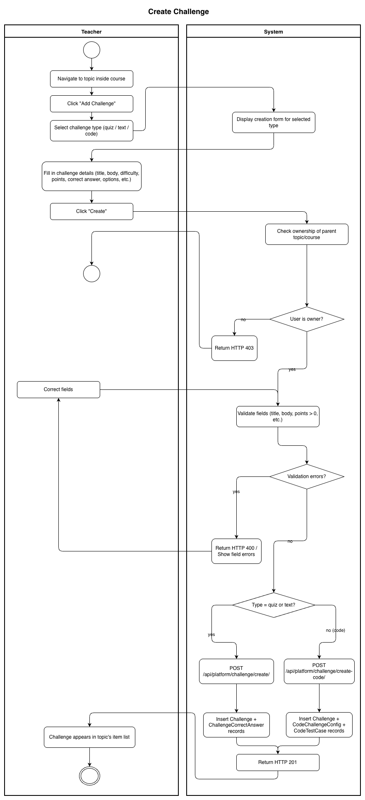
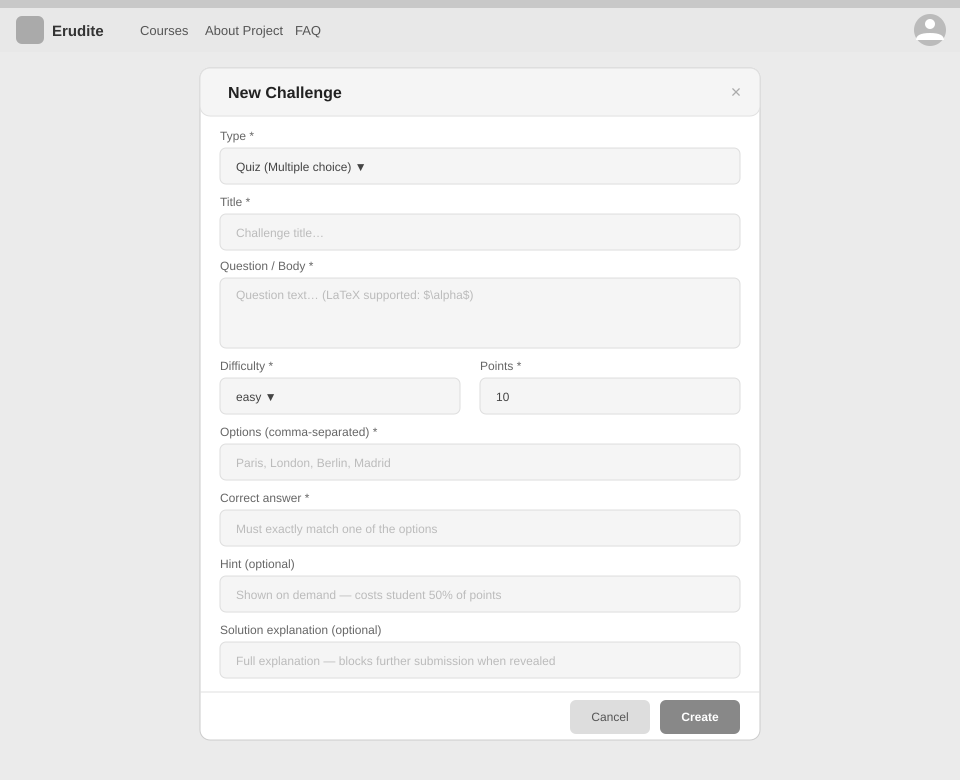
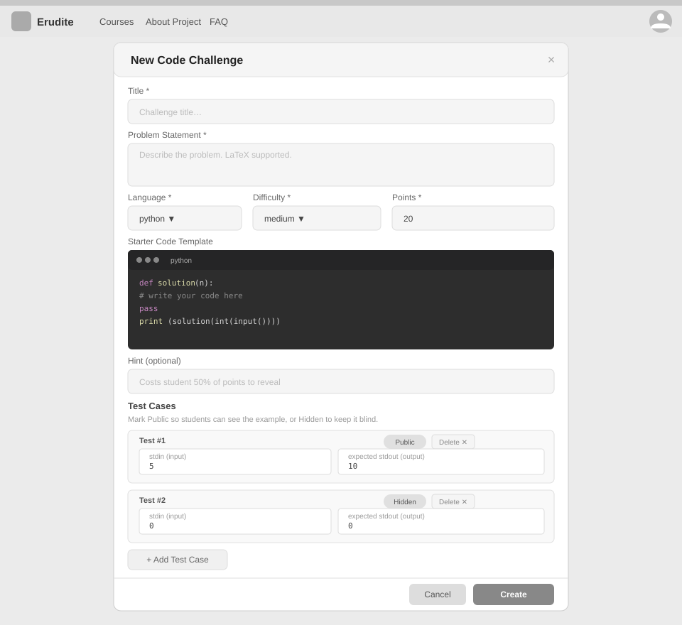

# Use-Case Name: Create Challenge

Use-case: Create Challenge — CRUD: Create

## 1. Brief Description

A Teacher creates a new challenge within a course topic. Erudite supports three challenge types, each with its own creation flow:

- **Quiz** — multiple-choice question with one correct answer.
- **Text** — free-text answer matched against a correct answer string.
- **Code** — a coding task with a template, hidden solution, and automated test cases.

Once created, the challenge is linked to the topic and becomes available to students when the parent course is published.

---

## 2. Basic Flow

### 2A — Create Quiz or Text Challenge

1. Teacher navigates to a topic and clicks **"Add Challenge"**.
2. Teacher selects challenge type: `quiz` or `text`.
3. System displays a form (multipart):
   - Title *(required)*
   - Body / problem statement *(required)*
   - Difficulty: `easy` / `medium` / `hard`
   - Points *(required, positive integer)*
   - Correct answer *(required)*
   - Case-sensitive toggle *(text only)*
   - Options (for quiz: up to N options, one marked correct)
   - Optional: photo, hint, solution explanation
   - Sort order
4. Teacher fills and submits the form.
5. System sends `POST /api/platform/challenge/create/` (multipart).
6. System validates the input.
7. System creates the `Challenge`, `ChallengeCorrectAnswer`, and (for quiz) `ChallengeOption` records.
8. System responds with HTTP 201.

### 2B — Create Code Challenge

1. Teacher selects challenge type: `code`.
2. System displays a form (JSON):
   - Title, body, difficulty, points, hint, solution explanation, sort order (same as above)
   - Language: `python` / `javascript` / `java` / `cpp` / `sql`
   - Solution template (starter code shown to student)
   - Hidden solution (reference solution, never exposed)
   - Time limit (seconds) and memory limit (MB)
   - Test cases: each with `stdin`, `expected_stdout`, `is_public` flag, `weight`, `description`
3. Teacher fills and submits.
4. System sends `POST /api/platform/challenge/create-code/` (JSON).
5. System creates `Challenge`, `CodeChallengeConfig`, and `CodeTestCase` records.
6. System responds with HTTP 201.

### 2.1 Activity Diagram



### 2.2 Mock-up

**Quiz / Text challenge:**



**Code challenge:**



### 2.3 Alternate Flows

- **Missing required fields:** HTTP 400 with field-level errors.
- **Negative points value:** HTTP 400 validation error.
- **Slug conflict:** System auto-generates a unique slug by appending a suffix.
- **Cancel:** Returns to topic without saving.

### 2.4 Narrative

```gherkin
Feature: Create Challenge
  As a Teacher
  I want to create challenges in my topic
  So that students can test their knowledge

  Background:
    Given I am logged in as a Teacher and own topic "chapter-1-algebra"

  Scenario: Create a quiz challenge
    When I send a POST request to "/api/platform/challenge/create/" with:
      | topic_slug   | chapter-1-algebra       |
      | title        | What is 2+2?            |
      | body         | Select the correct sum  |
      | challenge_type | quiz                  |
      | difficulty   | easy                    |
      | points       | 10                      |
      | correct_answer | 4                     |
    Then the response status code is 201
    And the challenge appears in the topic's list

  Scenario: Create a code challenge
    When I send a POST request to "/api/platform/challenge/create-code/" with title,
    body, language "python", a solution template, hidden solution, and at least one test case
    Then the response status code is 201
    And the code challenge is created with test cases

  Scenario: Fail to create a challenge with missing title
    When I submit a challenge form without a title
    Then the response status code is 400
    And I see a validation error for "title"
```

[Link to feature file](https://github.com/coffee3333/erudite-django-web-app/blob/main/features/create_challenge.feature)

---

## 3. Preconditions

- Teacher is logged in with `role = teacher`.
- The target topic exists and belongs to a course owned by the Teacher.

## 4. Postconditions

- A new `Challenge` record exists in the database, linked to the topic.
- For quiz: `ChallengeOption` records are created.
- For text: `ChallengeCorrectAnswer` record is created.
- For code: `CodeChallengeConfig` and `CodeTestCase` records are created.
- Students can see and attempt the challenge once the course is published.

## 5. Exceptions

- **Permission denied:** HTTP 403 for non-owners or students.
- **Topic not found:** HTTP 404.

## 6. Link to SRS

[Software Requirements Specification](../../Documents/SoftwareRequirementsSpecification.md)

## 7. CRUD Classification

- **Create** — creates a new Challenge (and related) record.
