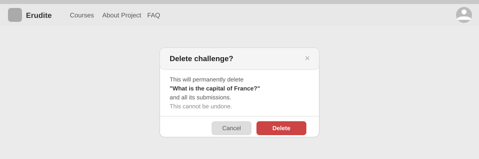

# Use-Case Name: Delete Challenge

Use-case: Delete Challenge — CRUD: Delete

## 1. Brief Description

A Teacher permanently removes a challenge from a topic. All submissions for that challenge are cascade-deleted.

---

## 2. Basic Flow

1. Teacher navigates to the challenge.
2. Teacher clicks **"Delete Challenge"**.
3. System shows a confirmation dialog.
4. Teacher confirms.
5. System deletes the `Challenge` record and all associated Submissions, Options, CorrectAnswer, CodeConfig, and TestCases.
6. System responds with HTTP 204.
7. Challenge is removed from the topic's item list.

### 2.1 Alternate Flows

- **Cancel:** No deletion.
- **Non-owner:** HTTP 403.

### 2.2 Mock-up

---

## 3. Preconditions

- Teacher is logged in.
- Challenge exists and belongs to a course owned by the Teacher.

## 4. Postconditions

- Challenge and all cascaded data permanently deleted.

## 5. Link to SRS

[Software Requirements Specification](../../Documents/SoftwareRequirementsSpecification.md)

## 7. CRUD Classification

- **Delete** — removes a Challenge record and cascades.

## 8. Function Points

Function Points are tracked at **group level** for Erudite because the project contains many small, structurally similar Use Cases. Grouping produces a more reliable FP vs Time correlation (R² = 0.67) and matches the Berkling UCL methodology.

This Use Case belongs to group **`challenges`** (AFP = **70 (Week 20 actual)**).

| Attribute | Value |
|---|---|
| **Group** | `challenges` |
| **UCs in group** | CreateChallenge, EditChallenge, DeleteChallenge, ViewChallenges, SubmitChallenge |
| **Group AFP** | 70 (Week 20 actual) |
| **Full FP breakdown** | [UCs/FUNCTION_POINTS.md](../FUNCTION_POINTS.md) |
