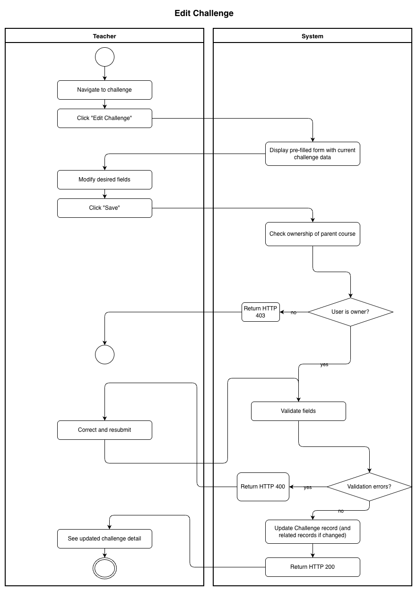
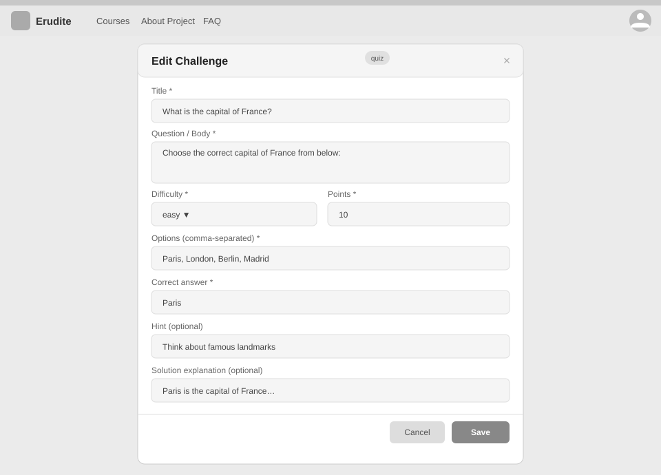

# Use-Case Name: Edit Challenge

Use-case: Edit Challenge — CRUD: Update

## 1. Brief Description

A Teacher updates an existing challenge in their topic. Any field — title, body, difficulty, points, correct answer, options, photo, hint, or solution explanation — can be modified. For code challenges, the configuration and test cases can also be updated.

---

## 2. Basic Flow

1. Teacher navigates to the challenge.
2. Teacher clicks **"Edit Challenge"**.
3. System displays a pre-filled form with the current challenge data.
4. Teacher modifies the desired fields.
5. Teacher clicks **"Save"**.
6. System sends `PATCH /api/platform/challenges/<slug>/update/` *(or the relevant endpoint)*.
7. System validates the input.
8. System updates the `Challenge` record and related records.
9. System responds with HTTP 200.

### 2.1 Activity Diagram



### 2.2 Mock-up



### 2.3 Alternate Flows

- **Missing title or body:** HTTP 400.
- **Invalid points (negative):** HTTP 400.
- **Cancel:** Returns to challenge detail without saving.
- **Non-owner:** HTTP 403.
- **Updating a challenge that has submissions:** The update is saved, but existing submissions are not re-graded.

### 2.4 Narrative

```gherkin
Feature: Edit Challenge
  As a Teacher
  I want to edit an existing challenge
  So that I can fix errors or improve the question

  Background:
    Given I am logged in as a Teacher
    And a challenge with slug "what-is-2-plus-2" exists in my topic

  Scenario: Successfully update a challenge
    When I update the title to "What is 2 + 2?" and points to 15
    Then the response status code is 200
    And the challenge reflects the updated values

  Scenario: Fail to update with empty title
    When I submit with an empty title
    Then the response status code is 400
    And I see a validation error

  Scenario: Non-owner cannot edit
    Given I am a different Teacher
    When I attempt to update the challenge
    Then the response status code is 403
```

---

## 3. Preconditions

- Teacher is logged in.
- Challenge exists and belongs to a topic in a course owned by the Teacher.

## 4. Postconditions

- Updated `Challenge` record (and related records) are persisted.
- Existing student submissions remain unchanged.

## 5. Exceptions

- **Challenge not found:** HTTP 404.
- **Permission denied:** HTTP 403.

## 6. Link to SRS

[Software Requirements Specification](../../Documents/SoftwareRequirementsSpecification.md)

## 7. CRUD Classification

- **Update** — modifies an existing Challenge record.

## 8. Function Points

Function Points are tracked at **group level** for Erudite because the project contains many small, structurally similar Use Cases. Grouping produces a more reliable FP vs Time correlation (R² = 0.67) and matches the Berkling UCL methodology.

This Use Case belongs to group **`challenges`** (AFP = **70 (Week 20 actual)**).

| Attribute | Value |
|---|---|
| **Group** | `challenges` |
| **UCs in group** | CreateChallenge, EditChallenge, DeleteChallenge, ViewChallenges, SubmitChallenge |
| **Group AFP** | 70 (Week 20 actual) |
| **Full FP breakdown** | [UCs/FUNCTION_POINTS.md](../FUNCTION_POINTS.md) |
