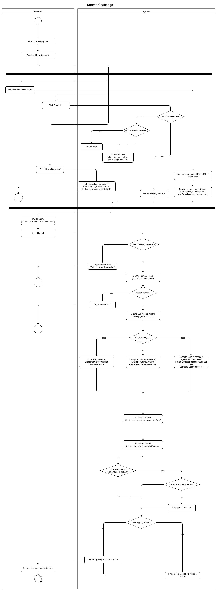
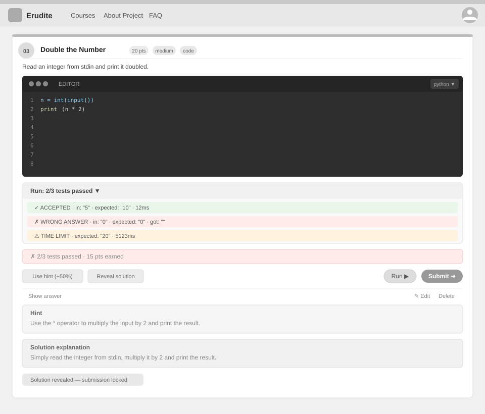

# Use-Case Name: Submit Challenge

Use-case: Submit Challenge Answer — the core student interaction

## 1. Brief Description

A student submits an answer to a challenge. The system grades it automatically based on the challenge type. A `Submission` record is created each time, tracking the attempt number, score, and status. If a hint was used, the score is capped at 50%. Revealing the solution blocks further submissions.

This UC covers all three challenge types and includes two related alternate flows: **Use Hint** and **Reveal Solution**.

---

## 2. Basic Flow

1. Student navigates to a challenge.
2. Student reads the problem statement (and for code challenges: the starter template and any public test cases).
3. Student provides an answer:
   - **Quiz:** Selects one option.
   - **Text:** Types a free-text answer.
   - **Code:** Writes code in the editor.
4. Student clicks **"Submit"**.
5. System sends `POST /api/platform/challenges/<slug>/submit/` with `{ "answer": "..." }`.
6. System records a new `Submission` with `attempt_no = last + 1`.
7. System grades the submission:
   - **Quiz:** Compares selected option text to `ChallengeCorrectAnswer.correct_answer` (case-insensitive).
   - **Text:** Compares trimmed answer to `ChallengeCorrectAnswer.correct_answer` (respects `case_sensitive` flag).
   - **Code:** Executes the code against all test cases in a sandbox; computes weighted score from passing test cases.
8. System saves the score and status (`passed` / `failed` / `graded`).
9. System applies hint penalty: if `hint_used = true` → `score = min(score, 0.5 * max_points)`.
10. System returns the grading result.
11. If the student's cumulative course score reaches the `completion_threshold` (default 80%), a `Certificate` is auto-issued.
12. If the course has an active LTI mapping, the system fires a grade passback to the Moodle LMS.

### 2.1 Activity Diagram



### 2.2 Mock-up



---

## 2.3 Alternate Flow A — Use Hint

1. Before submitting, student clicks **"Use Hint"**.
2. System sends `POST /api/platform/challenges/<slug>/use-hint/`.
3. System checks that:
   - The student has not already used the hint for this challenge.
   - The student has not revealed the solution.
4. System sets `hint_used = true` on the current submission context.
5. System returns the hint text.
6. **Score penalty applies:** Any correct submission after using a hint is capped at 50% of full points.

---

## 2.4 Alternate Flow B — Reveal Solution

1. Student clicks **"Reveal Solution"**.
2. System sends `POST /api/platform/challenges/<slug>/reveal-solution/`.
3. System returns the `solution_explanation` text (never the hidden code).
4. System sets `solution_revealed = true`.
5. **Further submissions are blocked:** The student can no longer submit answers for this challenge.

---

## 2.5 Alternate Flow C — Run Code (Dry-Run, Code Challenges Only)

1. Student clicks **"Run"** (without submitting).
2. System sends `POST /api/platform/challenges/<slug>/run/` with the student's code.
3. System executes the code against **public test cases only** (those with `is_public = true`).
4. System returns pass/fail per test case, stdout/stderr, and execution time.
5. **No `Submission` record is created.**

---

## 2.6 Narrative

```gherkin
Feature: Submit Challenge
  As a student
  I want to submit answers to challenges
  So that I can earn points and track my progress

  Background:
    Given I am logged in as a student
    And I am enrolled in a course with challenge "what-is-2-plus-2" (type: quiz)

  Scenario: Successfully pass a quiz challenge
    When I send a POST request to "/api/platform/challenges/what-is-2-plus-2/submit/" with:
      | answer | 4 |
    Then the response status code is 200
    And the submission status is "passed"
    And my score is 10 (full points)

  Scenario: Submit wrong quiz answer
    When I submit the answer "5"
    Then the submission status is "failed"
    And my score is 0

  Scenario: Submit after using a hint
    Given I used the hint for this challenge
    When I submit the correct answer "4"
    Then the submission status is "passed"
    And my score is capped at 5 (50% of 10)

  Scenario: Submit code challenge successfully
    Given a code challenge with slug "sum-two-numbers"
    When I send a POST request with valid Python code that passes all test cases
    Then the submission status is "graded"
    And my score is proportional to the test cases passed

  Scenario: Run code challenge without submitting
    When I send a POST request to "/api/platform/challenges/sum-two-numbers/run/"
    Then I receive test case results for public tests only
    And no submission record is created

  Scenario: Attempt to submit after revealing solution
    Given I have revealed the solution for this challenge
    When I try to submit
    Then the response status code is 400
    And I see an error "Solution already revealed, submission not allowed"

  Scenario: Certificate auto-issued on threshold reached
    Given my cumulative score across all challenges in the course reaches 80%
    When I submit the last challenge and pass
    Then a Certificate is automatically issued for this course
```

[Link to feature file](https://github.com/coffee3333/erudite-django-web-app/blob/main/features/submit_challenge.feature)

---

## 3. Preconditions

- Student is logged in with a verified email.
- The parent course is published (or the student is enrolled for private courses).
- The student has not revealed the solution for this challenge.

## 4. Postconditions

- A `Submission` record is created with attempt number, answer, score, and status.
- For code challenges: `CodeSubmissionResult` records are created per test case.
- Score is stored and factored into the student's course progress.
- If course completion threshold reached: a `Certificate` is issued.
- If LTI is active: grade passback is triggered.

## 5. Exceptions

- **Solution already revealed:** HTTP 400 — submission blocked.
- **Course access denied:** HTTP 403.
- **Code execution timeout:** Status `time_limit` on the relevant test case.
- **Compilation error:** Status `compilation_error` on the relevant test case.

## 6. Link to SRS

[Software Requirements Specification](../../Documents/SoftwareRequirementsSpecification.md)

## 7. Function Points

Function Points are tracked at **group level** for Erudite because the project contains many small, structurally similar Use Cases. Grouping produces a more reliable FP vs Time correlation (R² = 0.67) and matches the Berkling UCL methodology.

This Use Case belongs to group **`challenges`** (AFP = **70 (Week 20 actual)**).

| Attribute | Value |
|---|---|
| **Group** | `challenges` |
| **UCs in group** | CreateChallenge, EditChallenge, DeleteChallenge, ViewChallenges, SubmitChallenge |
| **Group AFP** | 70 (Week 20 actual) |
| **Full FP breakdown** | [UCs/FUNCTION_POINTS.md](../FUNCTION_POINTS.md) |
