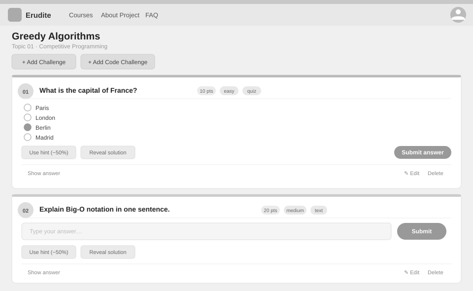

# Use-Case Name: View Challenges

Use-case: View Challenges in Topic — CRUD: Read

## 1. Brief Description

A student or teacher views the list of challenges within a topic. Each challenge card shows the title, type, difficulty, points, and the student's current submission status (if any).

---

## 2. Basic Flow

1. User navigates to a topic and clicks on the **Challenges** tab (or sees challenges in the merged item list).
2. System sends `GET /api/platform/topics/<slug>/challenges/`.
3. System checks parent course access permissions.
4. System returns a list of challenges with:
   - Title, type (`quiz` / `text` / `code`), difficulty, points
   - Student's best submission status and score (if authenticated)

### 2.1 Mock-up



### 2.2 Alternate Flows

- **Access denied:** HTTP 403 for non-enrolled on private courses.
- **No challenges yet:** Empty list returned.

### 2.2 Narrative

```gherkin
Feature: View Challenges
  As a student
  I want to see all challenges in a topic
  So that I know what to attempt

  Scenario: View challenges in a published topic
    Given a topic with slug "chapter-1" has 3 challenges
    When I send a GET request to "/api/platform/topics/chapter-1/challenges/"
    Then I receive a list of 3 challenges with their details
```

---

## 3. Preconditions

- User is authenticated.
- Parent course access rules are satisfied.

## 4. Postconditions

- No data modified.

## 5. Link to SRS

[Software Requirements Specification](../../Documents/SoftwareRequirementsSpecification.md)

## 7. CRUD Classification

- **Read** — reads Challenge records for a topic.
