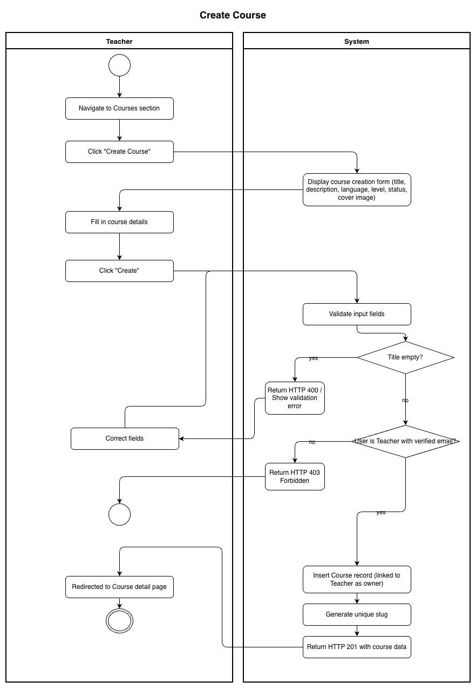
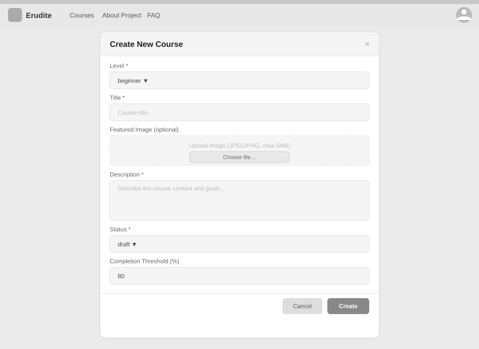

# Use-Case Name: Create Course

Use-case: Create Course — CRUD: Create

## 1. Brief Description

A Teacher creates a new course on the Erudite platform by providing a title, description, language, level, and optional cover image. The course is stored in the database and becomes visible in the catalog once published.

---

## 2. Basic Flow

1. Teacher logs in and navigates to the **Courses** section.
2. Teacher clicks **"Create Course"**.
3. System displays a form with:
   - Course title *(required)*
   - Description *(required)*
   - Language *(default: English)*
   - Level: `beginner` / `intermediate` / `advanced`
   - Status: `draft` / `published` / `private` / `archived`
   - Cover image *(optional)*
4. Teacher fills out the form and clicks **"Create"**.
5. System sends `POST /api/platform/courses/create/`.
6. System validates the input.
7. System inserts the new `Course` record linked to the Teacher's account.
8. System responds with HTTP 201 and the course data.
9. Teacher is redirected to the course detail page.

### 2.1 Activity Diagram



### 2.2 Mock-up



### 2.3 Alternate Flows

- **Missing required fields:** System returns HTTP 400 with field-level errors; course is not created.
- **Cancel:** Teacher clicks "Cancel" → returns to the Courses list without saving.
- **Draft mode:** Course is saved but invisible to students until the Teacher changes status to `published`.
- **Private course:** Only enrolled students and the owner can access the course.

### 2.4 Narrative

```gherkin
Feature: Create Course
  As a Teacher
  I want to create a course
  So that students can enroll and complete challenges

  Background:
    Given I am logged in as a Teacher with a verified email

  Scenario: Successfully create a published course
    When I send a POST request to "/api/platform/courses/create/" with:
      | title       | Introduction to Python |
      | description | Learn Python from scratch |
      | language    | English                   |
      | level       | beginner                  |
      | status      | published                 |
    Then the response status code is 201
    And the course appears in the public catalog

  Scenario: Fail to create a course with missing title
    When I send a POST request with an empty title field
    Then the response status code is 400
    And the response contains a validation error for "title"

  Scenario: Create a private course
    When I create a course with status "private"
    Then the course is not listed in the public catalog
    And only I (the owner) can access it by default
```

[Link to feature file](https://github.com/coffee3333/erudite-django-web-app/blob/main/features/create_course.feature)

---

## 3. Preconditions

- User is logged in with `role = teacher` and `email_verified = true`.
- The courses endpoint is reachable.

## 4. Postconditions

- A new `Course` record exists in the database with the Teacher as `owner`.
- If status is `published`, the course is visible in the catalog.
- The Teacher can now add Topics and Lessons to the course.

## 5. Exceptions

- **Permission denied:** A student attempting to create a course receives HTTP 403.
- **Server error:** User is notified to retry.

## 6. Link to SRS

[Software Requirements Specification](../../Documents/SoftwareRequirementsSpecification.md)

## 7. CRUD Classification

- **Create** — creates a new Course record.

## 8. Function Points

Function Points are tracked at **group level** for Erudite because the project contains many small, structurally similar Use Cases. Grouping produces a more reliable FP vs Time correlation (R² = 0.67) and matches the Berkling UCL methodology.

This Use Case belongs to group **`courses`** (AFP = **95 (Week 20 actual)**).

| Attribute | Value |
|---|---|
| **Group** | `courses` |
| **UCs in group** | CreateCourse, EditCourse, DeleteCourse, ViewCourses, ManageEnrollments |
| **Group AFP** | 95 (Week 20 actual) |
| **Full FP breakdown** | [UCs/FUNCTION_POINTS.md](../FUNCTION_POINTS.md) |
