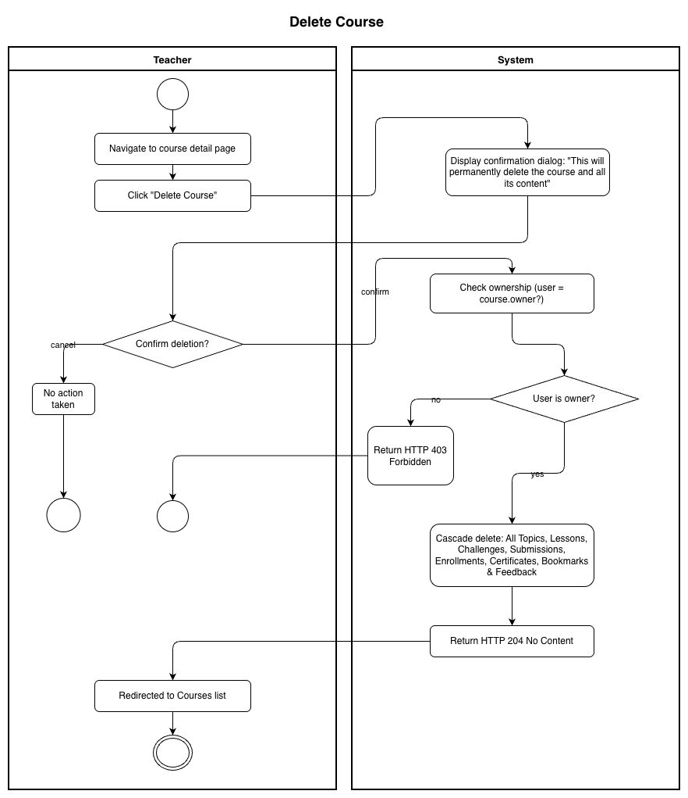
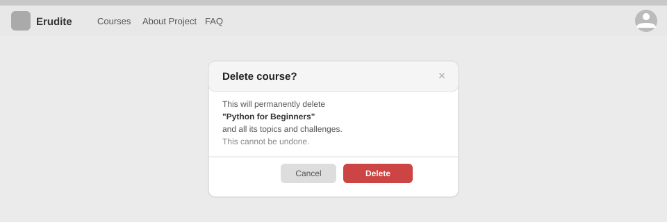

# Use-Case Name: Delete Course

Use-case: Delete Course — CRUD: Delete

## 1. Brief Description

A Teacher permanently deletes a course they own. Deletion is cascading: all associated topics, lessons, challenges, submissions, enrollments, and certificates for that course are also removed.

---

## 2. Basic Flow

1. Teacher navigates to the course detail page.
2. Teacher clicks **"Delete Course"**.
3. System shows a confirmation dialog: *"Are you sure? This will permanently delete the course and all its content."*
4. Teacher confirms by clicking **"Delete"**.
5. System sends `DELETE /api/platform/courses/<slug>/delete/`.
6. System performs a cascading delete of:
   - All Topics (and their Lessons, Challenges, Submissions)
   - All CourseEnrollments
   - All Certificates
   - All Bookmarks and Feedback for this course
7. System responds with HTTP 204 No Content.
8. Teacher is redirected to the Courses list.

### 2.1 Activity Diagram



### 2.2 Mock-up



### 2.3 Alternate Flows

- **Cancel:** Teacher clicks "Cancel" on the confirmation dialog → no deletion occurs.
- **Non-owner attempt:** System returns HTTP 403.

### 2.4 Narrative

```gherkin
Feature: Delete Course
  As a Teacher
  I want to delete a course I own
  So that I can remove outdated content from the platform

  Background:
    Given I am logged in as a Teacher
    And a course with slug "old-course" exists and I am its owner

  Scenario: Successfully delete a course
    When I send a DELETE request to "/api/platform/courses/old-course/delete/"
    Then the response status code is 204
    And the course no longer appears in the catalog

  Scenario: Non-owner cannot delete a course
    Given I am logged in as a different Teacher
    When I send a DELETE request to "/api/platform/courses/old-course/delete/"
    Then the response status code is 403
```

---

## 3. Preconditions

- Teacher is logged in with `email_verified = true`.
- The course exists and the Teacher is its `owner`.

## 4. Postconditions

- The Course and all cascaded child records are permanently deleted.
- The course slug becomes available for reuse.

## 5. Exceptions

- **Course not found:** HTTP 404.
- **Permission denied:** HTTP 403 for non-owners.

## 6. Link to SRS

[Software Requirements Specification](../../Documents/SoftwareRequirementsSpecification.md)

## 7. CRUD Classification

- **Delete** — removes a Course record and cascades.
