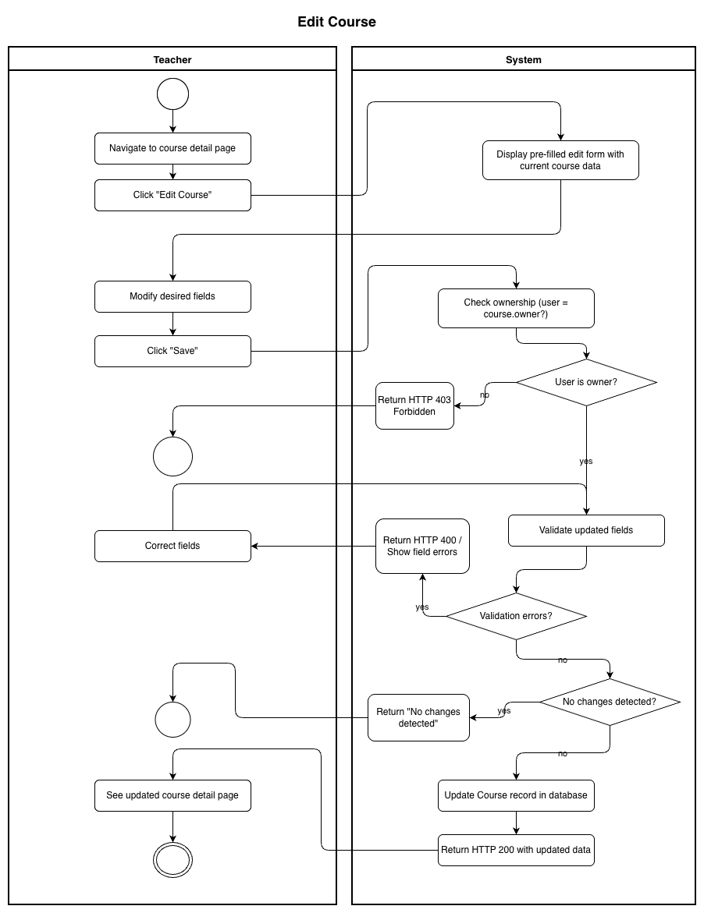
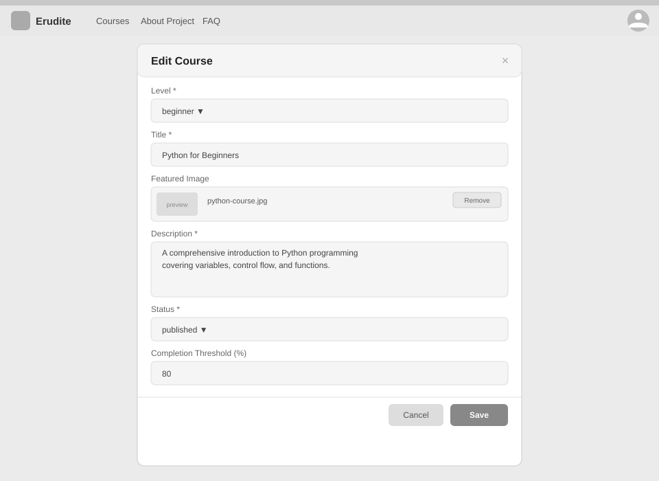

# Use-Case Name: Edit Course

Use-case: Edit Course — CRUD: Update

## 1. Brief Description

A Teacher updates an existing course they own. Any field (title, description, language, level, status, cover image) can be modified. Changes are saved to the database and immediately reflected in the catalog if the course is published.

---

## 2. Basic Flow

1. Teacher navigates to the course they want to edit.
2. Teacher clicks **"Edit Course"**.
3. System displays a pre-filled form with the course's current data.
4. Teacher modifies the desired fields.
5. Teacher clicks **"Save"**.
6. System sends `PATCH /api/platform/courses/<slug>/update/` with the changed fields.
7. System validates the input.
8. System updates the `Course` record.
9. System responds with HTTP 200 and the updated data.
10. Teacher sees the updated course detail page.

### 2.1 Activity Diagram



### 2.2 Mock-up



### 2.3 Alternate Flows

- **Invalid data:** Missing title or description → HTTP 400 with field errors; no save.
- **No changes detected:** If all fields are identical → system returns `{"detail": "No changes detected"}`.
- **Cancel:** Teacher clicks "Cancel" → returns to course detail without saving.
- **Change to private:** Existing enrolled students retain access; new visitors are blocked.

### 2.4 Narrative

```gherkin
Feature: Edit Course
  As a Teacher
  I want to edit a course I own
  So that I can correct mistakes or update the content

  Background:
    Given I am logged in as a Teacher
    And a course with slug "math-basics" exists and I am its owner

  Scenario: Successfully update a course
    When I send a PATCH request to "/api/platform/courses/math-basics/update/" with:
      | title  | Advanced Math Basics    |
      | level  | intermediate            |
      | status | published               |
    Then the response status code is 200
    And the course title is updated to "Advanced Math Basics"

  Scenario: Fail to update with empty title
    When I send a PATCH request with an empty title
    Then the response status code is 400
    And the response contains a validation error for "title"

  Scenario: Non-owner cannot edit a course
    Given I am logged in as a different Teacher
    When I send a PATCH request to "/api/platform/courses/math-basics/update/"
    Then the response status code is 403
```

[Link to feature file](https://github.com/coffee3333/erudite-django-web-app/blob/main/features/update_course.feature)

---

## 3. Preconditions

- Teacher is logged in with `email_verified = true`.
- The course exists and the Teacher is its `owner`.

## 4. Postconditions

- The updated `Course` record is persisted in the database.
- If published, the changes are immediately visible to students.

## 5. Exceptions

- **Permission denied:** HTTP 403 if user is not the course owner.
- **Course not found:** HTTP 404.

## 6. Link to SRS

[Software Requirements Specification](../../Documents/SoftwareRequirementsSpecification.md)

## 7. CRUD Classification

- **Update** — modifies an existing Course record.

## 8. Function Points

Function Points are tracked at **group level** for Erudite because the project contains many small, structurally similar Use Cases. Grouping produces a more reliable FP vs Time correlation (R² = 0.67) and matches the Berkling UCL methodology.

This Use Case belongs to group **`courses`** (AFP = **95 (Week 20 actual)**).

| Attribute | Value |
|---|---|
| **Group** | `courses` |
| **UCs in group** | CreateCourse, EditCourse, DeleteCourse, ViewCourses, ManageEnrollments |
| **Group AFP** | 95 (Week 20 actual) |
| **Full FP breakdown** | [UCs/FUNCTION_POINTS.md](../FUNCTION_POINTS.md) |
