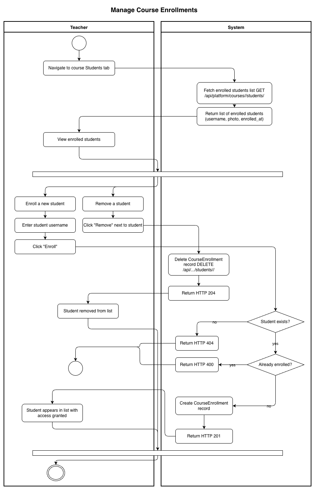
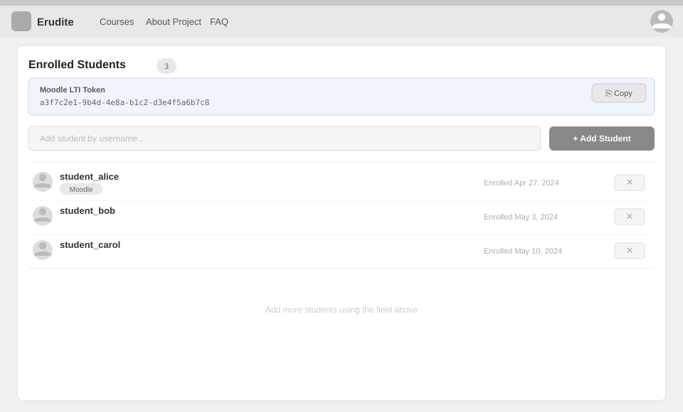

# Use-Case Name: Manage Course Enrollments

Use-case: Course Enrollment Management — part of Courses

## 1. Brief Description

The Teacher of a **private** course controls who can access it by manually enrolling and removing students. Students who are enrolled in a private course can view its topics and submit challenges. The Teacher can also view the full enrollment list.

---

## 2. Basic Flow

### 2A — Enroll a Student

1. Teacher navigates to the course's **Students** tab.
2. Teacher enters the student's username.
3. Teacher clicks **"Enroll"**.
4. System sends `POST /api/platform/courses/<slug>/students/` with `{ "username": "..." }`.
5. System verifies the course is owned by the requesting Teacher.
6. System creates a `CourseEnrollment` record linking the student to the course.
7. System responds with HTTP 201 and enrollment details.

### 2B — Remove a Student

1. Teacher finds the student in the enrollment list.
2. Teacher clicks **"Remove"** next to the student.
3. System sends `DELETE /api/platform/courses/<slug>/students/<username>/`.
4. System deletes the `CourseEnrollment` record.
5. System responds with HTTP 204.

### 2C — List Enrolled Students

1. Teacher navigates to the **Students** tab.
2. System sends `GET /api/platform/courses/<slug>/students/`.
3. System returns a list of enrolled students (username, photo, enrolled_at).

### 2.1 Activity Diagram



### 2.2 Mock-up



### 2.3 Alternate Flows

- **Student not found:** HTTP 404 if the username doesn't exist.
- **Already enrolled:** HTTP 400 if the student is already enrolled.
- **Not owner:** HTTP 403 if the requesting user is not the course owner.
- **Auto-enrollment for code challenges:** When a student submits a code challenge in a private course, the system auto-enrolls them if they are not yet enrolled.

### 2.3 Narrative

```gherkin
Feature: Course Enrollment Management
  As a Teacher
  I want to control who is enrolled in my private course
  So that only authorized students can access its content

  Background:
    Given I am logged in as a Teacher
    And I own a private course with slug "private-python"

  Scenario: Enroll a student
    When I send a POST request to "/api/platform/courses/private-python/students/" with:
      | username | student_alice |
    Then the response status code is 201
    And "student_alice" can now access the course

  Scenario: Remove a student
    Given "student_alice" is enrolled
    When I send a DELETE request to "/api/platform/courses/private-python/students/student_alice/"
    Then the response status code is 204
    And "student_alice" can no longer access the course

  Scenario: List enrolled students
    When I send a GET request to "/api/platform/courses/private-python/students/"
    Then I receive a list of enrolled students with their details
```

---

## 3. Preconditions

- Teacher is logged in and is the `owner` of the course.
- The course has `status = private`.
- (For enrollment) The target student has a registered account.

## 4. Postconditions

- **Enroll:** A `CourseEnrollment` record is created; the student gains access.
- **Remove:** The `CourseEnrollment` record is deleted; the student loses access.

## 5. Exceptions

- **Student not found:** HTTP 404.
- **Duplicate enrollment:** HTTP 400.

## 6. Link to SRS

[Software Requirements Specification](../../Documents/SoftwareRequirementsSpecification.md)

## 7. CRUD Classification

- **Create/Delete** — manages CourseEnrollment records.

## 8. Function Points

Function Points are tracked at **group level** for Erudite because the project contains many small, structurally similar Use Cases. Grouping produces a more reliable FP vs Time correlation (R² = 0.67) and matches the Berkling UCL methodology.

This Use Case belongs to group **`courses`** (AFP = **95 (Week 20 actual)**).

| Attribute | Value |
|---|---|
| **Group** | `courses` |
| **UCs in group** | CreateCourse, EditCourse, DeleteCourse, ViewCourses, ManageEnrollments |
| **Group AFP** | 95 (Week 20 actual) |
| **Full FP breakdown** | [UCs/FUNCTION_POINTS.md](../FUNCTION_POINTS.md) |
