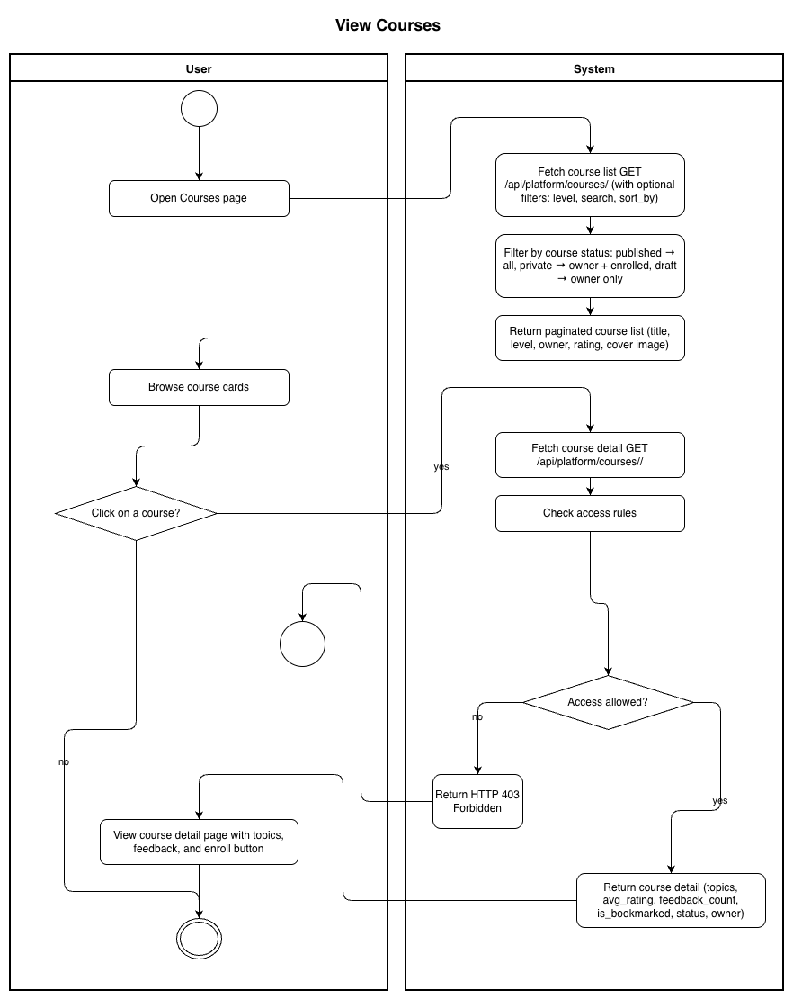
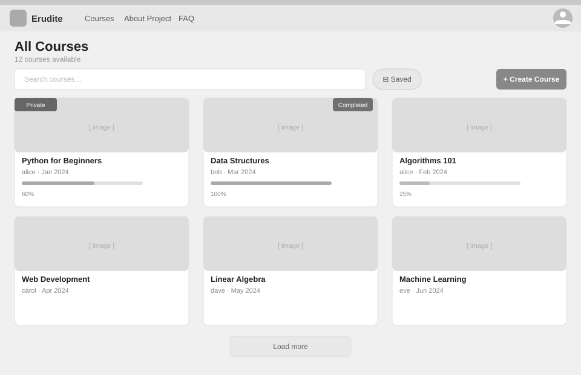
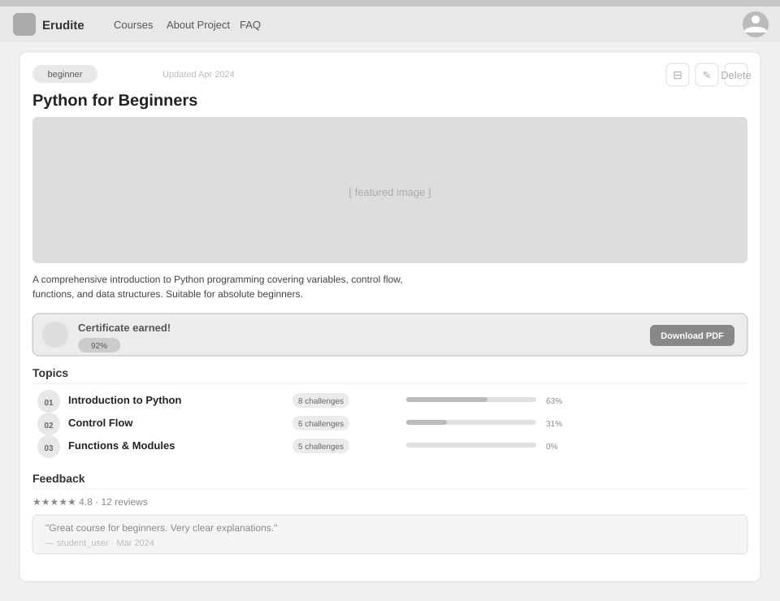

# Use-Case Name: View Courses

Use-case: Browse and View Courses — CRUD: Read

## 1. Brief Description

Any visitor can browse the public course catalog with filters and search. An authenticated user can also view a course's full detail page including its topics, enrollment status, average rating, and feedback. Private courses are only visible to enrolled students and the course owner.

---

## 2. Basic Flow

### 2A — Browse Catalog

1. User opens the **Courses** page.
2. System fetches `GET /api/platform/courses/` with optional query params:
   - `search` — full-text search in title/description
   - `level` — `beginner` / `intermediate` / `advanced`
   - `owner_username` — filter by teacher
   - `sort_by` — e.g. `created_at`, `title`
3. System returns a paginated list of published (and, if logged in, private-enrolled) courses.
4. Each course card shows: title, owner, level, language, cover image, average rating, feedback count.

### 2B — View Course Detail

1. User clicks on a course card.
2. System fetches `GET /api/platform/courses/<slug>/`.
3. System checks access:
   - `published` → accessible to all.
   - `private` → only owner or enrolled students.
   - `draft` / `archived` → only owner.
4. System returns course details including: title, description, owner, topics list, `is_bookmarked`, `avg_rating`, `feedback_count`, `status`.
5. Course detail page displays the topic list, feedback section, and enroll/continue button.

### 2.1 Activity Diagram



### 2.2 Mock-up

**Course list:**



**Course detail:**



### 2.3 Alternate Flows

- **Course not found:** System returns HTTP 404.
- **Access denied (private course):** System returns HTTP 403 if user is not enrolled.
- **Empty search results:** Catalog displays a "no courses found" message.

### 2.4 Narrative

```gherkin
Feature: View Courses
  As a user
  I want to browse and view course details
  So that I can find courses I want to enroll in

  Scenario: Browse the public catalog
    Given I am on the Courses page
    When I apply the filter "level=beginner"
    Then I see only beginner-level published courses

  Scenario: View a published course detail
    Given a published course with slug "intro-to-python" exists
    When I navigate to "/api/platform/courses/intro-to-python/"
    Then I see the course title, description, topics, and ratings

  Scenario: Attempt to view a private course without enrollment
    Given a private course with slug "secret-course" exists
    And I am not enrolled
    When I navigate to "/api/platform/courses/secret-course/"
    Then I receive a 403 Forbidden response
```

---

## 3. Preconditions

- For public/published courses: no authentication required.
- For private courses: user must be logged in and enrolled (or be the owner).

## 4. Postconditions

- The course data is displayed to the user.
- No data is modified.

## 5. Exceptions

- **Course deleted:** HTTP 404 is returned.
- **Server error:** Error page is shown.

## 6. Link to SRS

[Software Requirements Specification](../../Documents/SoftwareRequirementsSpecification.md)

## 7. CRUD Classification

- **Read** — reads Course records.

## 8. Function Points

Function Points are tracked at **group level** for Erudite because the project contains many small, structurally similar Use Cases. Grouping produces a more reliable FP vs Time correlation (R² = 0.67) and matches the Berkling UCL methodology.

This Use Case belongs to group **`courses`** (AFP = **95 (Week 20 actual)**).

| Attribute | Value |
|---|---|
| **Group** | `courses` |
| **UCs in group** | CreateCourse, EditCourse, DeleteCourse, ViewCourses, ManageEnrollments |
| **Group AFP** | 95 (Week 20 actual) |
| **Full FP breakdown** | [UCs/FUNCTION_POINTS.md](../FUNCTION_POINTS.md) |
