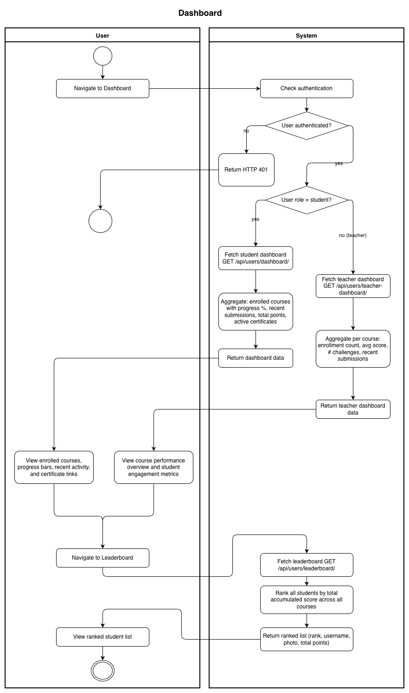
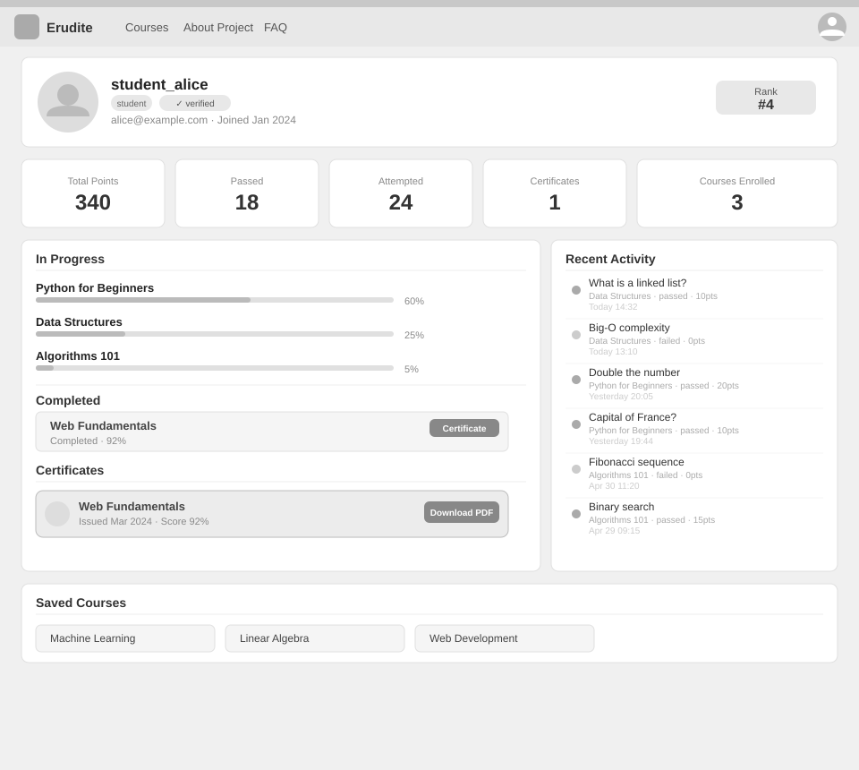
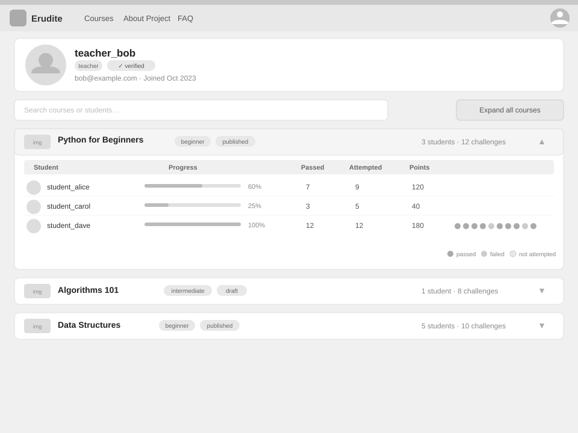
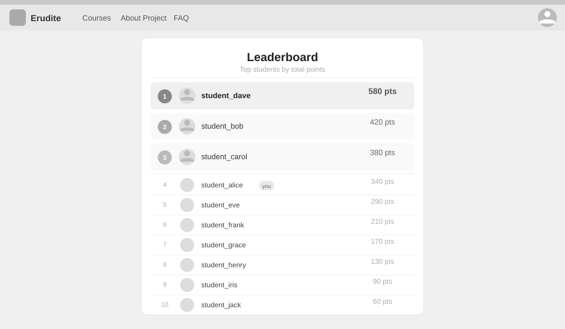

# Use-Case Name: Dashboard

Use-case: Student Dashboard, Teacher Dashboard, and Leaderboard

## 1. Brief Description

Erudite provides personalized dashboard views for students and teachers, plus a global leaderboard. These views aggregate a user's activity, progress, and performance data into a single summary page.

---

## 2. Basic Flow

### 2A — Student Dashboard

1. Student navigates to **"Dashboard"**.
2. System sends `GET /api/users/dashboard/`.
3. System returns:
   - List of enrolled courses with progress % per course.
   - Recent submissions (last N challenges attempted).
   - Total points earned across all courses.
   - Active certificates.
4. Dashboard displays progress bars, recent activity, and quick-access course links.

### 2B — Teacher Dashboard

1. Teacher navigates to **"Dashboard"**.
2. System sends `GET /api/users/teacher-dashboard/`.
3. System returns:
   - List of courses owned by the teacher.
   - Per-course: enrollment count, average student score, number of challenges.
   - Recent student submissions across all owned courses.
4. Dashboard shows course performance overview and student engagement metrics.

### 2C — Leaderboard

1. User navigates to **"Leaderboard"**.
2. System sends `GET /api/users/leaderboard/`.
3. System returns a ranked list of students ordered by total accumulated score across all courses.
4. The leaderboard shows rank, username, photo, and total points.

### 2.1 Activity Diagram



### 2.2 Mock-up

**Student dashboard:**



**Teacher dashboard:**



**Leaderboard:**



### 2.3 Alternate Flows

- **No activity yet:** Dashboard shows empty state with call-to-action to enroll in courses.
- **Not authenticated:** HTTP 401.

### 2.2 Narrative

```gherkin
Feature: Dashboard
  As a user
  I want to see my activity and progress summarized
  So that I can track how well I am doing

  Scenario: Student views dashboard
    Given I am logged in as a student enrolled in 2 courses
    When I send a GET request to "/api/users/dashboard/"
    Then I receive my enrolled courses with progress data
    And my recent submissions

  Scenario: Teacher views teacher dashboard
    Given I am logged in as a Teacher who owns 3 courses
    When I send a GET request to "/api/users/teacher-dashboard/"
    Then I see enrollment counts and performance stats for each course

  Scenario: View leaderboard
    When I send a GET request to "/api/users/leaderboard/"
    Then I receive a ranked list of students by total points
```

---

## 3. Preconditions

- User is authenticated.
- For teacher dashboard: user has `role = teacher`.

## 4. Postconditions

- No data modified; aggregated data is returned.

## 5. Link to SRS

[Software Requirements Specification](../../Documents/SoftwareRequirementsSpecification.md)
