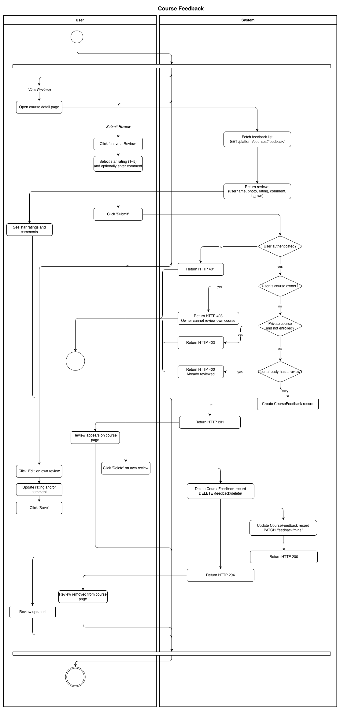
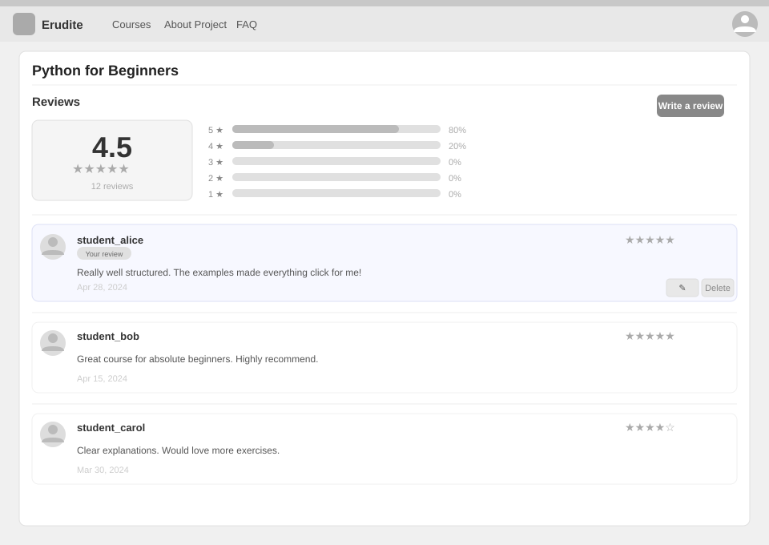
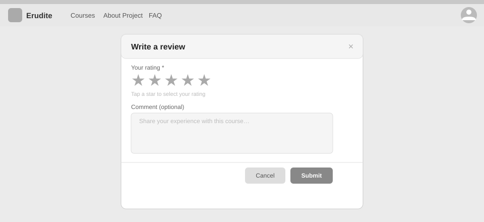

# Use-Case Name: Course Feedback

Use-case: Submit, Edit, Delete, and View Course Feedback — Ratings & Reviews

## 1. Brief Description

Students can submit a star rating (1–5) and an optional text comment for a course after accessing it. Each user can have at most one review per course. The course owner cannot review their own course. Reviews are visible to all users on the course detail page. Aggregate rating statistics (`avg_rating`, `feedback_count`) are returned with the course.

---

## 2. Basic Flow

### 2A — View Feedback

1. User opens a course detail page.
2. System fetches `GET /api/platform/courses/<slug>/feedback/`.
3. System returns a list of reviews: username, photo, rating (1–5 stars), comment, `is_own` flag, created/updated timestamps.
4. The page also shows `avg_rating` and `feedback_count` from the course detail serializer.

### 2B — Submit Feedback

1. Authenticated student clicks **"Leave a Review"**.
2. User selects a star rating (1–5) and optionally enters a comment.
3. User clicks **"Submit"**.
4. System sends `POST /api/platform/courses/<slug>/feedback/submit/`.
5. System checks:
   - User is authenticated.
   - User is not the course owner.
   - For private courses: user must be enrolled.
   - User has not already reviewed this course.
6. System creates a `CourseFeedback` record.
7. System responds with HTTP 201.

### 2C — Edit Own Feedback

1. User clicks **"Edit"** on their own review.
2. User updates the rating and/or comment.
3. User clicks **"Save"**.
4. System sends `PATCH /api/platform/courses/<slug>/feedback/mine/`.
5. System updates the `CourseFeedback` record.
6. System responds with HTTP 200.

### 2D — Delete Own Feedback

1. User clicks **"Delete"** on their own review.
2. System sends `DELETE /api/platform/courses/<slug>/feedback/delete/`.
3. System deletes the `CourseFeedback` record.
4. System responds with HTTP 204.

### 2.1 Activity Diagram



### 2.2 Mock-up

**Reviews section (course detail page):**



**Submit / edit review dialog:**



### 2.3 Alternate Flows

- **Already reviewed:** Attempting to submit a second review returns HTTP 400.
- **Owner attempting to review their own course:** HTTP 403.
- **Not enrolled in private course:** HTTP 403.
- **Not authenticated:** HTTP 401.

### 2.2 Narrative

```gherkin
Feature: Course Feedback
  As a student
  I want to rate and review courses
  So that others can make informed enrollment decisions

  Background:
    Given I am logged in as a student and enrolled in "intro-to-python"

  Scenario: Submit a review
    When I send a POST request to "/api/platform/courses/intro-to-python/feedback/submit/" with:
      | rating  | 5                          |
      | comment | Great course for beginners |
    Then the response status code is 201
    And my review appears on the course page

  Scenario: Edit my review
    Given I have already submitted a review
    When I send a PATCH request to "/api/platform/courses/intro-to-python/feedback/mine/" with:
      | rating  | 4                  |
      | comment | Very good content  |
    Then the response status code is 200

  Scenario: Delete my review
    Given I have already submitted a review
    When I send a DELETE request to "/api/platform/courses/intro-to-python/feedback/delete/"
    Then the response status code is 204
    And my review is removed

  Scenario: Course owner cannot review their own course
    Given I am the owner of "intro-to-python"
    When I attempt to submit a review
    Then the response status code is 403

  Scenario: Student cannot submit two reviews
    Given I have already submitted a review
    When I attempt to submit another review
    Then the response status code is 400
```

---

## 3. Preconditions

- User is authenticated.
- The course exists.
- For private courses: user must be enrolled.
- For submit: user is not the course owner and has not already reviewed.

## 4. Postconditions

- **Submit:** A `CourseFeedback` record is created.
- **Edit:** The record is updated; `avg_rating` recalculates on next fetch.
- **Delete:** The record is removed.

## 5. Exceptions

- **Course not found:** HTTP 404.

## 6. Link to SRS

[Software Requirements Specification](../../Documents/SoftwareRequirementsSpecification.md)

## 7. Function Points

Function Points are tracked at **group level** for Erudite because the project contains many small, structurally similar Use Cases. Grouping produces a more reliable FP vs Time correlation (R² = 0.67) and matches the Berkling UCL methodology.

This Use Case belongs to group **`feedback`** (AFP = **15.30 (UFP × VAF 1.02)**).

| Attribute | Value |
|---|---|
| **Group** | `feedback` |
| **UCs in group** | CourseFeedback |
| **Group AFP** | 15.30 (UFP × VAF 1.02) |
| **Full FP breakdown** | [UCs/FUNCTION_POINTS.md](../FUNCTION_POINTS.md) |
