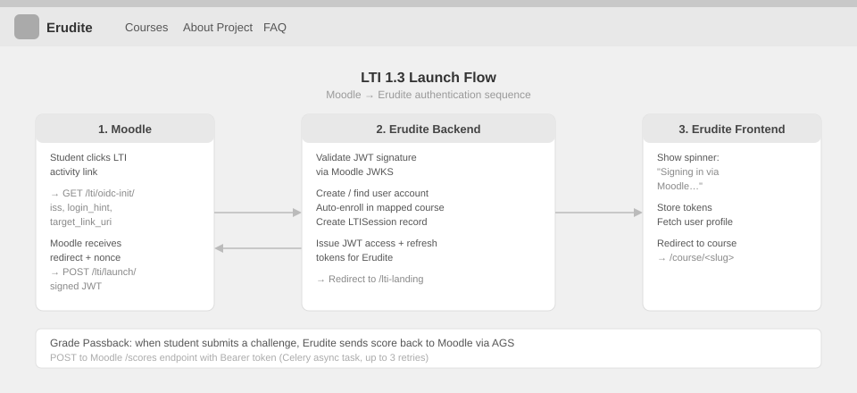
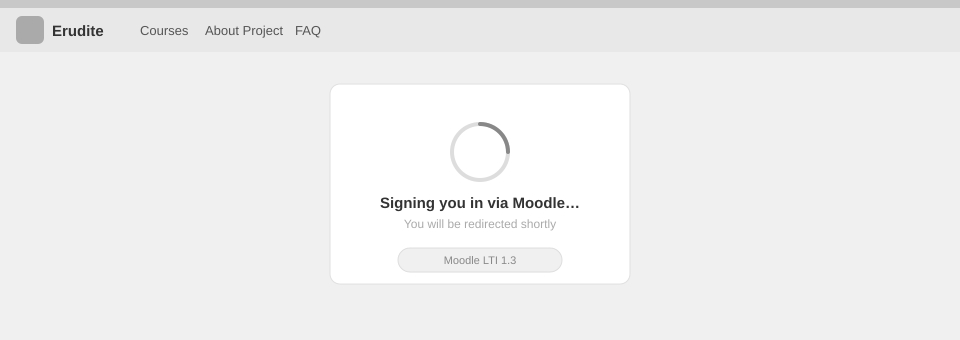
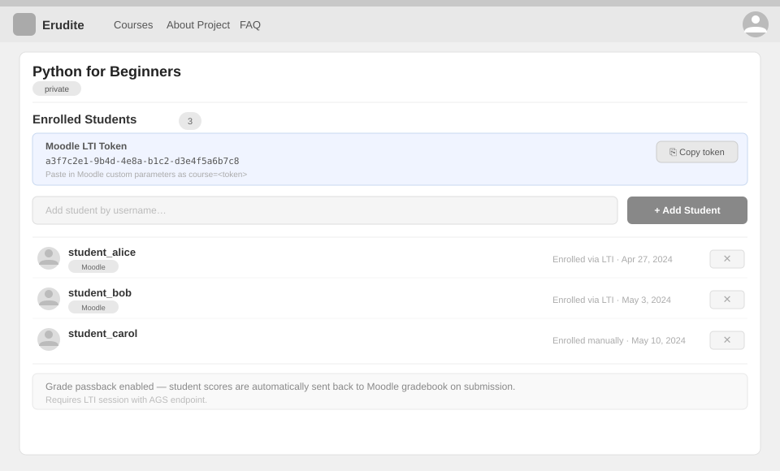

# Use-Case Name: LTI / Moodle Integration

Use-case: LTI 1.3 Launch and Grade Passback

## 1. Brief Description

Erudite supports LTI 1.3 (Learning Tools Interoperability) integration with Moodle. A Moodle instructor configures an Erudite course as an external LTI tool inside a Moodle activity. When a Moodle student opens the activity, they are seamlessly logged in or registered in Erudite, taken directly to the linked course, and when they complete challenges, their scores are sent back to Moodle's gradebook automatically.

---

## 2. Actors

- **Moodle Platform** — the external LMS (Moodle instance).
- **Moodle Student** — a student accessing Erudite via a Moodle activity link.
- **LTI Admin** — the person who configures the LTI registration (sets up keys, URLs).

---

## 2. Basic Flow

### 2A — Initial Setup (one-time, by LTI Admin)

1. LTI Admin creates an `LTIRegistration` record in the Erudite admin panel:
   - Moodle platform issuer URL
   - Client ID, Deployment ID
   - Platform JWKS URL and auth/token URLs
   - Tool RSA key pair (generated)
2. Erudite exposes its JWKS at `GET /lti/jwks/` and its config at `GET /lti/config/`.
3. Admin adds the Moodle course-to-Erudite-course mapping via `LTIResourceMapping`.

### 2B — LTI Launch (Student Access)

1. Moodle student clicks the LTI activity link in Moodle.
2. Moodle initiates OIDC login by redirecting to `GET /lti/oidc-init/`.
3. Erudite validates the request and redirects back to Moodle's auth endpoint.
4. Moodle sends a signed LTI JWT to `POST /lti/launch/`.
5. Erudite validates the JWT (RSA signature, issuer, audience, nonce).
6. Erudite extracts user identity from the JWT claims:
   - If the user's email does not exist → creates a new account with `email_verified = true`, `role = student`, `moodle_platform = <issuer>`.
   - If the user exists → logs them in.
7. Erudite issues JWT tokens and auto-enrolls the student in the linked course.
8. Student is redirected to the Erudite course page (seamless SSO).

### 2C — Grade Passback (Automatic after Submission)

1. Student submits a challenge on Erudite (see [Submit Challenge UC](../Challenges/SubmitChallenge.md)).
2. If the course has an active `LTIResourceMapping` with a `lineitem_url`:
   - Erudite calculates the student's overall course score percentage.
   - Erudite fetches a fresh access token from Moodle via the AGS endpoint.
   - Erudite sends the score to the Moodle gradebook via the AGS Score endpoint.
3. Moodle gradebook is updated with the student's current Erudite score.

### 2.1 Activity Diagram


### 2.2 Mock-up

**LTI launch flow (3-step sequence):**



**Student landing page (spinner while signing in):**



**Teacher course setup (LTI token + enrollment panel):**



### 2.3 Alternate Flows

- **Invalid LTI JWT:** Erudite returns an error page; the student sees "Access denied."
- **No resource mapping:** Student is logged in but not automatically directed to a specific course.
- **Grade passback fails:** Erudite logs the error but the submission is still saved; the grade will not appear in Moodle.
- **LTI user tries to change username:** Blocked by the profile update endpoint (`moodle_platform` check).

### 2.2 Narrative

```gherkin
Feature: LTI Moodle Integration
  As a Moodle student
  I want to access Erudite challenges directly from Moodle
  So that my grades automatically appear in the Moodle gradebook

  Scenario: First-time LTI launch (new user)
    Given a valid LTI registration exists for my Moodle instance
    When I click the Erudite LTI activity link in Moodle
    Then a new Erudite account is created for me (email_verified, role=student)
    And I am auto-enrolled in the linked course
    And I am redirected to the Erudite course page

  Scenario: Returning LTI user
    Given I have used Erudite via Moodle before
    When I click the LTI activity link again
    Then I am logged in to my existing Erudite account
    And I am taken to the linked course

  Scenario: Grade passback after submission
    Given I am a Moodle student enrolled in the linked Erudite course
    When I submit a challenge and my cumulative score updates
    Then the updated score is sent to the Moodle gradebook via AGS
    And my Moodle grade reflects my Erudite progress
```

---

## 3. Preconditions

- An `LTIRegistration` has been configured with valid keys and URLs.
- An `LTIResourceMapping` links the Moodle activity to an Erudite course.
- The Moodle instance is reachable from the Erudite backend (for token fetch during grade passback).

## 4. Postconditions

- **Launch:** Student is authenticated in Erudite, enrolled in the mapped course.
- **Grade passback:** Moodle gradebook reflects the student's current Erudite score.

## 5. Exceptions

- **Invalid JWT:** Launch rejected; student sees an error.
- **Grade passback network error:** Error logged; submission remains saved in Erudite.

## 6. Link to SRS

[Software Requirements Specification](../../Documents/SoftwareRequirementsSpecification.md)
