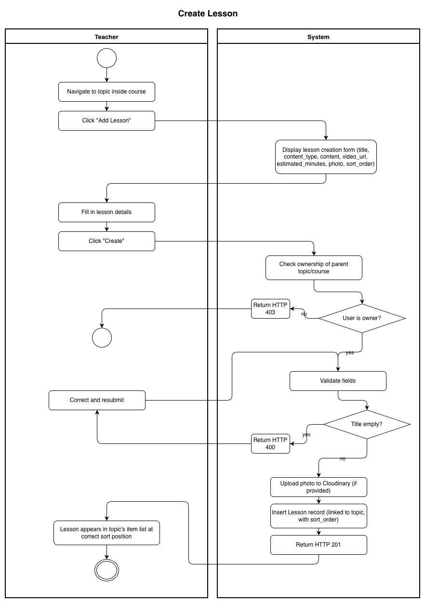
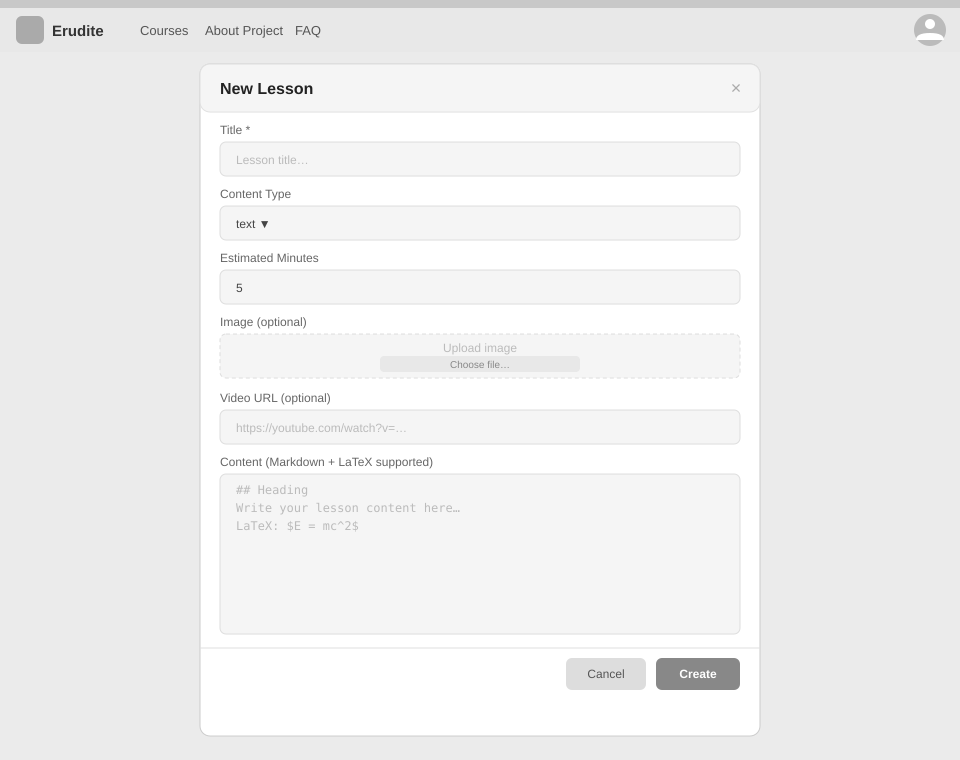

# Use-Case Name: Create Lesson

Use-case: Create Lesson — CRUD: Create

## 1. Brief Description

A Teacher adds a new lesson to a topic. A lesson is a reading or video material item. It can contain Markdown text, a video URL, or both. The `sort_order` field controls where it appears relative to other lessons and challenges in the topic.

---

## 2. Basic Flow

1. Teacher navigates to a topic inside their course.
2. Teacher clicks **"Add Lesson"**.
3. System displays a form:
   - Title *(required)*
   - Content type: `text` / `video` / `mixed`
   - Content (Markdown) *(optional)*
   - Video URL *(optional)*
   - Estimated reading time in minutes
   - Optional: photo
   - Sort order
4. Teacher fills the form and clicks **"Create"**.
5. System sends `POST /api/platform/lessons/create/` (multipart).
6. System validates the input.
7. System creates the `Lesson` record linked to the topic.
8. System responds with HTTP 201.

### 2.1 Activity Diagram



### 2.2 Mock-up



### 2.3 Alternate Flows

- **Missing title:** HTTP 400.
- **No content or video URL provided:** System accepts it (content is optional).
- **Cancel:** Returns to topic view without saving.

### 2.2 Narrative

```gherkin
Feature: Create Lesson
  As a Teacher
  I want to create a lesson in a topic
  So that students have learning material before attempting challenges

  Background:
    Given I am logged in as a Teacher and own topic "chapter-1-algebra"

  Scenario: Create a text lesson
    When I send a POST request to "/api/platform/lessons/create/" with:
      | topic_slug    | chapter-1-algebra              |
      | title         | Introduction to Variables      |
      | content_type  | text                           |
      | content       | A variable stores a value...   |
      | sort_order    | 1                              |
    Then the response status code is 201
    And the lesson appears in the topic's item list

  Scenario: Create a video lesson
    When I send a POST request with a video URL and content_type "video"
    Then the lesson is created with the video URL
```

---

## 3. Preconditions

- Teacher is logged in with `role = teacher`.
- Target topic exists and belongs to a course owned by the Teacher.

## 4. Postconditions

- A new `Lesson` record is created.
- The lesson appears in the sorted item list of the topic.

## 5. Exceptions

- **Permission denied:** HTTP 403.
- **Topic not found:** HTTP 404.

## 6. Link to SRS

[Software Requirements Specification](../../Documents/SoftwareRequirementsSpecification.md)

## 7. CRUD Classification

- **Create** — creates a new Lesson record.

## 8. Function Points

Function Points are tracked at **group level** for Erudite because the project contains many small, structurally similar Use Cases. Grouping produces a more reliable FP vs Time correlation (R² = 0.67) and matches the Berkling UCL methodology.

This Use Case belongs to group **`lessons`** (AFP = **55.08 (UFP × VAF 1.02)**).

| Attribute | Value |
|---|---|
| **Group** | `lessons` |
| **UCs in group** | CreateLesson, EditLesson, DeleteLesson, ViewLesson |
| **Group AFP** | 55.08 (UFP × VAF 1.02) |
| **Full FP breakdown** | [UCs/FUNCTION_POINTS.md](../FUNCTION_POINTS.md) |
