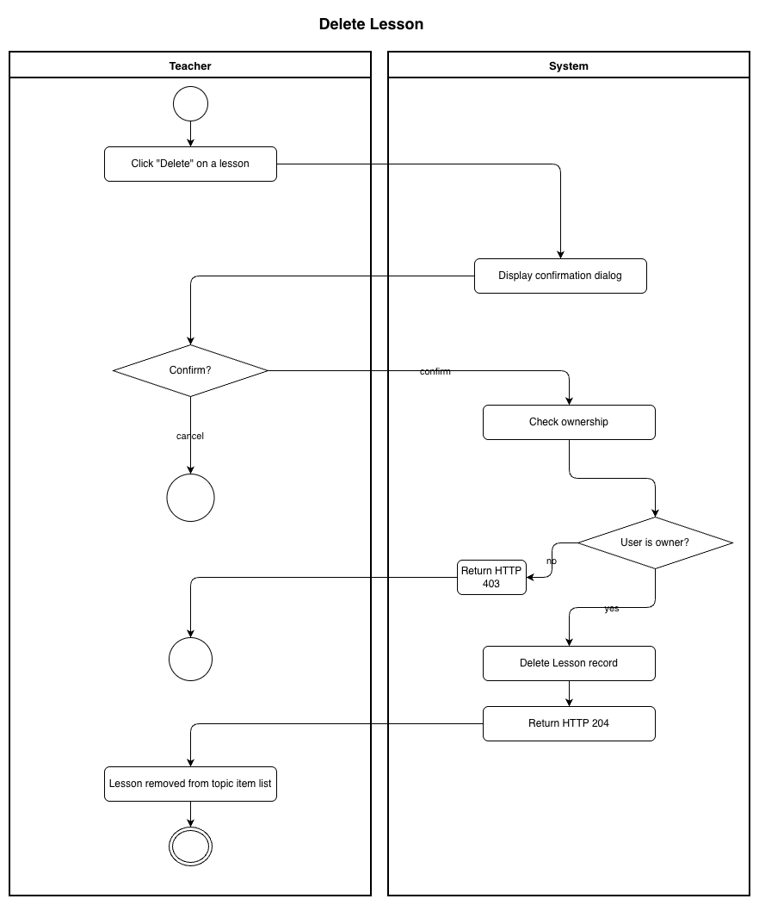

# Use-Case Name: Delete Lesson

Use-case: Delete Lesson — CRUD: Delete

## 1. Brief Description

A Teacher permanently removes a lesson from a topic.

---

## 2. Basic Flow

1. Teacher clicks **"Delete"** on a lesson.
2. System shows a confirmation dialog.
3. Teacher confirms.
4. System sends `DELETE /api/platform/lessons/<slug>/delete/`.
5. System deletes the `Lesson` record.
6. System responds with HTTP 204.
7. Lesson is removed from the topic's item list.

### 2.1 Activity Diagram



### 2.2 Mock-up


### 2.3 Alternate Flows

- **Cancel:** No deletion.
- **Non-owner:** HTTP 403.

### 2.2 Narrative

```gherkin
Feature: Delete Lesson
  As a Teacher
  I want to delete a lesson
  So that I can remove outdated material

  Scenario: Successfully delete a lesson
    Given I own a lesson with slug "old-lesson"
    When I send a DELETE request to "/api/platform/lessons/old-lesson/delete/"
    Then the response status code is 204
    And the lesson is removed from the topic
```

---

## 3. Preconditions

- Teacher is logged in.
- Lesson exists and belongs to a topic in a course owned by the Teacher.

## 4. Postconditions

- Lesson record is permanently deleted.

## 5. Link to SRS

[Software Requirements Specification](../../Documents/SoftwareRequirementsSpecification.md)

## 7. CRUD Classification

- **Delete** — removes a Lesson record.

## 8. Function Points

Function Points are tracked at **group level** for Erudite because the project contains many small, structurally similar Use Cases. Grouping produces a more reliable FP vs Time correlation (R² = 0.67) and matches the Berkling UCL methodology.

This Use Case belongs to group **`lessons`** (AFP = **55.08 (UFP × VAF 1.02)**).

| Attribute | Value |
|---|---|
| **Group** | `lessons` |
| **UCs in group** | CreateLesson, EditLesson, DeleteLesson, ViewLesson |
| **Group AFP** | 55.08 (UFP × VAF 1.02) |
| **Full FP breakdown** | [UCs/FUNCTION_POINTS.md](../FUNCTION_POINTS.md) |
