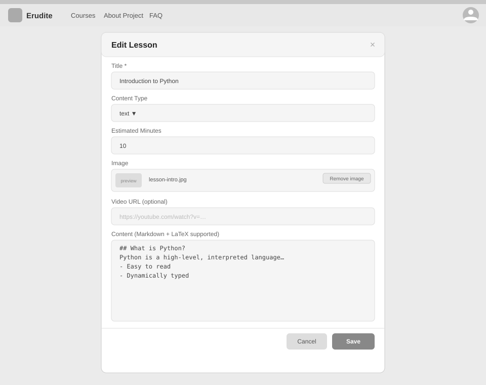

# Use-Case Name: Edit Lesson

Use-case: Edit Lesson — CRUD: Update

## 1. Brief Description

A Teacher updates the content, title, video URL, or sort order of an existing lesson in their topic.

---

## 2. Basic Flow

1. Teacher clicks **"Edit"** on a lesson.
2. System displays a pre-filled form with current lesson data.
3. Teacher modifies the desired fields.
4. Teacher clicks **"Save"**.
5. System sends `PATCH /api/platform/lessons/<slug>/update/`.
6. System validates and saves the changes.
7. System responds with HTTP 200.

### 2.1 Activity Diagram


### 2.2 Mock-up



### 2.3 Alternate Flows

- **Empty title:** HTTP 400 validation error.
- **Cancel:** Returns to topic view without saving.
- **Non-owner:** HTTP 403.

### 2.2 Narrative

```gherkin
Feature: Edit Lesson
  As a Teacher
  I want to edit a lesson
  So that I can fix errors or add new content

  Scenario: Successfully update a lesson
    Given I own a lesson with slug "intro-to-variables"
    When I send a PATCH request with a new title "Introduction to Variables (v2)"
    Then the response status code is 200
    And the lesson title is updated
```

---

## 3. Preconditions

- Teacher is logged in.
- Lesson exists and belongs to a topic in a course owned by the Teacher.

## 4. Postconditions

- Updated Lesson record is persisted.

## 5. Link to SRS

[Software Requirements Specification](../../Documents/SoftwareRequirementsSpecification.md)

## 7. CRUD Classification

- **Update** — modifies an existing Lesson record.

## 8. Function Points

Function Points are tracked at **group level** for Erudite because the project contains many small, structurally similar Use Cases. Grouping produces a more reliable FP vs Time correlation (R² = 0.67) and matches the Berkling UCL methodology.

This Use Case belongs to group **`lessons`** (AFP = **55.08 (UFP × VAF 1.02)**).

| Attribute | Value |
|---|---|
| **Group** | `lessons` |
| **UCs in group** | CreateLesson, EditLesson, DeleteLesson, ViewLesson |
| **Group AFP** | 55.08 (UFP × VAF 1.02) |
| **Full FP breakdown** | [UCs/FUNCTION_POINTS.md](../FUNCTION_POINTS.md) |
