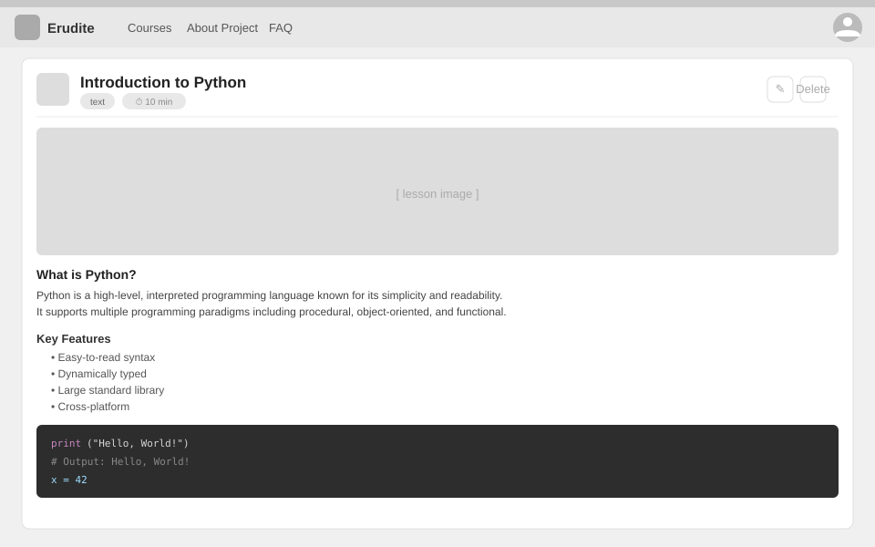

# Use-Case Name: View Lesson

Use-case: View Lesson — CRUD: Read

## 1. Brief Description

A student or teacher views the full content of a lesson. The lesson may contain Markdown text, a video URL, or both, depending on its `content_type`. Access is gated by the parent course's access rules.

---

## 2. Basic Flow

1. User clicks on a lesson item in the topic's item list.
2. System sends `GET /api/platform/lessons/<slug>/`.
3. System checks course access permissions.
4. System returns the lesson data: title, content, video URL, estimated minutes, photo.
5. Lesson content is rendered (Markdown to HTML on the frontend).

### 2.1 Mock-up



### 2.2 Alternate Flows

- **Access denied:** HTTP 403 for non-enrolled users on private courses.
- **Lesson not found:** HTTP 404.

### 2.2 Narrative

```gherkin
Feature: View Lesson
  As a student
  I want to read a lesson
  So that I can prepare for the challenges in this topic

  Scenario: View a lesson in a published course
    Given a lesson with slug "intro-to-variables" exists
    When I send a GET request to "/api/platform/lessons/intro-to-variables/"
    Then I receive the lesson content

  Scenario: Access denied for unenrolled student on private course
    Given the lesson belongs to a private course
    And I am not enrolled
    When I request the lesson
    Then I receive a 403 response
```

---

## 3. Preconditions

- User is authenticated.
- Parent course access rules are satisfied.

## 4. Postconditions

- No data is modified.

## 5. Link to SRS

[Software Requirements Specification](../../Documents/SoftwareRequirementsSpecification.md)

## 7. CRUD Classification

- **Read** — reads a Lesson record.
