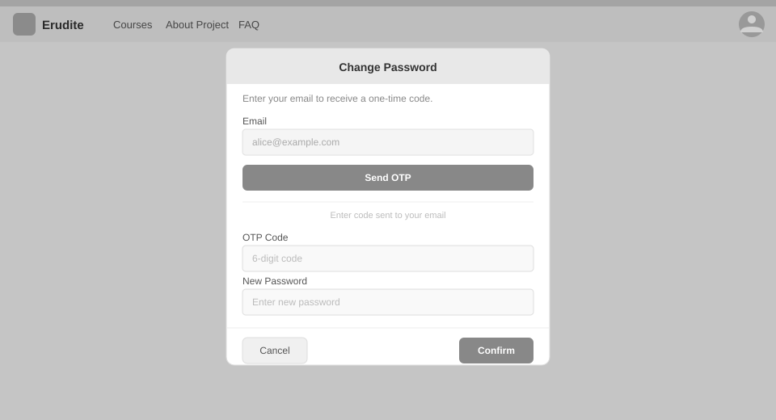

# Use-Case Name: Change Password

Use-case: Change Password — Profile / Security

## 1. Brief Description

An authenticated user changes their account password using the OTP-based password reset flow. The user requests a reset code sent to their registered email, confirms with the OTP, and sets a new password. This flow is also used by users who are already logged in but want to change their password.

---

## 2. Basic Flow

1. User navigates to the **Password** section in their profile.
2. User clicks **"Change Password"**.
3. System displays the password change panel.
4. User clicks **"Send OTP"**.
5. System sends `POST /api/users/auth/password/reset/request/` with their email.
6. System emails a 6-digit OTP to the user (valid 10 minutes).
7. User enters the OTP and new password.
8. User clicks **"Confirm"**.
9. System sends `POST /api/users/auth/password/reset/confirm/`.
10. System validates the OTP, updates the password.
11. User sees a success confirmation.

### 2.1 Activity Diagram

### 2.2 Mock-up

### 2.3 Alternate Flows

- **Expired OTP:** System returns an error; user can request a new one.
- **Weak password:** System returns a validation error.
- **Moodle users:** This flow still works since the email is stored; the Moodle password is separate.

---

## 3. Preconditions

- User is authenticated and has access to their registered email.

## 4. Postconditions

- The user's password is updated.
- The OTP is invalidated.

## 5. Link to SRS

[Software Requirements Specification](../../Documents/SoftwareRequirementsSpecification.md)
