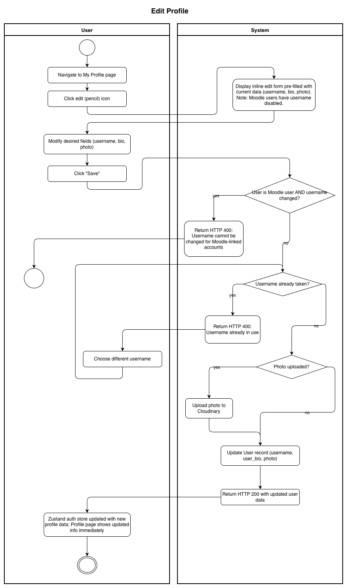
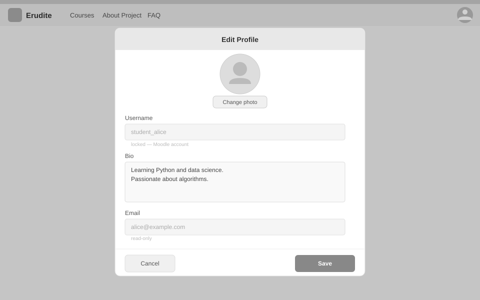

# Use-Case Name: Edit Profile

Use-case: Edit User Profile — CRUD: Update

## 1. Brief Description

An authenticated user updates their profile information: username, bio, and/or profile photo. For users who registered via Moodle LTI (`moodle_platform` is set), the username field is locked and cannot be changed. Photo uploads are processed and stored via Cloudinary.

---

## 2. Basic Flow

1. User navigates to **"My Profile"** and clicks the **edit (pencil) icon**.
2. System displays an inline edit form pre-filled with current data:
   - Username *(disabled for Moodle users)*
   - Bio
   - Profile photo (file upload)
3. User modifies the desired fields.
4. User clicks **"Save"**.
5. System sends `PATCH /api/users/profile/me/update/` (multipart form data).
6. System validates:
   - Username uniqueness (if changed).
   - Username is not being changed for a Moodle user.
7. System updates the `User` record.
8. System returns the updated user object.
9. The auth store (Zustand) is updated with the new user data.

### 2.1 Activity Diagram



### 2.2 Mock-up



### 2.3 Alternate Flows

- **Username taken:** HTTP 400 with "Username already in use" error.
- **Moodle user attempts to change username:** HTTP 400 — username change blocked.
- **Cancel:** Returns to profile view without saving.
- **Photo removed:** User can clear the photo field.

### 2.4 Narrative

```gherkin
Feature: Edit Profile
  As a user
  I want to update my profile
  So that my information stays current

  Background:
    Given I am logged in as a student

  Scenario: Successfully update bio and photo
    When I send a PATCH request to "/api/users/profile/me/update/" with:
      | user_bio | Learning Python enthusiast |
      | photo    | avatar.jpg                 |
    Then the response status code is 200
    And my profile shows the updated bio and photo

  Scenario: Moodle user cannot change username
    Given my account is linked to a Moodle platform
    When I send a PATCH request with a new username
    Then the response status code is 400
    And I see "Username cannot be changed for Moodle-linked accounts"

  Scenario: Username already taken
    When I try to change my username to one that is already in use
    Then the response status code is 400
    And I see a "Username already in use" error
```

---

## 3. Preconditions

- User is authenticated.
- For Moodle users (`moodle_platform != ''`): username field is read-only.

## 4. Postconditions

- The `User` record is updated in the database.
- The frontend auth store reflects the new profile data immediately.

## 5. Exceptions

- **Username conflict:** HTTP 400.

## 6. Link to SRS

[Software Requirements Specification](../../Documents/SoftwareRequirementsSpecification.md)

## 7. CRUD Classification

- **Update** — modifies an existing User record.
