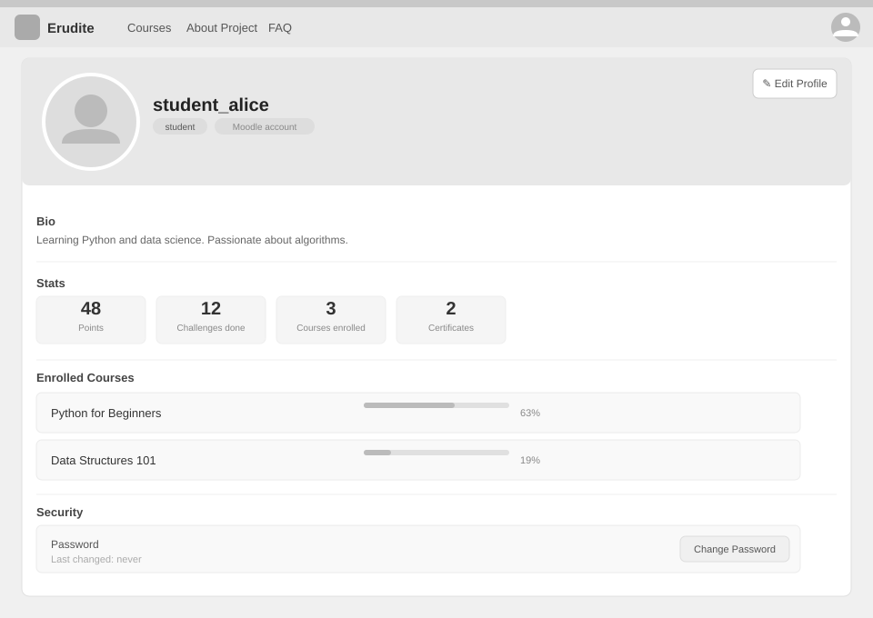

# Use-Case Name: View Profile

Use-case: View User Profile — CRUD: Read

## 1. Brief Description

Any authenticated user can view their own profile via the `/profile/me/` endpoint. The profile includes personal details (username, bio, photo), role, and associated stats. Users see a profile card on the frontend with their courses, saved courses, and activity.

---

## 2. Basic Flow

1. User navigates to **"My Profile"** in the navigation menu.
2. System sends `GET /api/users/profile/me/`.
3. System returns:
   - `username`, `email`, `user_bio`, `photo`, `role`
   - `email_verified` status
   - `slug` (used for public profile URLs)
   - `moodle_platform` (non-empty if account came via LTI)
4. The profile page displays the user's info, owned courses (for teachers), enrolled courses (for students), and bookmarked courses.

### 2.1 Mock-up

### 2.2 Alternate Flows

- **Not authenticated:** HTTP 401.

---

## 3. Preconditions

- User is authenticated.

## 4. Postconditions

- Profile data is returned. No data is modified.

## 5. Link to SRS

[Software Requirements Specification](../../Documents/SoftwareRequirementsSpecification.md)

## 7. CRUD Classification

- **Read** — reads the User record.
