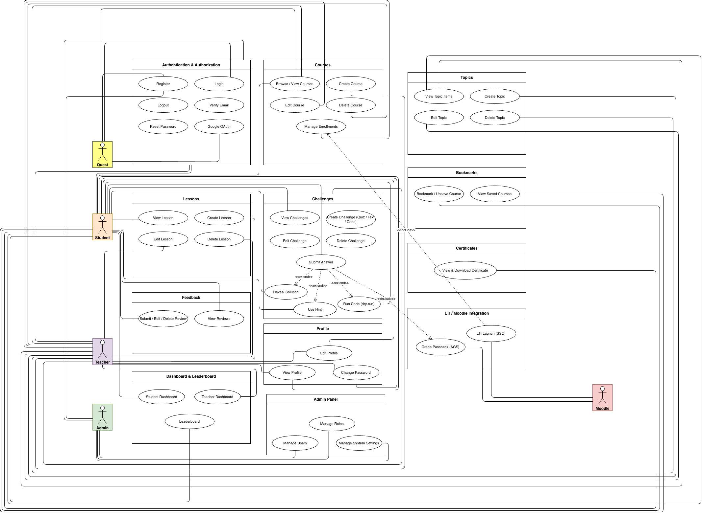

# Use Cases - Erudite

43 use cases across 12 groups. 40 implemented by the team, 3 provided by Django (Admin Panel).

---

## Use Case Diagram

<picture>
  <source media="(prefers-color-scheme: dark)" srcset="../Diagrams/UseCaseDiagramDark.drawio.png">
  
</picture>

---

## Authentication (6)

| #   | Use Case       | File                                                |
| --- | -------------- | --------------------------------------------------- |
| 1   | Register       | [Register.md](Authentication/Register.md)           |
| 2   | Login          | [Login.md](Authentication/Login.md)                 |
| 3   | Logout         | [Logout.md](Authentication/Logout.md)               |
| 4   | Google OAuth   | [GoogleOAuth.md](Authentication/GoogleOAuth.md)     |
| 5   | Verify Email   | [VerifyEmail.md](Authentication/VerifyEmail.md)     |
| 6   | Reset Password | [ResetPassword.md](Authentication/ResetPassword.md) |

## Courses (5)

| #   | Use Case                                                   | File                                                 |
| --- | ---------------------------------------------------------- | ---------------------------------------------------- |
| 7   | View Courses - 2A: Browse Catalog · 2B: View Course Detail | [ViewCourses.md](Courses/ViewCourses.md)             |
| 8   | Create Course                                              | [CreateCourse.md](Courses/CreateCourse.md)           |
| 9   | Edit Course                                                | [EditCourse.md](Courses/EditCourse.md)               |
| 10  | Delete Course                                              | [DeleteCourse.md](Courses/DeleteCourse.md)           |
| 11  | Manage Enrollments - 2A: Enroll · 2B: Remove · 2C: List    | [ManageEnrollments.md](Courses/ManageEnrollments.md) |

## Topics (4)

| #   | Use Case     | File                                    |
| --- | ------------ | --------------------------------------- |
| 12  | View Topic   | [ViewTopic.md](Topics/ViewTopic.md)     |
| 13  | Create Topic | [CreateTopic.md](Topics/CreateTopic.md) |
| 14  | Edit Topic   | [EditTopic.md](Topics/EditTopic.md)     |
| 15  | Delete Topic | [DeleteTopic.md](Topics/DeleteTopic.md) |

## Lessons (4)

| #   | Use Case      | File                                       |
| --- | ------------- | ------------------------------------------ |
| 16  | View Lesson   | [ViewLesson.md](Lessons/ViewLesson.md)     |
| 17  | Create Lesson | [CreateLesson.md](Lessons/CreateLesson.md) |
| 18  | Edit Lesson   | [EditLesson.md](Lessons/EditLesson.md)     |
| 19  | Delete Lesson | [DeleteLesson.md](Lessons/DeleteLesson.md) |

## Challenges (8)

| #   | Use Case                                    | File                                                      |
| --- | ------------------------------------------- | --------------------------------------------------------- |
| 20  | View Challenges                             | [ViewChallenges.md](Challenges/ViewChallenges.md)         |
| 21  | Create Challenge - 2A: Quiz/Text · 2B: Code | [CreateChallenge.md](Challenges/CreateChallenge.md)       |
| 22  | Edit Challenge                              | [EditChallenge.md](Challenges/EditChallenge.md)           |
| 23  | Delete Challenge                            | [DeleteChallenge.md](Challenges/DeleteChallenge.md)       |
| 24  | Submit Challenge                            | [SubmitChallenge.md](Challenges/SubmitChallenge.md)       |
| 24a | ↳ Use Hint                                  | [SubmitChallenge.md § 2.3](Challenges/SubmitChallenge.md) |
| 24b | ↳ Reveal Solution                           | [SubmitChallenge.md § 2.4](Challenges/SubmitChallenge.md) |
| 24c | ↳ Run Code (Dry-Run)                        | [SubmitChallenge.md § 2.5](Challenges/SubmitChallenge.md) |

## Feedback (4)

| #   | Use Case            | File                                                 |
| --- | ------------------- | ---------------------------------------------------- |
| 25a | View Feedback       | [CourseFeedback.md § 2A](Feedback/CourseFeedback.md) |
| 25b | Submit Feedback     | [CourseFeedback.md § 2B](Feedback/CourseFeedback.md) |
| 25c | Edit Own Feedback   | [CourseFeedback.md § 2C](Feedback/CourseFeedback.md) |
| 25d | Delete Own Feedback | [CourseFeedback.md § 2D](Feedback/CourseFeedback.md) |

## Profile (3)

| #   | Use Case        | File                                           |
| --- | --------------- | ---------------------------------------------- |
| 26  | View Profile    | [ViewProfile.md](Profile/ViewProfile.md)       |
| 27  | Edit Profile    | [EditProfile.md](Profile/EditProfile.md)       |
| 28  | Change Password | [ChangePassword.md](Profile/ChangePassword.md) |

## Dashboard & Leaderboard (3)

| #   | Use Case          | File                                        |
| --- | ----------------- | ------------------------------------------- |
| 29a | Student Dashboard | [Dashboard.md § 2A](Dashboard/Dashboard.md) |
| 29b | Teacher Dashboard | [Dashboard.md § 2B](Dashboard/Dashboard.md) |
| 29c | Leaderboard       | [Dashboard.md § 2C](Dashboard/Dashboard.md) |

## Bookmarks (2)

| #   | Use Case                | File                                                  |
| --- | ----------------------- | ----------------------------------------------------- |
| 30a | Toggle Bookmark         | [BookmarkCourse.md § 2A](Bookmarks/BookmarkCourse.md) |
| 30b | View Bookmarked Courses | [BookmarkCourse.md § 2B](Bookmarks/BookmarkCourse.md) |

## Certificates (3)

| #   | Use Case             | File                                                           |
| --- | -------------------- | -------------------------------------------------------------- |
| 31a | Auto-Issuance        | [CourseCertificate.md § 2A](Certificates/CourseCertificate.md) |
| 31b | View Certificate     | [CourseCertificate.md § 2B](Certificates/CourseCertificate.md) |
| 31c | Download Certificate | [CourseCertificate.md § 2C](Certificates/CourseCertificate.md) |

## LTI / Moodle Integration (3)

| #   | Use Case                    | File                                                          |
| --- | --------------------------- | ------------------------------------------------------------- |
| 32a | Initial Setup               | [LTI-MoodleIntegration.md § 2A](LTI/LTI-MoodleIntegration.md) |
| 32b | LTI Launch (Student Access) | [LTI-MoodleIntegration.md § 2B](LTI/LTI-MoodleIntegration.md) |
| 32c | Grade Passback              | [LTI-MoodleIntegration.md § 2C](LTI/LTI-MoodleIntegration.md) |

## Admin Panel - Django (3)

| #   | Use Case       | Description                        |
| --- | -------------- | ---------------------------------- |
| 33  | Manage Users   | Provided by Django Admin Framework |
| 34  | Manage Content | Provided by Django Admin Framework |
| 35  | View Logs      | Provided by Django Admin Framework |

---

## Function Points

See [FUNCTION_POINTS.md](FUNCTION_POINTS.md) for FP calculations and Week 13 → Week 20 evolution.
