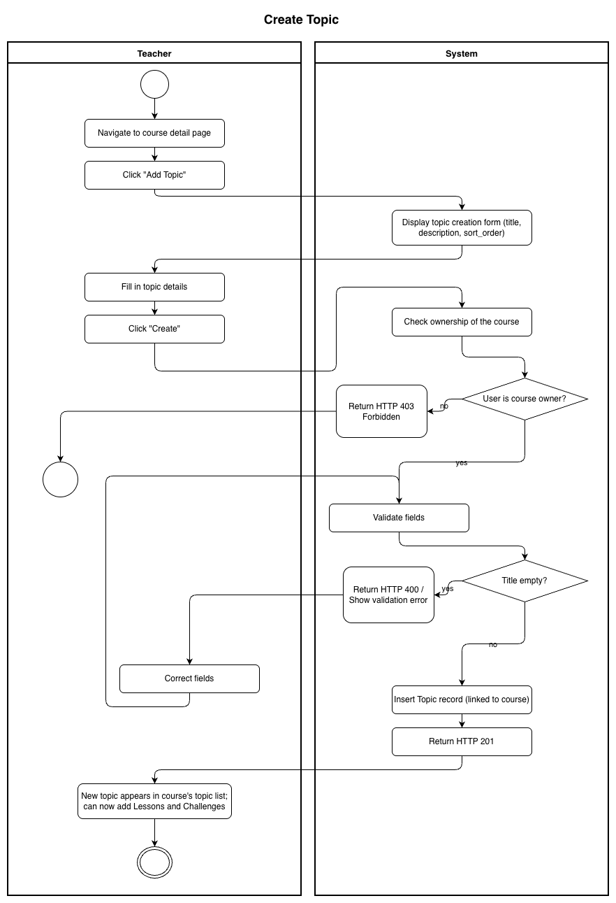
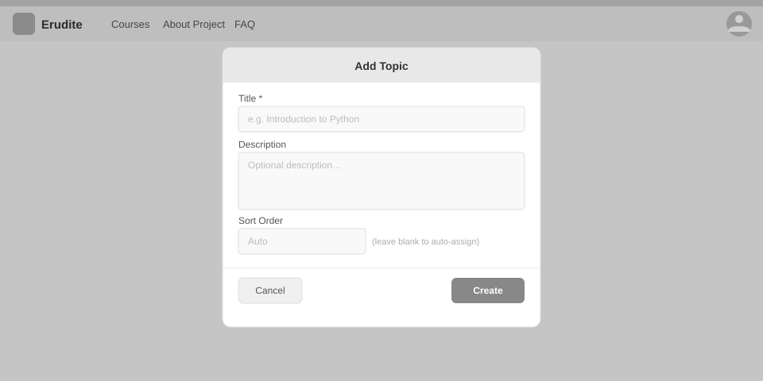

# Use-Case Name: Create Topic

Use-case: Create Topic — CRUD: Create

## 1. Brief Description

A Teacher creates a new topic within an existing course. Topics are ordered sections that group related lessons and challenges. A `sort_order` value controls the topic's position within the course.

---

## 2. Basic Flow

1. Teacher navigates to a course detail page.
2. Teacher clicks **"Add Topic"**.
3. System displays a form with:
   - Title *(required)*
   - Description *(optional)*
   - Sort order *(optional, auto-assigned if not provided)*
4. Teacher fills the form and clicks **"Create"**.
5. System sends `POST /api/platform/topics/create/` with the course slug.
6. System validates input and creates the `Topic` record linked to the course.
7. System responds with HTTP 201 and the new topic data.
8. The new topic appears in the course's topic list.

### 2.1 Activity Diagram



### 2.2 Mock-up



### 2.3 Alternate Flows

- **Missing title:** System returns HTTP 400 with a validation error.
- **Course not found:** HTTP 404.
- **Non-owner attempt:** HTTP 403.

### 2.4 Narrative

```gherkin
Feature: Create Topic
  As a Teacher
  I want to add a topic to my course
  So that I can organize lessons and challenges into sections

  Background:
    Given I am logged in as a Teacher and own a course "math-basics"

  Scenario: Successfully create a topic
    When I send a POST request to "/api/platform/topics/create/" with:
      | course_slug | math-basics         |
      | title       | Chapter 1: Algebra  |
      | description | Intro to algebra    |
      | sort_order  | 1                   |
    Then the response status code is 201
    And the topic appears in the course's topic list

  Scenario: Create topic without a title
    When I submit the form with an empty title
    Then the response status code is 400
    And I see a validation error for "title"
```

---

## 3. Preconditions

- Teacher is logged in with `role = teacher`.
- The target course exists and the Teacher is its owner.

## 4. Postconditions

- A new `Topic` record is created linked to the course.
- The Teacher can now add Lessons and Challenges to the topic.

## 5. Exceptions

- **Permission denied:** HTTP 403 for non-owners.
- **Course not found:** HTTP 404.

## 6. Link to SRS

[Software Requirements Specification](../../Documents/SoftwareRequirementsSpecification.md)

## 7. CRUD Classification

- **Create** — creates a new Topic record.
