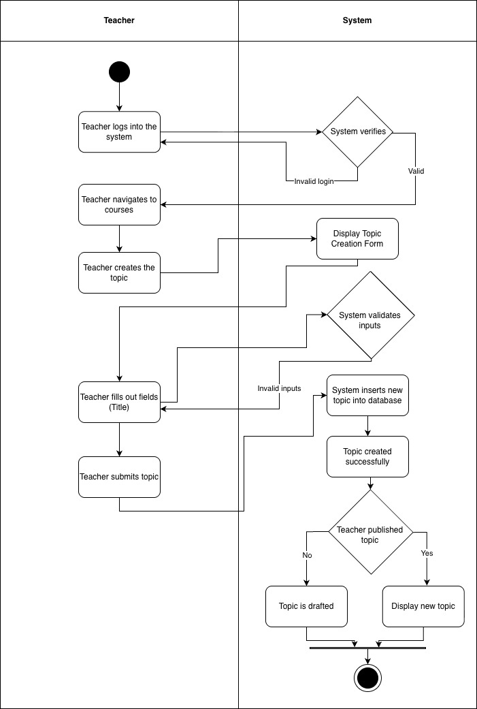
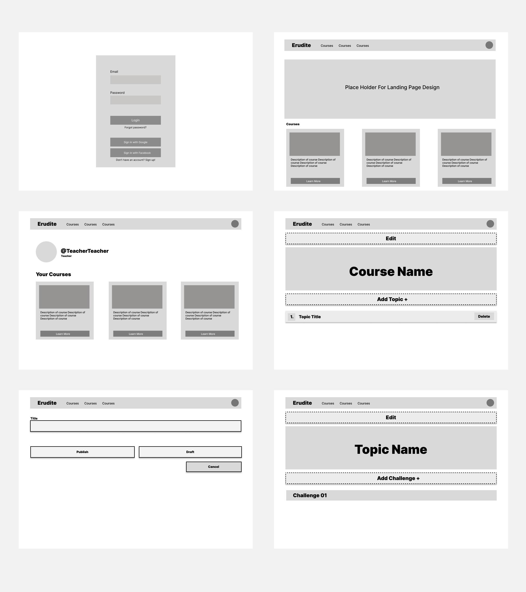

# 1 Use-Case Name
Create Topic / Module — CRUD: Create

## 1.1 Brief Description

This use case describes how a Teacher creates a new **Topic** within an existing course.
A Topic contains a title. Once created, the Topic becomes part of the course structure and can later contain challenges.

---

# 2 Flow of Events

## 2.1 Basic Flow
1. Teacher logs into the platform.
2. Teacher navigates to **Courses** and selects an existing course.
3. Teacher opens the **Topics** section for that course.
4. Teacher clicks **“Create Topic.”**
5. System displays a form with the following fields:
   - Topic title
6. Teacher fills out the form and submits it.
7. System validates the input.
8. System inserts the new topic into the database, linked to the selected course.
9. System shows confirmation: **“Topic created successfully.”**

### 2.1.1 Activity Diagram


### 2.1.2 Mock-up


### 2.1.3 Narrative
The Teacher uses this form to create new Topics inside a course.
Topics help organize the course into structured learning units.
Once saved, the Topic appears within the course, and the Teacher can add challenges under it.

---


```gherkin
Feature: Create a new topic/module

  As a Teacher
  I want to add a topic to an existing course
  So that I can structure the course into modules.

  Background:
    Given I am logged in as an existing teacher with verified email
    And a course with ID 10 exists

  Scenario: Successfully create a topic
    When I send a POST request to "/api/platform/courses/10/topics/create/" with:
        | title       | Introduction to Algebra |
        | description | Basic concepts          |
        | order       | 1                       |
    Then the response status code should be 201
    And the response should contain "Topic created successfully."

  Scenario: Fail to create a topic with missing title
    When I send a POST request to "/api/platform/courses/10/topics/create/" with:
        | title       |           |
        | description | Basics    |
    Then the response status code should be 400
    And the response should contain "title"
```

## 2.2 Alternative Flows
- **Cancel:** Teacher clicks “Cancel”: Return to topics list without saving.
- **Validation error:** Missing or invalid input: Show error, no save.

# 3 Special Requirements

- Only authenticated users with **role = teacher** can create courses.
- Topic titles must be unique within the same course.
The course must already exist.

# 4 Preconditions

- Teacher is logged in and active.
- Teacher has permission to edit the selected course.
- The course exists and is active.

# 5 Postconditions

- A new topic record exists in the database.
- The topic is linked to the selected course.
- The Teacher can now add challenges to the topic.

# 6 Extension Points

- **Edit Topic:** Modify topic title or description.
- **Delete Topic:** Remove the topic from the course.
- **Add Challenge:** Teacher can add challenges under the topic.
