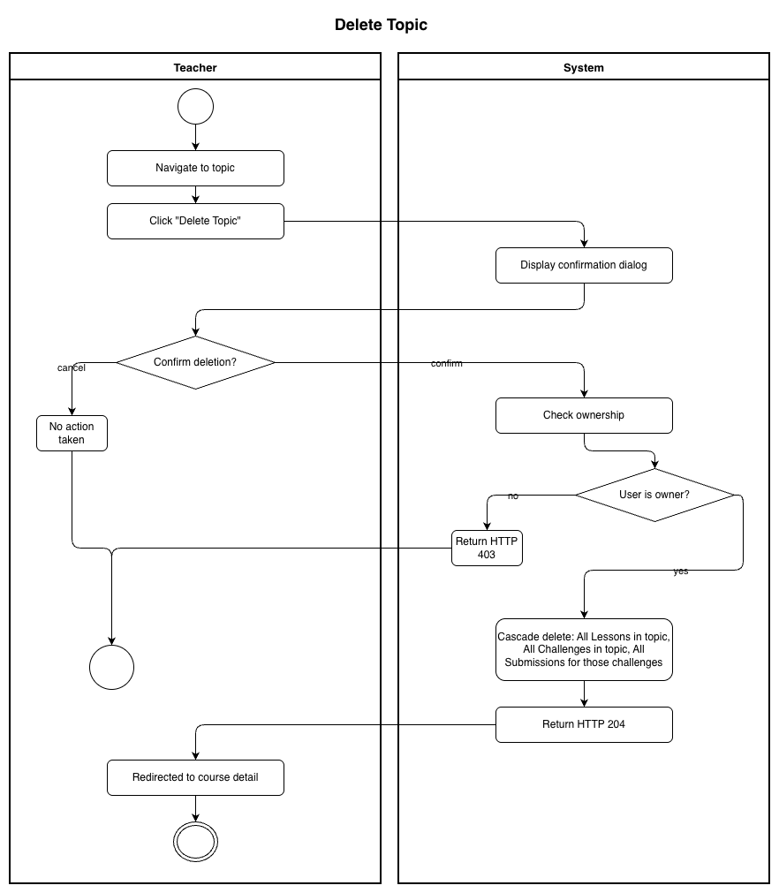

# Use-Case Name: Delete Topic

Use-case: Delete Topic — CRUD: Delete

## 1. Brief Description

A Teacher permanently deletes a topic from their course. All lessons and challenges belonging to the topic — including submissions — are cascade-deleted.

---

## 2. Basic Flow

1. Teacher navigates to the topic.
2. Teacher clicks **"Delete Topic"**.
3. System shows a confirmation dialog.
4. Teacher confirms.
5. System sends `DELETE /api/platform/topics/<slug>/delete/`.
6. System cascade-deletes all Lessons, Challenges, and Submissions under the topic.
7. System responds with HTTP 204.
8. Teacher is redirected to the course detail page.

### 2.1 Activity Diagram



### 2.2 Mock-up


### 2.3 Alternate Flows

- **Cancel:** Teacher dismisses the dialog → no deletion.
- **Non-owner:** HTTP 403.

### 2.4 Narrative

```gherkin
Feature: Delete Topic
  As a Teacher
  I want to delete a topic from my course
  So that I can remove outdated sections

  Scenario: Successfully delete a topic
    Given I own a topic with slug "old-chapter"
    When I send a DELETE request to "/api/platform/topics/old-chapter/delete/"
    Then the response status code is 204
    And the topic and all its content are removed
```

---

## 3. Preconditions

- Teacher is logged in.
- The topic exists and belongs to a course owned by the Teacher.

## 4. Postconditions

- Topic and all cascaded data (Lessons, Challenges, Submissions) are permanently deleted.

## 5. Exceptions

- **Topic not found:** HTTP 404.
- **Permission denied:** HTTP 403.

## 6. Link to SRS

[Software Requirements Specification](../../Documents/SoftwareRequirementsSpecification.md)

## 7. CRUD Classification

- **Delete** — removes a Topic record and cascades.

## 8. Function Points

Function Points are tracked at **group level** for Erudite because the project contains many small, structurally similar Use Cases. Grouping produces a more reliable FP vs Time correlation (R² = 0.67) and matches the Berkling UCL methodology.

This Use Case belongs to group **`topics`** (AFP = **43 (Week 20 actual)**).

| Attribute | Value |
|---|---|
| **Group** | `topics` |
| **UCs in group** | CreateTopic, EditTopic, DeleteTopic, ViewTopic |
| **Group AFP** | 43 (Week 20 actual) |
| **Full FP breakdown** | [UCs/FUNCTION_POINTS.md](../FUNCTION_POINTS.md) |
