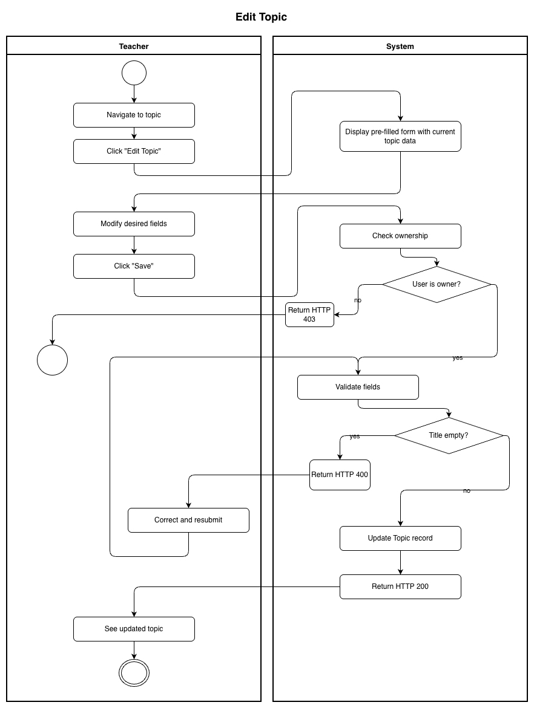
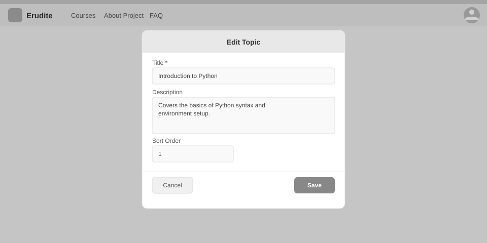

# Use-Case Name: Edit Topic

Use-case: Edit Topic — CRUD: Update

## 1. Brief Description

A Teacher updates the title, description, or sort order of an existing topic within their course.

---

## 2. Basic Flow

1. Teacher navigates to the topic within their course.
2. Teacher clicks **"Edit Topic"**.
3. System displays a pre-filled form with the topic's current data.
4. Teacher modifies the desired fields.
5. Teacher clicks **"Save"**.
6. System sends `PATCH /api/platform/topics/<slug>/update/` with the changed fields.
7. System validates and saves the changes.
8. System responds with HTTP 200 and updated topic data.

### 2.1 Activity Diagram



### 2.2 Mock-up



### 2.3 Alternate Flows

- **Invalid data:** Empty title → HTTP 400.
- **Cancel:** Returns to topic view without saving.
- **Non-owner:** HTTP 403.

### 2.4 Narrative

```gherkin
Feature: Edit Topic
  As a Teacher
  I want to edit a topic in my course
  So that I can fix errors or reorder content

  Background:
    Given I am logged in as a Teacher
    And a topic with slug "chapter-1-algebra" exists in my course

  Scenario: Successfully update a topic title
    When I send a PATCH request to "/api/platform/topics/chapter-1-algebra/update/" with:
      | title | Chapter 1: Linear Algebra |
    Then the response status code is 200
    And the topic title is updated

  Scenario: Non-owner cannot edit topic
    Given I am a different Teacher
    When I send a PATCH request to the topic
    Then the response status code is 403
```

---

## 3. Preconditions

- Teacher is logged in.
- The topic exists and belongs to a course owned by the Teacher.

## 4. Postconditions

- Updated `Topic` record is persisted in the database.

## 5. Exceptions

- **Topic not found:** HTTP 404.
- **Permission denied:** HTTP 403.

## 6. Link to SRS

[Software Requirements Specification](../../Documents/SoftwareRequirementsSpecification.md)

## 7. CRUD Classification

- **Update** — modifies an existing Topic record.
