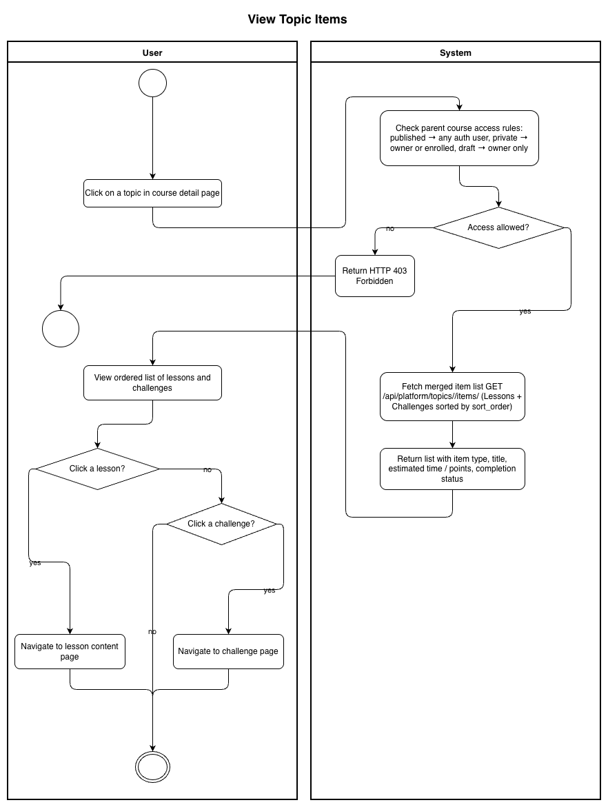
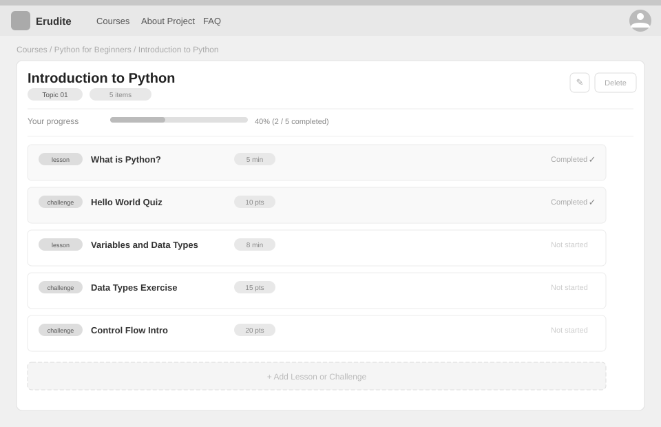

# Use-Case Name: View Topic

Use-case: View Topic & Its Items — CRUD: Read

## 1. Brief Description

A user views the items within a topic: a merged, ordered list of lessons and challenges. Access depends on the parent course status. Students can track which items they have completed.

---

## 2. Basic Flow

1. User navigates to a course and clicks on a topic.
2. System fetches `GET /api/platform/topics/<slug>/items/`.
3. System checks course access rules:
   - `published` → any authenticated user.
   - `private` → enrolled students or owner.
4. System returns the merged, `sort_order`-sorted list of Lessons and Challenges.
5. Each item shows: type (`lesson` / `challenge`), title, estimated time or points, completion status.

### 2.1 Activity Diagram



### 2.2 Mock-up



### 2.3 Alternate Flows

- **Access denied:** HTTP 403 for non-enrolled users on private courses.
- **Topic not found:** HTTP 404.

### 2.4 Narrative

```gherkin
Feature: View Topic Items
  As a student
  I want to see all items in a topic
  So that I can navigate lessons and challenges in order

  Scenario: View items in a published topic
    Given a published topic "chapter-1" exists
    When I send a GET request to "/api/platform/topics/chapter-1/items/"
    Then I receive a sorted list of lessons and challenges

  Scenario: Student cannot view items in private course they are not enrolled in
    Given a private course topic "private-topic" exists
    And I am not enrolled
    When I send a GET request to the topic's items
    Then I receive a 403 response
```

---

## 3. Preconditions

- User is authenticated.
- Access rules for the parent course are satisfied.

## 4. Postconditions

- No data is modified; items list is returned.

## 5. Link to SRS

[Software Requirements Specification](../../Documents/SoftwareRequirementsSpecification.md)

## 7. CRUD Classification

- **Read** — reads Topic and related Lesson/Challenge records.

## 8. Function Points

Function Points are tracked at **group level** for Erudite because the project contains many small, structurally similar Use Cases. Grouping produces a more reliable FP vs Time correlation (R² = 0.67) and matches the Berkling UCL methodology.

This Use Case belongs to group **`topics`** (AFP = **43 (Week 20 actual)**).

| Attribute | Value |
|---|---|
| **Group** | `topics` |
| **UCs in group** | CreateTopic, EditTopic, DeleteTopic, ViewTopic |
| **Group AFP** | 43 (Week 20 actual) |
| **Full FP breakdown** | [UCs/FUNCTION_POINTS.md](../FUNCTION_POINTS.md) |
