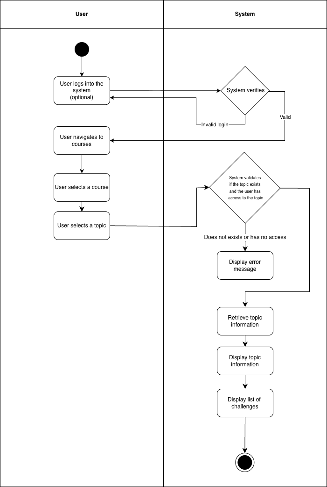

# 1 Use-Case Name
View Topic — CRUD: Read

## 1.1 Brief Description

This use case describes how a Teacher or Student views an existing **Topic** within a course.  
A Topic displays its title and the list of challenges that belong to it.

---

# 2 Flow of Events

## 2.1 Basic Flow
1. User logs into the platform (optional for public courses).
2. User navigates to the **Courses** section.
3. User selects an existing course.
4. User opens the **Topics** section for that course.
5. User selects a specific Topic to view.
6. System retrieves Topic details from the database.
7. System displays:
   - Topic title
   - List of challenges under the Topic
8. User can interact with the Topic or select a challenge to continue.

### 2.1.1 Activity Diagram


### 2.1.2 Mock-up


### 2.1.3 Narrative
The user selects a course and views its Topics.  
Upon selecting a Topic, the system fetches and displays all relevant information, including a list of challenges.  
Students may only see Topics that are visible or unlocked based on permissions or challenge progress.  
Teachers can see all Topics, including drafts or hidden ones.

---

```gherkin
Feature: View an existing topic/module

  As a User
  I want to view a topic inside a course
  So that I can see its content and available challenges.

  Background:
    Given a course with ID 10 exists
    And a topic with ID 5 exists for course 10

  Scenario: Successfully view a topic
    When I send a GET request to "/api/platform/courses/10/topics/5/"
    Then the response status code should be 200
    And the response should contain the topic title

  Scenario: Attempt to view a non-existing topic
    When I send a GET request to "/api/platform/courses/10/topics/999/"
    Then the response status code should be 404
    And the response should contain "Topic not found"

  Scenario: Permission error (hidden topic)
    Given I am logged in as a student
    And the topic is marked as hidden
    When I send a GET request to "/api/platform/courses/10/topics/5/"
    Then the response status code should be 403
    And the response should contain "Not authorized"
```

## 2.2 Alternative Flows

- **Topic not found**

- **Permission error:** User does not have access to the Topic.

- **Drafted Topic:** System hides the Topic or its challenges until published.

---

# 3 Special Requirements

- Students can only view Topics that are **published**.
- Teachers can view all Topics, including **draft** or **hidden** ones.
- The Topic must belong to the selected course.

---

# 4 Preconditions

- The course exists and is active.  
- The Topic exists for the selected course.  
- The user meets visibility or permission requirements (student or teacher role).

---

# 5 Postconditions

- Topic information is displayed to the user.  
- The user may navigate to the challenges contained within the Topic.

---

# 6 Extension Points

- **Edit Topic:** Teacher may modify the Topic.  
- **Delete Topic:** Teacher may remove the Topic.  
- **View Challenge:** User may select one of the Topic’s challenges to continue.  
